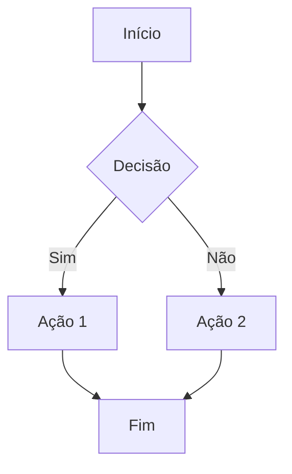
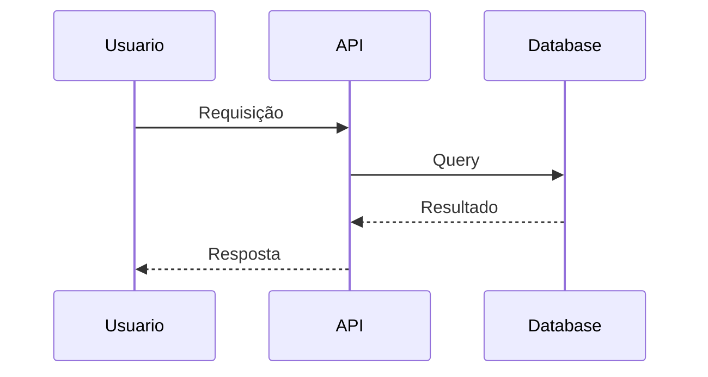
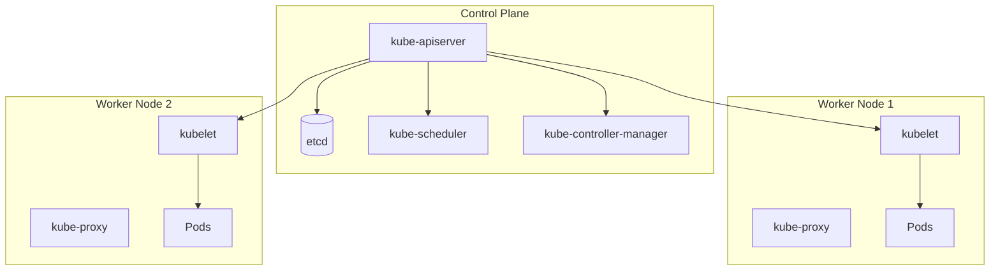
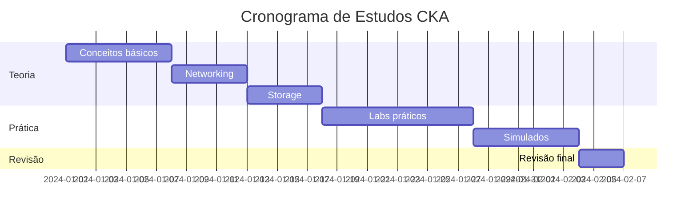
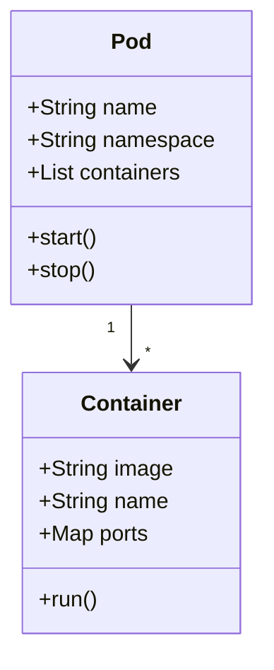
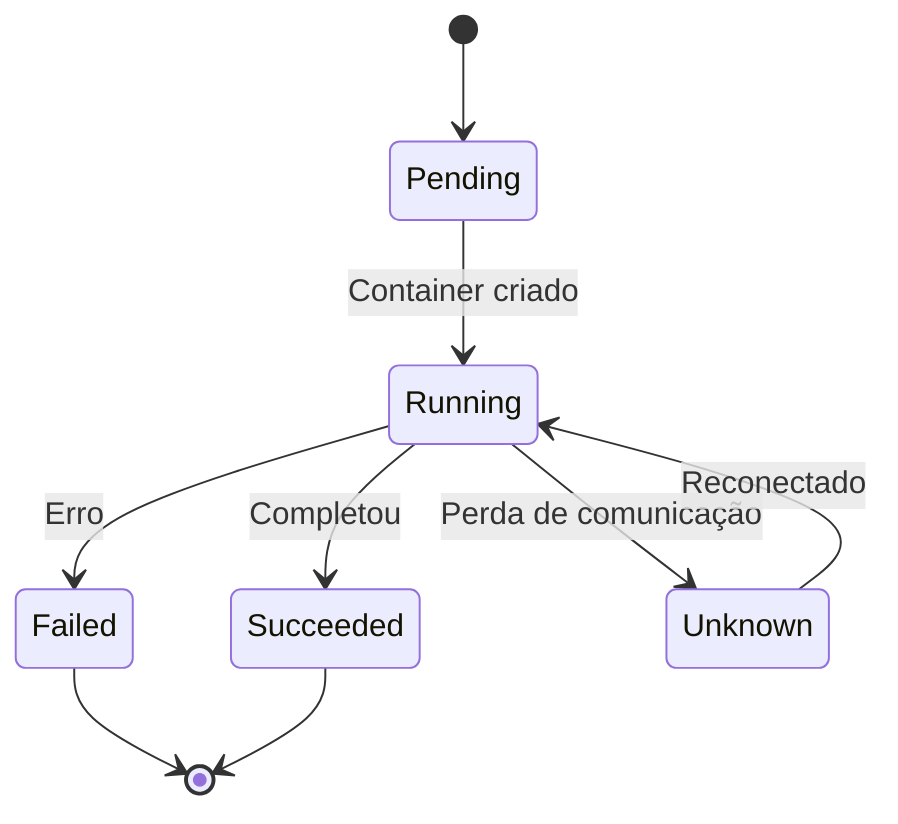
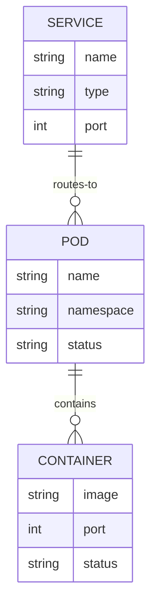

# Exemplos de Plugins

Esta página demonstra os plugins e recursos ativados na wiki Nebulosa.

## 💡 Admonitions (Caixas de Aviso)

### Note (Nota)

:::note
Esta é uma nota informativa básica.
:::

:::note Título Customizado
Você pode adicionar um título personalizado!
:::

### Tip (Dica)

:::tip Dica Útil
Use este tipo para dicas e sugestões úteis!
:::

### Info (Informação)

:::info
Informações importantes vão aqui.
:::

### Warning (Aviso)

:::warning Atenção!
Use este tipo para avisos importantes.
:::

:::warning
Também funciona sem título.
:::

### Danger (Perigo)

:::danger Cuidado!
Use este tipo para alertas críticos de segurança ou erros graves.
:::

### Caution (Cuidado)

:::caution
Tenha cuidado ao executar comandos destrutivos!
:::

### Success (Sucesso) - Customizado

:::tip Sucesso ✅
Você pode usar emojis nos títulos para criar tipos customizados!
:::

### Exemplo Prático - Kubernetes

:::warning Importante para CKA
No exame CKA, você tem apenas 2 horas para completar todas as questões. Gerencie seu tempo com cuidado!
:::

:::tip Dica de Estudo
Use `kubectl explain` para consultar a documentação diretamente no terminal:
```bash
kubectl explain pod.spec.containers
```
:::

:::danger Comando Destrutivo
O comando `kubectl delete` é irreversível no exame!
```bash
# ⚠️ CUIDADO: Isso deletará TODOS os pods
kubectl delete pods --all -n production
```
:::

## 📊 Diagramas Mermaid

### Diagrama de Fluxo



### Diagrama de Sequência



### Arquitetura Kubernetes



## 🧮 Fórmulas Matemáticas (KaTeX)

### Inline Math

A fórmula $E = mc^2$ é a famosa equação de Einstein.

### Block Math

$$
\int_{a}^{b} x^2 \,dx = \frac{x^3}{3} \Bigg|_a^b
$$

### Complexidade de Algoritmos

Complexidade de busca binária: $O(\log n)$

$$
T(n) = \begin{cases}
    O(1) & \text{se } n = 1 \\
    T(\frac{n}{2}) + O(1) & \text{se } n > 1
\end{cases}
$$

## 💻 Syntax Highlighting

### YAML (Kubernetes Manifest)

```yaml
apiVersion: v1
kind: Pod
metadata:
  name: nginx-pod
  labels:
    app: nginx
spec:
  containers:
  - name: nginx
    image: nginx:latest
    ports:
    - containerPort: 80
```

### JSON

```json
{
  "apiVersion": "v1",
  "kind": "Service",
  "metadata": {
    "name": "my-service"
  },
  "spec": {
    "selector": {
      "app": "nginx"
    },
    "ports": [
      {
        "protocol": "TCP",
        "port": 80,
        "targetPort": 9376
      }
    ]
  }
}
```

### Bash

```bash
#!/bin/bash

# Deploy aplicação
kubectl apply -f deployment.yaml

# Verificar status
kubectl get pods -n production

# Logs
kubectl logs -f deployment/my-app --tail=100
```

### Python

```python
def fibonacci(n):
    """Calcula o n-ésimo número de Fibonacci"""
    if n <= 1:
        return n
    return fibonacci(n-1) + fibonacci(n-2)

# Exemplo de uso
for i in range(10):
    print(f"F({i}) = {fibonacci(i)}")
```

### Go

```go
package main

import "fmt"

func main() {
    // Hello World em Go
    fmt.Println("Hello, Nebulosa!")

    // Exemplo de goroutine
    go func() {
        fmt.Println("Executando em paralelo!")
    }()
}
```

### Dockerfile

```docker
FROM node:20-alpine

WORKDIR /app

COPY package*.json ./
RUN npm install

COPY . .

EXPOSE 3000

CMD ["npm", "start"]
```

### Nginx

```nginx
server {
    listen 80;
    server_name example.com;

    location / {
        proxy_pass http://localhost:3000;
        proxy_set_header Host $host;
        proxy_set_header X-Real-IP $remote_addr;
    }
}
```

---

## 🎨 Destaque de Linhas de Código

### Destacar Linhas Específicas

```yaml {3-5}
apiVersion: v1
kind: Pod
metadata:
  name: nginx-pod
  namespace: production
spec:
  containers:
  - name: nginx
    image: nginx:latest
```

Linhas 3-5 estão destacadas! Use `{3-5}` ou `{2,5,7}` para múltiplas linhas.

### Título no Bloco de Código

```yaml title="deployment.yaml"
apiVersion: apps/v1
kind: Deployment
metadata:
  name: nginx-deployment
spec:
  replicas: 3
```

## 📝 Tabs (Abas)

import Tabs from '@theme/Tabs';
import TabItem from '@theme/TabItem';

<Tabs>
  <TabItem value="yaml" label="YAML" default>

```yaml
apiVersion: v1
kind: Service
metadata:
  name: my-service
spec:
  selector:
    app: nginx
  ports:
  - port: 80
```

  </TabItem>
  <TabItem value="json" label="JSON">

```json
{
  "apiVersion": "v1",
  "kind": "Service",
  "metadata": {
    "name": "my-service"
  },
  "spec": {
    "selector": {
      "app": "nginx"
    },
    "ports": [
      {
        "port": 80
      }
    ]
  }
}
```

  </TabItem>
  <TabItem value="bash" label="kubectl">

```bash
kubectl create service clusterip my-service --tcp=80:80
```

  </TabItem>
</Tabs>

## 📋 Detalhes Colapsáveis

<details>
<summary>Clique para ver a solução do exercício</summary>

```bash
# Criar namespace
kubectl create namespace production

# Criar deployment
kubectl create deployment nginx --image=nginx:latest -n production

# Expor como service
kubectl expose deployment nginx --port=80 --type=LoadBalancer -n production
```

:::tip
Use detalhes colapsáveis para exercícios, FAQs e conteúdo opcional!
:::

</details>

## ✅ Listas de Tarefas

### Checklist de Estudo CKA

- [x] Estudar conceitos básicos do Kubernetes
- [x] Praticar comandos do kubectl
- [ ] Fazer simulados de exame
- [ ] Revisar networking
- [ ] Estudar RBAC
- [ ] Praticar troubleshooting

## 🔗 Links e Referências

### Links Internos
- [Ir para Kubernetes](./kubernetes/)
- [Ver Certificações](./kubernetes/certifications/)
- [Voltar para Início](./intro)

### Links com Âncora
- [Pular para Mermaid](#-diagramas-mermaid)
- [Ver Admonitions](#-admonitions-caixas-de-aviso)

## 📊 Tabelas Avançadas

### Comparação de Certificações

| Certificação | Dificuldade | Duração | Hands-on | Validade |
|:-------------|:-----------:|:-------:|:--------:|---------:|
| KCNA         | ⭐⭐        | 90 min  | ❌       | 3 anos   |
| CKAD         | ⭐⭐⭐      | 2h      | ✅       | 3 anos   |
| CKA          | ⭐⭐⭐⭐    | 2h      | ✅       | 3 anos   |
| CKS          | ⭐⭐⭐⭐⭐  | 2h      | ✅       | 2 anos   |

### Tabela com Código

| Comando | Descrição | Exemplo |
|---------|-----------|---------|
| `get` | Lista recursos | `kubectl get pods` |
| `describe` | Detalhes do recurso | `kubectl describe pod nginx` |
| `logs` | Visualiza logs | `kubectl logs -f pod/nginx` |
| `exec` | Executa comando | `kubectl exec -it nginx -- bash` |

## 💬 Citações

> "A melhor maneira de aprender é fazendo."
>
> — Provérbio chinês

### Citação Aninhada

> Documentação oficial do Kubernetes:
>
> > Kubernetes é uma plataforma open-source para automação de implantação,
> > dimensionamento e gerenciamento de aplicações em containers.

## 🎯 MDX - Componentes React

### Usando Variáveis

export const exam = 'CKA';
export const duration = '2 horas';

O exame **{exam}** tem duração de **{duration}**.

### Cálculos Inline

export const questoes = 17;
export const acertos = 15;
export const percentual = Math.round((acertos / questoes) * 100);

Resultado: {acertos}/{questoes} = **{percentual}%** ✅

## 🌈 Emojis

Você pode usar emojis livremente:

- 🚀 Deploy
- 🐛 Bug
- ✨ Feature nova
- 📝 Documentação
- 🔒 Segurança
- ⚡ Performance
- 🎨 UI/Estilo
- ♻️ Refatoração

## 📸 Imagens

### Sintaxe Básica

```markdown

```

### Com Título

```markdown

```

## 🔢 Listas Numeradas com Sub-itens

### Instalação do Kubernetes

1. Preparar o ambiente
   - Instalar Docker
   - Configurar o sistema
   - Desabilitar swap
2. Instalar kubeadm, kubelet e kubectl
   ```bash
   apt-get install -y kubelet kubeadm kubectl
   ```
3. Inicializar o cluster
   - Control plane: `kubeadm init`
   - Workers: `kubeadm join`
4. Instalar network plugin
   - Calico
   - Flannel
   - Weave

## 🎭 HTML Customizado

<div style={{
  background: 'linear-gradient(135deg, #667eea 0%, #764ba2 100%)',
  padding: '20px',
  borderRadius: '10px',
  color: 'white',
  textAlign: 'center',
  margin: '20px 0'
}}>
  <h3>🌟 Destaque Especial</h3>
  <p>Você pode usar HTML e CSS inline em MDX!</p>
</div>

## 📐 Mais Diagramas Mermaid

### Gantt Chart



### Diagrama de Classes



### Diagrama de Estado



### Diagrama ER



## 🧮 Fórmulas Matemáticas Avançadas

### Matriz

$$
\begin{bmatrix}
1 & 2 & 3 \\
4 & 5 & 6 \\
7 & 8 & 9
\end{bmatrix}
$$

### Sistema de Equações

$$
\begin{cases}
x + y = 5 \\
2x - y = 1
\end{cases}
$$

### Somatório e Produtório

$$
\sum_{i=1}^{n} i = \frac{n(n+1)}{2}
$$

$$
\prod_{i=1}^{n} i = n!
$$

### Fração Complexa

$$
\frac{\displaystyle\sum_{i=1}^{n}(x_i - \bar{x})^2}{n-1}
$$

## 📊 Código com Diff

```diff title="Alteração no Deployment"
apiVersion: apps/v1
kind: Deployment
metadata:
  name: nginx
spec:
- replicas: 2
+ replicas: 5
  selector:
    matchLabels:
      app: nginx
  template:
    metadata:
      labels:
        app: nginx
    spec:
      containers:
      - name: nginx
-       image: nginx:1.14
+       image: nginx:1.21
        ports:
        - containerPort: 80
```

---

## 🎉 Resumo de Recursos

✅ **Tudo isso está disponível na wiki Nebulosa:**

1. 💡 Admonitions (6 tipos)
2. 📊 Mermaid (flowchart, sequence, gantt, class, state, ER)
3. 🧮 KaTeX (fórmulas matemáticas)
4. 💻 Syntax highlighting (11+ linguagens)
5. 📝 Números de linha automáticos
6. 🎨 Destaque de linhas
7. 📋 Tabs (abas)
8. 🔽 Detalhes colapsáveis
9. ✅ Listas de tarefas
10. 📊 Tabelas avançadas
11. 💬 Citações
12. 🌈 Emojis
13. 🎭 HTML/CSS customizado
14. 🔢 Listas numeradas
15. 🔗 Links internos e externos
16. 📸 Imagens
17. 🎯 MDX/React components
18. 📐 Diagramas complexos
19. 🧮 Matemática avançada
20. 📊 Diffs de código

**Explore e use todos esses recursos nas suas anotações!** 🚀✨
