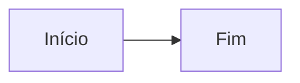

# Guia de Markdown

Guia rápido de como usar os recursos de Markdown na wiki Nebulosa.

## 📦 Admonitions

### Sintaxe Básica

```markdown
:::note
Sua nota aqui
:::
```

### Tipos Disponíveis

| Tipo | Uso | Cor |
|------|-----|-----|
| `note` | Notas informativas gerais | Azul |
| `tip` | Dicas e sugestões | Verde |
| `info` | Informações importantes | Azul claro |
| `warning` | Avisos importantes | Laranja |
| `danger` | Alertas críticos | Vermelho |
| `caution` | Cuidados necessários | Amarelo |

### Com Título Customizado

```markdown
:::tip Dica de Ouro
Sempre faça backup antes de deletar!
:::
```

### Admonitions Aninhados

:::warning Atenção
Este é um aviso importante.

:::tip Dica
Você pode aninhar admonitions dentro de outros!
:::

Continuação do aviso externo.
:::

## 📊 Diagramas Mermaid

```markdown

```

## 🧮 Fórmulas Matemáticas

```markdown
Inline: $E = mc^2$

Block:
$$
\int_a^b f(x)dx
$$
```

## 💻 Código com Destaque

### Destacar Linhas Específicas

```yaml {2-4}
apiVersion: v1
kind: Pod
metadata:
  name: nginx
spec:
  containers:
  - name: nginx
```

Use `{2-4}` ou `{2,5,7}` para destacar linhas.

### Título no Bloco de Código

```yaml title="pod.yaml"
apiVersion: v1
kind: Pod
metadata:
  name: my-pod
```

### Mostrar Números de Linha

Os números já estão ativados globalmente, mas você pode usar:

```yaml showLineNumbers
apiVersion: v1
kind: Pod
```

## 🔗 Links e Referências

### Link Interno
```markdown
[Ir para Kubernetes](./kubernetes/)
```

### Link Externo
```markdown
[Documentação Oficial](https://kubernetes.io)
```

### Âncora na Mesma Página
```markdown
[Ir para Admonitions](#-admonitions)
```

## 📝 Tabelas

```markdown
| Coluna 1 | Coluna 2 | Coluna 3 |
|----------|----------|----------|
| Valor 1  | Valor 2  | Valor 3  |
```

### Com Alinhamento

```markdown
| Esquerda | Centro | Direita |
|:---------|:------:|--------:|
| Texto    | Texto  | Texto   |
```

## ✅ Listas de Tarefas

```markdown
- [x] Tarefa completa
- [ ] Tarefa pendente
- [ ] Outra tarefa
```

Resultado:
- [x] Tarefa completa
- [ ] Tarefa pendente
- [ ] Outra tarefa

## 🎨 Texto Formatado

```markdown
**Negrito**
*Itálico*
***Negrito e Itálico***
~~Riscado~~
`código inline`
```

**Negrito**
*Itálico*
***Negrito e Itálico***
~~Riscado~~
`código inline`

## 📸 Imagens

```markdown

```

### Com Dimensões

```markdown

```

## 💬 Citações

```markdown
> Esta é uma citação.
> Pode ter várias linhas.
>
> > E pode ser aninhada!
```

> Esta é uma citação.
> Pode ter várias linhas.
>
> > E pode ser aninhada!

## 📋 Detalhes Colapsáveis

```markdown
<details>
<summary>Clique para expandir</summary>

Conteúdo oculto aqui!

</details>
```

<details>
<summary>Clique para expandir</summary>

Conteúdo oculto aqui!

Pode incluir:
- Listas
- Código
- Qualquer Markdown

</details>

---

✨ **Explore e use todos esses recursos nas suas anotações!**
