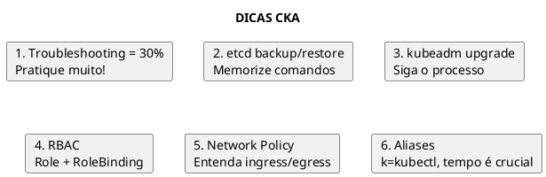

# CKA - Certified Kubernetes Administrator

> **Nível**: Practitioner | **Formato**: Hands-on (Performance-based)

## Visão Geral do Exame

### Informações do Exame

| Aspecto | Detalhes |
|---------|----------|
| **Duração** | 2 horas |
| **Formato** | Performance-based (hands-on) |
| **Questões** | 15-20 tarefas práticas |
| **Nota mínima** | 66% |
| **Validade** | 3 anos |
| **Retake** | 1 retake gratuito |
| **Proctored** | Sim, online |
| **Ambiente** | Terminal Linux + kubectl |

### Distribuição do Currículo

```plantuml,format=png
@startuml
skinparam monochrome true
skinparam backgroundColor white

title DOMÍNIOS DO CKA

card "Storage" as d1 #lightgray
card "Troubleshooting" as d2 #lightgray
card "Workloads & Scheduling" as d3 #lightgray
card "Cluster Architecture, Installation & Configuration" as d4 #lightgray
card "Services & Networking" as d5 #lightgray

note right of d1 : 10%
note right of d2 : 30%
note right of d3 : 15%
note right of d4 : 25%
note right of d5 : 20%

@enduml
```

---

## Domínio 1: Storage (10%)

### 1.1 Persistent Volumes

```yaml
{{#include ../assets/persistent-volumes/persistentvolume-pv-demo.yaml}}
```

```yaml
{{#include ../assets/persistent-volumes/persistentvolumeclaim-pvc-demo.yaml}}
```

### 1.2 Storage Classes

```yaml
{{#include ../assets/storage/storageclass-fast.yaml}}
```

### 1.3 Volume Types

```yaml
{{#include ../assets/pod/pod-volume-demo.yaml}}
```

### 1.4 Comandos Úteis

```bash
# Listar PVs e PVCs
kubectl get pv
kubectl get pvc

# Ver detalhes
kubectl describe pv pv-demo
kubectl describe pvc pvc-demo

# Storage classes
kubectl get storageclass
kubectl get sc
```

---

## Domínio 2: Troubleshooting (30%) - CRÍTICO!

### 2.1 Application Troubleshooting

```bash
# Verificar status do pod
kubectl get pods
kubectl describe pod <pod-name>

# Ver logs
kubectl logs <pod-name>
kubectl logs <pod-name> --previous
kubectl logs <pod-name> -c <container>

# Exec para debug
kubectl exec -it <pod-name> -- /bin/sh

# Verificar eventos
kubectl get events --sort-by='.lastTimestamp'
kubectl get events --field-selector type=Warning

# Verificar endpoints
kubectl get endpoints
```

### 2.2 Control Plane Troubleshooting

```bash
# Verificar componentes do control plane
kubectl get pods -n kube-system

# Logs dos componentes (se static pods)
kubectl logs -n kube-system kube-apiserver-<node>
kubectl logs -n kube-system kube-controller-manager-<node>
kubectl logs -n kube-system kube-scheduler-<node>
kubectl logs -n kube-system etcd-<node>

# Ou via crictl/journalctl
crictl ps
crictl logs <container-id>
journalctl -u kubelet

# Verificar manifestos static pods
ls /etc/kubernetes/manifests/
cat /etc/kubernetes/manifests/kube-apiserver.yaml
```

### 2.3 Worker Node Troubleshooting

```bash
# Status do node
kubectl get nodes
kubectl describe node <node-name>

# Verificar kubelet
systemctl status kubelet
journalctl -u kubelet -f

# Verificar certificados
openssl x509 -in /var/lib/kubelet/pki/kubelet.crt -text -noout

# Verificar configuração kubelet
cat /var/lib/kubelet/config.yaml
cat /etc/kubernetes/kubelet.conf
```

### 2.4 Network Troubleshooting

```bash
# Testar conectividade
kubectl run tmp --image=busybox --rm -it --restart=Never -- wget -O- <service>

# Verificar DNS
kubectl run tmp --image=busybox --rm -it --restart=Never -- nslookup kubernetes

# Verificar service
kubectl get svc
kubectl get endpoints <service>

# Verificar Network Policy
kubectl get networkpolicy

# Debug com netshoot
kubectl run tmp --image=nicolaka/netshoot --rm -it --restart=Never -- bash
```

### 2.5 Problemas Comuns

```plantuml,format=png
@startuml
skinparam monochrome true
skinparam backgroundColor white

title PROBLEMAS COMUNS

card "Pod não inicia" as p1
card "CrashLoopBackOff" as p2
card "ImagePullBackOff" as p3
card "Node NotReady" as p4
card "Service não funciona" as p5

note right of p1
  • Verificar eventos
  • Recursos insuficientes
  • Node selector/affinity
end note

note right of p2
  • Verificar logs
  • Probes falhando
  • Comando errado
end note

note right of p3
  • Imagem não existe
  • Registry credentials
  • Network issue
end note

note right of p4
  • kubelet stopped
  • Disk pressure
  • Memory pressure
end note

note right of p5
  • Selector não match
  • Endpoints vazios
  • Network Policy
end note

@enduml
```



---

## Domínio 3: Workloads & Scheduling (15%)

### 3.1 Deployments e ReplicaSets

```bash
# Criar deployment
kubectl create deployment nginx --image=nginx --replicas=3

# Escalar
kubectl scale deployment nginx --replicas=5

# Rollout
kubectl rollout status deployment/nginx
kubectl rollout history deployment/nginx
kubectl rollout undo deployment/nginx
kubectl rollout undo deployment/nginx --to-revision=2
```

### 3.2 Scheduling

```yaml
{{#include ../assets/pod/pod-nginx.yaml}}
```

```yaml
{{#include ../assets/pod/pod-nginx-1.yaml}}
```

### 3.3 Taints e Tolerations

```bash
# Adicionar taint
kubectl taint nodes node1 key=value:NoSchedule

# Remover taint
kubectl taint nodes node1 key=value:NoSchedule-

# Ver taints
kubectl describe node node1 | grep Taint
```

```yaml
{{#include ../assets/pod/pod-nginx-2.yaml}}
```

### 3.4 Static Pods

```bash
# Localização padrão
/etc/kubernetes/manifests/

# Verificar staticPodPath
cat /var/lib/kubelet/config.yaml | grep staticPodPath

# Criar static pod
cat > /etc/kubernetes/manifests/nginx.yaml << EOF
apiVersion: v1
kind: Pod
metadata:
  name: nginx
spec:
  containers:
  - name: nginx
    image: nginx
EOF
```

### 3.5 Resource Limits

```yaml
{{#include ../assets/resource-quota/resourcequota-quota.yaml}}
```

```yaml
{{#include ../assets/limit-range/limitrange-limits.yaml}}
```

---

## Domínio 4: Cluster Architecture, Installation & Configuration (25%)

### 4.1 kubeadm

```bash
# Inicializar cluster
kubeadm init --pod-network-cidr=10.244.0.0/16

# Join worker
kubeadm join <control-plane>:6443 --token <token> \
  --discovery-token-ca-cert-hash sha256:<hash>

# Gerar novo token
kubeadm token create --print-join-command

# Upgrade cluster
kubeadm upgrade plan
kubeadm upgrade apply v1.28.0
```

### 4.2 Backup e Restore etcd

```bash
# Backup
ETCDCTL_API=3 etcdctl snapshot save /backup/etcd-snapshot.db \
  --endpoints=https://127.0.0.1:2379 \
  --cacert=/etc/kubernetes/pki/etcd/ca.crt \
  --cert=/etc/kubernetes/pki/etcd/server.crt \
  --key=/etc/kubernetes/pki/etcd/server.key

# Verificar snapshot
ETCDCTL_API=3 etcdctl snapshot status /backup/etcd-snapshot.db --write-out=table

# Restore
ETCDCTL_API=3 etcdctl snapshot restore /backup/etcd-snapshot.db \
  --data-dir=/var/lib/etcd-restored

# Atualizar etcd.yaml para usar novo diretório
# Editar /etc/kubernetes/manifests/etcd.yaml
```

### 4.3 Cluster Upgrade

```bash
# 1. Upgrade control plane
apt update
apt-cache madison kubeadm
apt-get install -y kubeadm=1.28.0-00

kubeadm upgrade plan
kubeadm upgrade apply v1.28.0

# 2. Upgrade kubelet e kubectl
apt-get install -y kubelet=1.28.0-00 kubectl=1.28.0-00
systemctl daemon-reload
systemctl restart kubelet

# 3. Upgrade worker nodes (um por vez)
kubectl drain <node> --ignore-daemonsets --delete-emptydir-data
# No worker:
apt-get install -y kubeadm=1.28.0-00
kubeadm upgrade node
apt-get install -y kubelet=1.28.0-00 kubectl=1.28.0-00
systemctl daemon-reload
systemctl restart kubelet
# No control plane:
kubectl uncordon <node>
```

### 4.4 RBAC

```yaml
{{#include ../assets/rbac/role-pod-reader-1.yaml}}
```

```yaml
{{#include ../assets/rbac/rolebinding-read-pods-1.yaml}}
```

```bash
# Verificar permissões
kubectl auth can-i create pods --namespace dev
kubectl auth can-i create pods --namespace dev --as jane
kubectl auth can-i --list --as jane
```

### 4.5 Certificates

```bash
# Ver certificados
kubeadm certs check-expiration

# Renovar certificados
kubeadm certs renew all

# Criar CSR
openssl genrsa -out jane.key 2048
openssl req -new -key jane.key -out jane.csr -subj "/CN=jane/O=dev"

# Aprovar CSR
kubectl certificate approve jane
```

---

## Domínio 5: Services & Networking (20%)

### 5.1 Services

```bash
# Tipos de Service
kubectl expose deployment nginx --port=80 --type=ClusterIP
kubectl expose deployment nginx --port=80 --type=NodePort
kubectl expose deployment nginx --port=80 --type=LoadBalancer
```

```yaml
{{#include ../assets/service/service-nginx-headless.yaml}}
```

### 5.2 Ingress

```bash
# Instalar nginx ingress controller
kubectl apply -f https://raw.githubusercontent.com/kubernetes/ingress-nginx/controller-v1.8.2/deploy/static/provider/cloud/deploy.yaml
```

```yaml
{{#include ../assets/ingress/ingress-app-ingress.yaml}}
```

### 5.3 DNS

```bash
# Verificar CoreDNS
kubectl get pods -n kube-system -l k8s-app=kube-dns
kubectl get svc -n kube-system kube-dns

# Testar DNS
kubectl run tmp --image=busybox --rm -it --restart=Never -- nslookup kubernetes
kubectl run tmp --image=busybox --rm -it --restart=Never -- nslookup nginx.default.svc.cluster.local
```

### 5.4 Network Policies

```yaml
{{#include ../assets/network-policy/networkpolicy-default-deny-all.yaml}}
```

```yaml
{{#include ../assets/network-policy/networkpolicy-allow-web.yaml}}
```

### 5.5 CNI

```bash
# Verificar CNI
ls /etc/cni/net.d/
cat /etc/cni/net.d/10-flannel.conflist

# Instalar Flannel
kubectl apply -f https://raw.githubusercontent.com/flannel-io/flannel/master/Documentation/kube-flannel.yml

# Instalar Calico
kubectl apply -f https://docs.projectcalico.org/manifests/calico.yaml
```

---

## Comandos Essenciais CKA

### Cluster Management

```bash
# Ver cluster info
kubectl cluster-info
kubectl get componentstatuses

# Ver nodes
kubectl get nodes -o wide
kubectl describe node <node>

# Cordon/Uncordon
kubectl cordon <node>
kubectl uncordon <node>

# Drain
kubectl drain <node> --ignore-daemonsets --delete-emptydir-data
```

### Certificados e Configuração

```bash
# kubeconfig
kubectl config view
kubectl config get-contexts
kubectl config use-context <context>
kubectl config set-context --current --namespace=<ns>

# Certificados
kubeadm certs check-expiration
openssl x509 -in /etc/kubernetes/pki/apiserver.crt -text -noout
```

### Debug

```bash
# Logs
kubectl logs <pod> -c <container> --previous
journalctl -u kubelet -f

# Eventos
kubectl get events --sort-by='.lastTimestamp'
kubectl get events -A --field-selector type=Warning

# API Server
kubectl get --raw /healthz
kubectl get --raw /api/v1/namespaces
```

---

## Dicas para o Exame



### Setup Inicial no Exame

```bash
# Aliases
alias k=kubectl
alias kn='kubectl config set-context --current --namespace'
export do='--dry-run=client -o yaml'

# Autocomplete
source <(kubectl completion bash)
complete -F __start_kubectl k
```

### Checklist Pré-Exame

1. ✅ Troubleshooting de pods, nodes, network
2. ✅ Backup e restore do etcd
3. ✅ Upgrade de cluster com kubeadm
4. ✅ RBAC (Role, ClusterRole, Bindings)
5. ✅ Certificates e kubeconfig
6. ✅ Network Policies
7. ✅ Services (ClusterIP, NodePort, LoadBalancer)
8. ✅ PV e PVC
9. ✅ Static Pods
10. ✅ Taints e Tolerations

---

## Referências

### Documentação Oficial
- [Kubernetes Docs](https://kubernetes.io/docs/)
- [kubectl Cheat Sheet](https://kubernetes.io/docs/reference/kubectl/cheatsheet/)
- [CKA Curriculum](https://github.com/cncf/curriculum)

### Arquivos Relacionados
- [Troubleshooting](../maintenance/troubleshooting.md)
- [kubeadm](../tools/kubeadm.md)
- [etcdctl](../security/etcdctl.md)
- [Backup e Restore](../maintenance/backup-e-restore.md)
- [Cluster Upgrade](../maintenance/cluster-upgrade.md)
- [RBAC](../security/rbac.md)
- [Storage](storage/storage.md)
- [Network Policy](../security/network-policy.md)
- [High Availability](fundamentals/high-availability.md)
