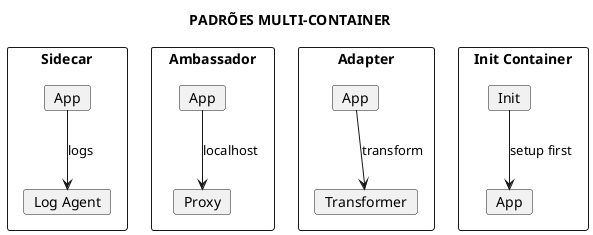
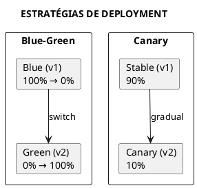
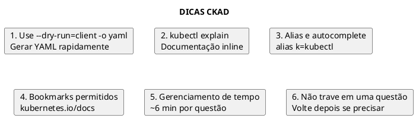

# CKAD - Certified Kubernetes Application Developer

> **Nível**: Practitioner | **Formato**: Hands-on (Performance-based)

## Visão Geral do Exame

### Informações do Exame

| Aspecto | Detalhes |
|---------|----------|
| **Duração** | 2 horas |
| **Formato** | Performance-based (hands-on) |
| **Questões** | 15-20 tarefas práticas |
| **Nota mínima** | 66% |
| **Validade** | 3 anos |
| **Retake** | 1 retake gratuito |
| **Proctored** | Sim, online |
| **Ambiente** | Terminal Linux + kubectl |

### Distribuição do Currículo

```plantuml,format=png
@startuml
skinparam monochrome true
skinparam backgroundColor white

title DOMÍNIOS DO CKAD

card "Application Design and Build" as d1 #lightgray
card "Application Deployment" as d2 #lightgray
card "Application Observability and Maintenance" as d3 #lightgray
card "Application Environment, Configuration and Security" as d4 #lightgray
card "Services and Networking" as d5 #lightgray

note right of d1 : 20%
note right of d2 : 20%
note right of d3 : 15%
note right of d4 : 25%
note right of d5 : 20%

@enduml
```



---

## Domínio 1: Application Design and Build (20%)

### 1.1 Container Images

```bash
# Build de imagem (Dockerfile)
docker build -t myapp:v1 .

# Multi-stage build (reduzir tamanho)
# Dockerfile
FROM golang:1.21 AS builder
WORKDIR /app
COPY . .
RUN go build -o myapp

FROM alpine:3.18
COPY --from=builder /app/myapp /myapp
CMD ["/myapp"]
```

### 1.2 Jobs e CronJobs

```yaml
{{#include ../assets/job/job-pi-job.yaml}}
```

```yaml
{{#include ../assets/cronjob/cronjob-backup-job.yaml}}
```

### 1.3 Multi-Container Pods



```yaml
{{#include ../assets/pod/pod-multi-container.yaml}}
```

### 1.4 Init Containers

```yaml
{{#include ../assets/pod/pod-init-demo.yaml}}
```

---

## Domínio 2: Application Deployment (20%)

### 2.1 Deployments

```bash
# Criar deployment
kubectl create deployment nginx --image=nginx:1.21 --replicas=3

# Escalar
kubectl scale deployment nginx --replicas=5

# Atualizar imagem
kubectl set image deployment/nginx nginx=nginx:1.22

# Rollout status
kubectl rollout status deployment/nginx

# Histórico
kubectl rollout history deployment/nginx

# Rollback
kubectl rollout undo deployment/nginx
kubectl rollout undo deployment/nginx --to-revision=2
```

### 2.2 Rolling Updates e Rollbacks

```yaml
{{#include ../assets/deployment/deployment-nginx-deployment.yaml}}
```

### 2.3 Blue-Green e Canary



```yaml
{{#include ../assets/certifications/ckad-example-6.yaml}}
```

### 2.4 Helm Basics

```bash
# Instalar chart
helm install myapp bitnami/nginx

# Upgrade
helm upgrade myapp bitnami/nginx --set replicaCount=3

# Rollback
helm rollback myapp 1

# Listar releases
helm list

# Desinstalar
helm uninstall myapp
```

---

## Domínio 3: Application Observability and Maintenance (15%)

### 3.1 Probes

```yaml
{{#include ../assets/pod/pod-probe-demo.yaml}}
```

### 3.2 Logs e Debugging

```bash
# Ver logs
kubectl logs pod-name
kubectl logs pod-name -c container-name  # Multi-container
kubectl logs -f pod-name                  # Follow
kubectl logs --tail=100 pod-name          # Últimas 100 linhas
kubectl logs --since=1h pod-name          # Última hora
kubectl logs -l app=nginx                 # Por label

# Exec no container
kubectl exec -it pod-name -- /bin/sh
kubectl exec pod-name -- cat /etc/config

# Debug
kubectl describe pod pod-name
kubectl get events --sort-by='.lastTimestamp'
```

### 3.3 Monitoramento

```bash
# Métricas de recursos
kubectl top nodes
kubectl top pods
kubectl top pods --containers

# Ver uso de recursos
kubectl describe node | grep -A 5 "Allocated resources"
```

---

## Domínio 4: Application Environment, Configuration and Security (25%)

### 4.1 ConfigMaps

```bash
# Criar ConfigMap
kubectl create configmap app-config \
  --from-literal=DB_HOST=mysql \
  --from-literal=DB_PORT=3306

# De arquivo
kubectl create configmap app-config --from-file=config.properties

# De diretório
kubectl create configmap app-config --from-file=config/
```

```yaml
{{#include ../assets/pod/pod-configmap-demo.yaml}}
```

### 4.2 Secrets

```bash
# Criar Secret
kubectl create secret generic db-secret \
  --from-literal=username=admin \
  --from-literal=password=secret123

# TLS Secret
kubectl create secret tls tls-secret \
  --cert=tls.crt \
  --key=tls.key

# Docker registry
kubectl create secret docker-registry regcred \
  --docker-server=registry.example.com \
  --docker-username=user \
  --docker-password=pass
```

```yaml
{{#include ../assets/pod/pod-secret-demo.yaml}}
```

### 4.3 ServiceAccounts

```bash
# Criar ServiceAccount
kubectl create serviceaccount myapp-sa

# Usar no Pod
kubectl run nginx --image=nginx --serviceaccount=myapp-sa
```

```yaml
{{#include ../assets/pod/pod-sa-demo.yaml}}
```

### 4.4 Resource Requirements

```yaml
{{#include ../assets/pod/pod-resource-demo.yaml}}
```

### 4.5 Security Context

```yaml
{{#include ../assets/pod/pod-security-demo.yaml}}
```

---

## Domínio 5: Services and Networking (20%)

### 5.1 Services

```bash
# Criar service
kubectl expose deployment nginx --port=80 --target-port=80

# ClusterIP (default)
kubectl expose deployment nginx --port=80 --type=ClusterIP

# NodePort
kubectl expose deployment nginx --port=80 --type=NodePort

# LoadBalancer
kubectl expose deployment nginx --port=80 --type=LoadBalancer
```

```yaml
{{#include ../assets/service/service-nginx-service.yaml}}
```

### 5.2 Ingress

```yaml
{{#include ../assets/ingress/ingress-app-ingress-1.yaml}}
```

### 5.3 Network Policies

```yaml
{{#include ../assets/network-policy/networkpolicy-deny-all.yaml}}
```

---

## Comandos Essenciais

### Criação Rápida (Imperativo)

```bash
# Pod
kubectl run nginx --image=nginx --port=80
kubectl run nginx --image=nginx --dry-run=client -o yaml > pod.yaml

# Deployment
kubectl create deployment nginx --image=nginx --replicas=3
kubectl create deployment nginx --image=nginx --dry-run=client -o yaml > deploy.yaml

# Service
kubectl expose deployment nginx --port=80 --type=ClusterIP
kubectl create service clusterip nginx --tcp=80:80

# ConfigMap
kubectl create configmap myconfig --from-literal=key=value

# Secret
kubectl create secret generic mysecret --from-literal=password=pass123

# Job
kubectl create job myjob --image=busybox -- echo "hello"

# CronJob
kubectl create cronjob mycron --image=busybox --schedule="*/5 * * * *" -- echo "hello"
```

### Edição e Patch

```bash
# Editar recurso
kubectl edit deployment nginx

# Patch
kubectl patch deployment nginx -p '{"spec":{"replicas":5}}'

# Set image
kubectl set image deployment/nginx nginx=nginx:1.22

# Set resources
kubectl set resources deployment nginx -c=nginx --limits=cpu=200m,memory=512Mi
```

### Troubleshooting

```bash
# Describe
kubectl describe pod nginx

# Logs
kubectl logs nginx
kubectl logs nginx --previous

# Exec
kubectl exec -it nginx -- /bin/sh

# Port-forward
kubectl port-forward pod/nginx 8080:80

# Events
kubectl get events --sort-by='.lastTimestamp'
```

---

## Dicas para o Exame



### Atalhos Importantes

```bash
# Aliases (já configurados no exame)
alias k=kubectl
complete -F __start_kubectl k

# Contexto
kubectl config get-contexts
kubectl config use-context <context>

# Namespace
kubectl config set-context --current --namespace=<ns>

# Dry-run
kubectl run nginx --image=nginx --dry-run=client -o yaml

# Explain
kubectl explain pod.spec.containers
kubectl explain deployment.spec.strategy
```

### Checklist Pré-Exame

1. ✅ Praticar criação imperativa de recursos
2. ✅ Dominar kubectl explain
3. ✅ Saber fazer rollouts e rollbacks
4. ✅ Configurar probes (liveness, readiness, startup)
5. ✅ ConfigMaps e Secrets (criar e usar)
6. ✅ Services e Ingress
7. ✅ Network Policies básicas
8. ✅ Jobs e CronJobs
9. ✅ Multi-container pods
10. ✅ Security Context básico

---

## Referências

### Documentação Oficial
- [Kubernetes Docs](https://kubernetes.io/docs/)
- [kubectl Cheat Sheet](https://kubernetes.io/docs/reference/kubectl/cheatsheet/)
- [CKAD Curriculum](https://github.com/cncf/curriculum)

### Arquivos Relacionados
- [Pod](../workloads/pod.md)
- [Deployment](../workloads/deployment.md)
- [Job](../workloads/job.md)
- [CronJob](../workloads/cronjob.md)
- [ConfigMap](../configuration/configmap.md)
- [Secrets](../configuration/secrets.md)
- [Service](../networking/service.md)
- [Ingress](../networking/ingress.md)
- [Network Policy](../security/network-policy.md)
- [Helm](../tools/helm.md)
