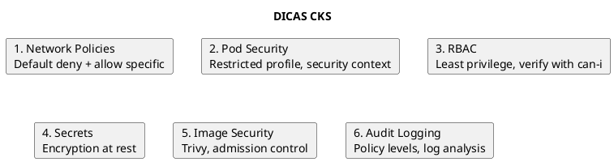

# CKS - Certified Kubernetes Security Specialist

> **Nível**: Specialist | **Formato**: Hands-on (Performance-based)

## Visão Geral do Exame

### Informações do Exame

| Aspecto | Detalhes |
|---------|----------|
| **Duração** | 2 horas |
| **Formato** | Performance-based (hands-on) |
| **Questões** | 15-20 tarefas práticas |
| **Nota mínima** | 67% |
| **Validade** | 2 anos |
| **Retake** | 1 retake gratuito |
| **Proctored** | Sim, online |
| **Pré-requisito** | CKA válido |

### Distribuição do Currículo

```plantuml,format=png
@startuml
skinparam monochrome true
skinparam backgroundColor white

title DOMÍNIOS DO CKS

card "Cluster Setup" as d1 #lightgray
card "Cluster Hardening" as d2 #lightgray
card "System Hardening" as d3 #lightgray
card "Minimize Microservice Vulnerabilities" as d4 #lightgray
card "Supply Chain Security" as d5 #lightgray
card "Monitoring, Logging and Runtime Security" as d6 #lightgray

note right of d1 : 10%
note right of d2 : 15%
note right of d3 : 15%
note right of d4 : 20%
note right of d5 : 20%
note right of d6 : 20%

@enduml
```



---

## Domínio 1: Cluster Setup (10%)

### 1.1 Network Policies

```yaml
{{#include ../assets/network-policy/networkpolicy-default-deny-ingress.yaml}}
```

```yaml
{{#include ../assets/network-policy/networkpolicy-default-deny-egress.yaml}}
```

```yaml
{{#include ../assets/network-policy/networkpolicy-api-policy.yaml}}
```

### 1.2 CIS Benchmark

```bash
# Executar kube-bench
kube-bench run --targets=master
kube-bench run --targets=node
kube-bench run --targets=etcd

# Como Job no cluster
kubectl apply -f https://raw.githubusercontent.com/aquasecurity/kube-bench/main/job.yaml
kubectl logs -l app=kube-bench
```

### 1.3 Ingress com TLS

```bash
# Criar certificado TLS
kubectl create secret tls tls-secret \
  --cert=tls.crt \
  --key=tls.key
```

```yaml
{{#include ../assets/ingress/ingress-secure-ingress.yaml}}
```

### 1.4 Verificar Binários

```bash
# Download binários
curl -LO "https://dl.k8s.io/release/v1.28.0/bin/linux/amd64/kubectl"
curl -LO "https://dl.k8s.io/release/v1.28.0/bin/linux/amd64/kubectl.sha256"

# Verificar checksum
echo "$(cat kubectl.sha256)  kubectl" | sha256sum --check

# Para kubeadm e kubelet
sha256sum /usr/bin/kubeadm
sha256sum /usr/bin/kubelet
sha256sum /usr/bin/kubectl
```

---

## Domínio 2: Cluster Hardening (15%)

### 2.1 RBAC

```yaml
{{#include ../assets/rbac/role-pod-reader-2.yaml}}
```

```yaml
{{#include ../assets/rbac/clusterrole-node-reader.yaml}}
```

```bash
# Verificar permissões
kubectl auth can-i --list
kubectl auth can-i create pods --as system:serviceaccount:default:mysa
kubectl auth can-i '*' '*' --as system:serviceaccount:kube-system:default
```

### 2.2 ServiceAccount Security

```yaml
{{#include ../assets/serviceaccount/serviceaccount-myapp-sa.yaml}}
```

```yaml
{{#include ../assets/pod/pod-secure-pod.yaml}}
```

### 2.3 Restrict API Access

```bash
# Verificar anonymous auth
cat /etc/kubernetes/manifests/kube-apiserver.yaml | grep anonymous

# Desabilitar (no kube-apiserver.yaml)
# --anonymous-auth=false

# Verificar insecure port
cat /etc/kubernetes/manifests/kube-apiserver.yaml | grep insecure
# Deve ser: --insecure-port=0
```

### 2.4 Upgrade do Cluster

```bash
# Verificar versões disponíveis
apt-cache madison kubeadm

# Upgrade control plane
apt-get update
apt-get install -y kubeadm=1.28.0-00
kubeadm upgrade plan
kubeadm upgrade apply v1.28.0

# Upgrade kubelet
apt-get install -y kubelet=1.28.0-00 kubectl=1.28.0-00
systemctl daemon-reload
systemctl restart kubelet
```

---

## Domínio 3: System Hardening (15%)

### 3.1 Minimize Host OS Footprint

```bash
# Verificar serviços desnecessários
systemctl list-units --type=service --state=running

# Desabilitar serviços
systemctl disable <service>
systemctl stop <service>

# Verificar portas abertas
ss -tulnp
netstat -tulnp

# Remover pacotes desnecessários
apt-get autoremove
```

### 3.2 AppArmor

```bash
# Verificar status
aa-status
cat /sys/module/apparmor/parameters/enabled

# Carregar profile
apparmor_parser -r /etc/apparmor.d/profile

# Listar profiles
aa-status | grep profiles
```

```yaml
{{#include ../assets/pod/pod-apparmor-pod.yaml}}
```

### 3.3 Seccomp

```yaml
{{#include ../assets/pod/pod-seccomp-pod.yaml}}
```

```yaml
{{#include ../assets/pod/pod-custom-seccomp.yaml}}
```

### 3.4 Kernel Hardening

```bash
# Verificar parâmetros do kernel
sysctl -a | grep net.ipv4

# Configurações recomendadas
cat >> /etc/sysctl.d/99-kubernetes.conf << EOF
net.ipv4.ip_forward = 1
net.bridge.bridge-nf-call-iptables = 1
net.bridge.bridge-nf-call-ip6tables = 1
EOF

sysctl --system
```

---

## Domínio 4: Minimize Microservice Vulnerabilities (20%)

### 4.1 Pod Security Standards

```yaml
{{#include ../assets/certifications/namespace-production.yaml}}
```

### 4.2 Security Context

```yaml
{{#include ../assets/pod/pod-secure-pod-1.yaml}}
```

### 4.3 Secrets Management

```bash
# Encryption at rest
cat > /etc/kubernetes/enc/enc.yaml << EOF
apiVersion: apiserver.config.k8s.io/v1
kind: EncryptionConfiguration
resources:
  - resources:
      - secrets
    providers:
      - aescbc:
          keys:
            - name: key1
              secret: $(head -c 32 /dev/urandom | base64)
      - identity: {}
EOF

# Configurar no kube-apiserver
# --encryption-provider-config=/etc/kubernetes/enc/enc.yaml
```

```bash
# Verificar se secrets estão criptografados
ETCDCTL_API=3 etcdctl get /registry/secrets/default/mysecret \
  --cacert=/etc/kubernetes/pki/etcd/ca.crt \
  --cert=/etc/kubernetes/pki/etcd/server.crt \
  --key=/etc/kubernetes/pki/etcd/server.key | hexdump -C
```

### 4.4 Runtime Classes (gVisor/Kata)

```yaml
{{#include ../assets/certifications/runtimeclass-gvisor.yaml}}
```

```yaml
{{#include ../assets/pod/pod-sandboxed-pod.yaml}}
```

### 4.5 mTLS com Service Mesh

```yaml
{{#include ../assets/certifications/peerauthentication-default.yaml}}
```

---

## Domínio 5: Supply Chain Security (20%)

### 5.1 Image Scanning

```bash
# Trivy scan
trivy image nginx:latest
trivy image --severity HIGH,CRITICAL nginx:latest

# Scan de configuração
trivy config deployment.yaml

# Scan do cluster
trivy k8s --report summary cluster
```

### 5.2 Image Signing (Cosign)

```bash
# Gerar chave
cosign generate-key-pair

# Assinar imagem
cosign sign --key cosign.key myregistry/myimage:tag

# Verificar assinatura
cosign verify --key cosign.pub myregistry/myimage:tag
```

### 5.3 Admission Controllers

```yaml
{{#include ../assets/certifications/validatingwebhookconfiguration-image-policy.yaml}}
```

### 5.4 OPA/Gatekeeper

```yaml
{{#include ../assets/certifications/constrainttemplate-k8sallowedrepos.yaml}}
```

```yaml
{{#include ../assets/certifications/k8sallowedrepos-allowed-repos.yaml}}
```

### 5.5 Static Analysis

```bash
# kubesec scan
kubesec scan deployment.yaml

# kube-score
kube-score score deployment.yaml

# Conftest (OPA)
conftest test deployment.yaml -p policy/
```

---

## Domínio 6: Monitoring, Logging and Runtime Security (20%)

### 6.1 Audit Logging

```yaml
{{#include ../assets/certifications/policy.yaml}}
```

```yaml
{{#include ../assets/certifications/cks-example-21.yaml}}
```

### 6.2 Falco

```bash
# Instalar Falco
helm repo add falcosecurity https://falcosecurity.github.io/charts
helm install falco falcosecurity/falco

# Ver logs
kubectl logs -l app=falco -n falco

# Regras customizadas
cat > /etc/falco/rules.d/custom.yaml << EOF
- rule: Detect Shell in Container
  desc: Detect shell execution in container
  condition: >
    spawned_process and container and
    shell_procs
  output: >
    Shell executed in container
    (user=%user.name container=%container.name
    shell=%proc.name parent=%proc.pname)
  priority: WARNING
EOF
```

### 6.3 Runtime Security

```bash
# Verificar processos no container
kubectl exec pod-name -- ps aux

# Verificar capabilities
kubectl exec pod-name -- cat /proc/1/status | grep Cap

# Verificar filesystem
kubectl exec pod-name -- mount | grep " / "
```

### 6.4 Immutable Containers

```yaml
{{#include ../assets/pod/pod-immutable-pod.yaml}}
```

### 6.5 Behavioral Analysis

```bash
# Monitorar syscalls
strace -p <pid>

# Monitorar rede
tcpdump -i any port 80

# Verificar conexões
ss -tulnp
netstat -tulnp
```

---

## Comandos Essenciais CKS

### Security Context

```bash
# Ver security context de pods
kubectl get pods -o jsonpath='{range .items[*]}{.metadata.name}{"\t"}{.spec.securityContext}{"\n"}{end}'

# Verificar capabilities
kubectl exec pod-name -- cat /proc/1/status | grep -i cap
```

### Audit e Logs

```bash
# Ver audit logs
tail -f /var/log/kubernetes/audit.log | jq .

# Filtrar por verbo
cat /var/log/kubernetes/audit.log | jq 'select(.verb=="delete")'

# Filtrar por usuário
cat /var/log/kubernetes/audit.log | jq 'select(.user.username=="system:anonymous")'
```

### Image Security

```bash
# Scan com Trivy
trivy image --severity HIGH,CRITICAL nginx:latest

# Verificar assinatura
cosign verify --key cosign.pub myimage:tag
```

---

## Dicas para o Exame



### Checklist Pré-Exame

1. ✅ Network Policies (default deny, allow specific)
2. ✅ Pod Security Standards/Admission
3. ✅ Security Context (runAsNonRoot, drop capabilities)
4. ✅ RBAC (least privilege, can-i)
5. ✅ ServiceAccount security (no automount)
6. ✅ Secrets encryption at rest
7. ✅ AppArmor e Seccomp
8. ✅ Image scanning (Trivy)
9. ✅ Admission controllers (OPA/Gatekeeper)
10. ✅ Audit logging
11. ✅ Falco basics
12. ✅ CIS Benchmark (kube-bench)

### Setup Inicial no Exame

```bash
# Aliases
alias k=kubectl
export do='--dry-run=client -o yaml'

# Verificar contexto
kubectl config get-contexts
kubectl config use-context <context>
```

---

## Referências

### Documentação Oficial
- [Kubernetes Security](https://kubernetes.io/docs/concepts/security/)
- [Pod Security Standards](https://kubernetes.io/docs/concepts/security/pod-security-standards/)
- [CKS Curriculum](https://github.com/cncf/curriculum)

### Arquivos Relacionados
- [Os Quatro Cs](../security/os-quatro-cs.md)
- [RBAC](../security/rbac.md)
- [Network Policy](../security/network-policy.md)
- [Pod Security Admission](../security/pod-security-admission.md)
- [AppArmor](../security/apparmor.md)
- [Seccomp](../security/seccomp.md)
- [Audit](../security/audit.md)
- [Supply Chain Security](../security/supply-chain-security.md)
- [CIS Benchmark](../security/cis-benchmark.md)
- [Threat Model](../security/threat-model.md)
- [Compliance](../security/compliance.md)
