# KCNA - Kubernetes and Cloud Native Associate

## Visão Geral do Exame

### Informações do Exame

| Aspecto | Detalhes |
|---------|----------|
| **Duração** | 90 minutos |
| **Formato** | Múltipla escolha |
| **Questões** | ~60 questões |
| **Nota mínima** | 75% |
| **Validade** | 3 anos |
| **Retake** | 1 retake gratuito |
| **Proctored** | Sim, online |

### Distribuição do Currículo

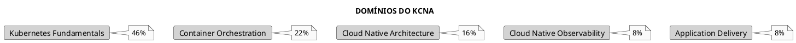

---

## Domínio 1: Kubernetes Fundamentals (46%)

### 1.1 Recursos Kubernetes

#### Pods

```plaintext
Pod = Menor unidade deployável no Kubernetes
    = 1 ou mais containers compartilhando:
      - Network namespace (mesmo IP)
      - Storage (volumes)
      - Lifecycle
```

#### Workloads

| Recurso | Propósito | Casos de Uso |
|---------|-----------|--------------|
| **Deployment** | Apps stateless | Web servers, APIs |
| **StatefulSet** | Apps stateful | Databases, caches |
| **DaemonSet** | 1 pod por node | Logging, monitoring |
| **Job** | Execução única | Migrations, backups |
| **CronJob** | Execução agendada | Reports, cleanup |

#### Services

| Tipo | Descrição |
|------|-----------|
| **ClusterIP** | IP interno do cluster (default) |
| **NodePort** | Expõe em porta do node (30000-32767) |
| **LoadBalancer** | Load balancer externo (cloud) |
| **ExternalName** | Alias DNS para serviço externo |

### 1.2 Arquitetura Kubernetes

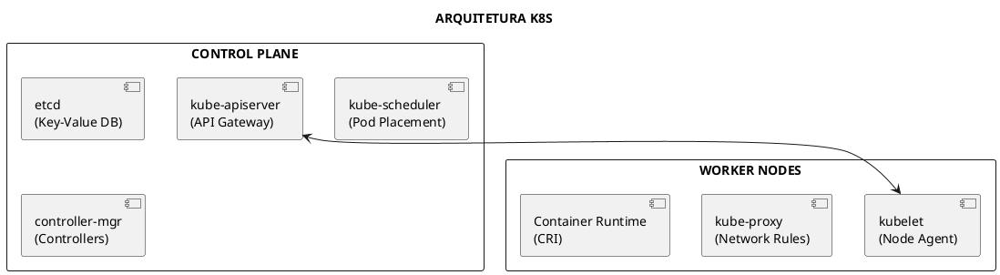

### 1.3 API e Kubectl

```bash
# Formato de recursos
<api-group>/<version>/<resource>

# Exemplos
apps/v1/deployments
v1/pods                    # Core API (sem grupo)
networking.k8s.io/v1/ingresses

# Explorar API
kubectl api-resources      # Listar todos recursos
kubectl api-versions       # Listar versões de API
kubectl explain pod.spec   # Documentação inline
```

### 1.4 RBAC

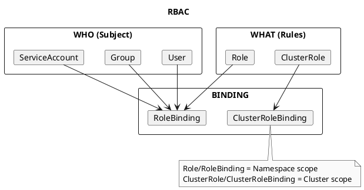

---

## Domínio 2: Container Orchestration (22%)

### 2.1 Conceitos de Containers

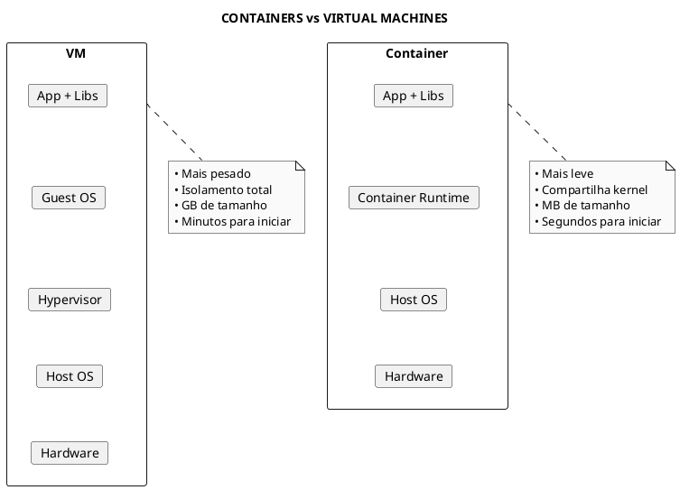

### 2.2 Padrões de Interface (CxI)

| Interface | Descrição | Exemplos |
|-----------|-----------|----------|
| **CRI** | Container Runtime Interface | containerd, CRI-O |
| **CNI** | Container Network Interface | Calico, Cilium, Flannel |
| **CSI** | Container Storage Interface | AWS EBS, GCE PD |
| **SMI** | Service Mesh Interface | Linkerd, Istio |

### 2.3 OCI - Open Container Initiative

```plaintext
OCI define padrões para:

1. Runtime Specification (runtime-spec)
   - Como executar containers
   - runc é a implementação de referência

2. Image Specification (image-spec)
   - Formato de imagens de container
   - Layers, config, manifest

3. Distribution Specification (distribution-spec)
   - Como distribuir imagens
   - Registry API
```

### 2.4 Container Runtimes

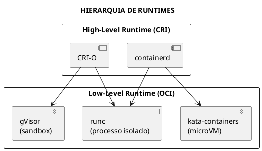

---

## Domínio 3: Cloud Native Architecture (16%)

### 3.1 Características Cloud Native

```plantuml,format=png
@startuml
skinparam monochrome true
skinparam backgroundColor white

title 12-FACTOR APP (Resumo)

card "1. Codebase" as f1
card "2. Dependencies" as f2
card "3. Config" as f3
card "4. Backing Services" as f4
card "5. Build/Release/Run" as f5
card "6. Processes" as f6
card "7. Port Binding" as f7
card "8. Concurrency" as f8
card "9. Disposability" as f9
card "10. Dev/Prod Parity" as f10
card "11. Logs" as f11
card "12. Admin Processes" as f12

note right of f1 : Um repo, múltiplos deploys
note right of f2 : Declarar e isolar dependências
note right of f3 : Configuração via ambiente
note right of f4 : Tratar como recursos anexados
note right of f5 : Separar estágios estritamente
note right of f6 : Executar como processos stateless
note right of f7 : Exportar serviços via porta
note right of f8 : Escalar via modelo de processo
note right of f9 : Maximizar robustez
note right of f10 : Manter ambientes similares
note right of f11 : Tratar como event streams
note right of f12 : Rodar admin tasks como one-offs

@enduml
```

### 3.2 Microservices vs Monolith

| Aspecto | Monolith | Microservices |
|---------|----------|---------------|
| **Deploy** | Tudo junto | Independente |
| **Escala** | Vertical | Horizontal |
| **Tecnologia** | Única stack | Polyglot |
| **Complexidade** | Baixa inicial | Alta inicial |
| **Falhas** | Cascata | Isoladas |

### 3.3 Autoscaling

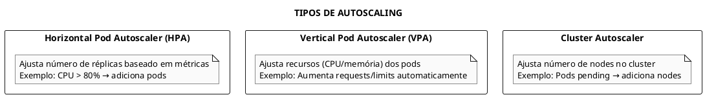

### 3.4 Serverless

```plaintext
Serverless no Kubernetes:

• Knative - Plataforma serverless para K8s
  - Serving: Auto-scaling (inclusive scale-to-zero)
  - Eventing: Event-driven architecture

• OpenFaaS - Functions as a Service
• Kubeless - Funções serverless nativas

Características:
- Scale to zero quando ocioso
- Pay-per-use
- Event-driven
```

---

## Domínio 4: Cloud Native Observability (8%)

### 4.1 Os Três Pilares

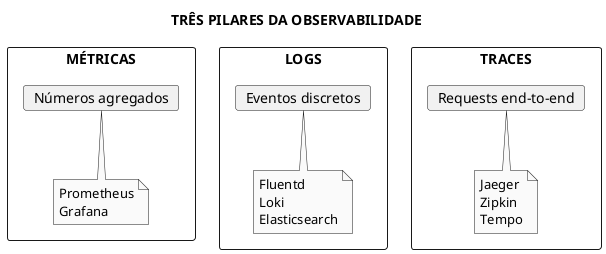

### 4.2 Prometheus

```plaintext
Prometheus (CNCF Graduated):

• Time-series database para métricas
• Pull-based model (scraping)
• PromQL para queries
• AlertManager para alertas

Tipos de métricas:
- Counter: Só incrementa (requests totais)
- Gauge: Pode subir/descer (temperatura)
- Histogram: Distribuição (latência)
- Summary: Similar histogram, calculado client-side
```

### 4.3 OpenTelemetry

```plaintext
OpenTelemetry (CNCF Incubating):

• Padrão unificado para telemetria
• Combina OpenTracing + OpenCensus
• Suporta métricas, logs e traces
• SDKs para múltiplas linguagens
• Collector para processar e exportar dados
```

---

## Domínio 5: Application Delivery (8%)

### 5.1 GitOps

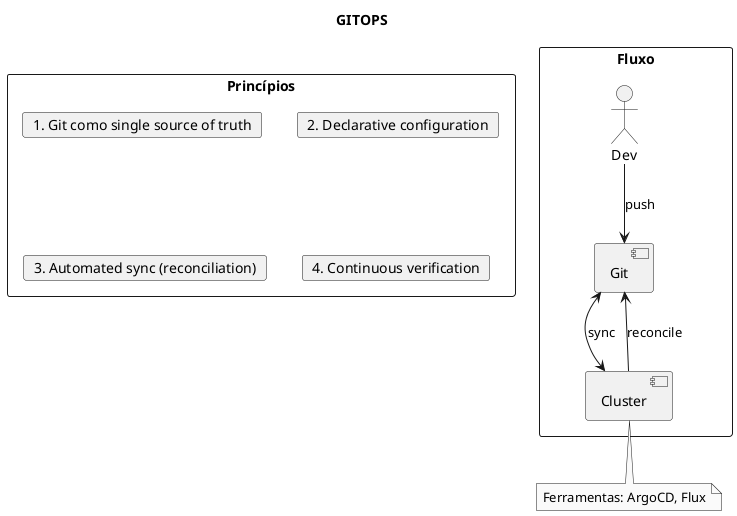

### 5.2 CI/CD

```plaintext
CI (Continuous Integration):
- Build automático
- Testes automáticos
- Merge frequente

CD (Continuous Delivery/Deployment):
- Deploy automatizado para staging
- Deployment: Push automático para produção
- Delivery: Aprovação manual antes de prod

Ferramentas:
- Jenkins, GitHub Actions, GitLab CI
- ArgoCD, Flux (GitOps)
- Tekton (cloud-native CI/CD)
```

### 5.3 Helm e Kustomize

| Ferramenta | Abordagem | Quando Usar |
|------------|-----------|-------------|
| **Helm** | Templates + Values | Apps complexas, charts públicos |
| **Kustomize** | Patches sobre base | Customização simples, nativo kubectl |

---

## CNCF - Cloud Native Computing Foundation

### Estágios de Projetos

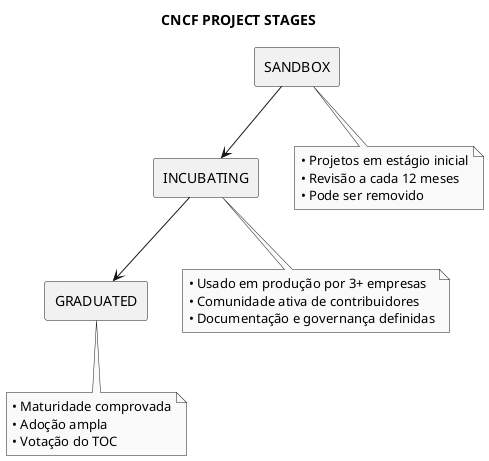

### Projetos Graduated Importantes

| Projeto | Função |
|---------|--------|
| **Kubernetes** | Orquestração de containers |
| **Prometheus** | Monitoramento e alertas |
| **Envoy** | Service proxy |
| **CoreDNS** | DNS para Kubernetes |
| **containerd** | Container runtime |
| **Helm** | Package manager |
| **Jaeger** | Distributed tracing |
| **Fluentd** | Logging |
| **Harbor** | Container registry |
| **etcd** | Key-value store |

---

## Papéis em Cloud Native

### SRE - Site Reliability Engineer

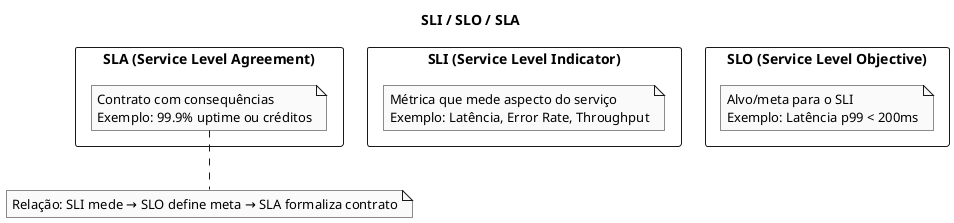

### Outros Papéis

| Papel | Responsabilidade |
|-------|------------------|
| **Cloud Architect** | Design de infraestrutura cloud |
| **DevOps Engineer** | Ciclo de vida completo da aplicação |
| **Platform Engineer** | Plataforma interna de desenvolvimento |
| **Security Engineer** | Segurança em cloud |
| **DevSecOps** | DevOps + Segurança integrada |

---

## Dicas para o Exame

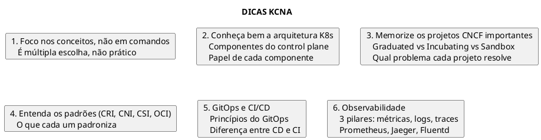

---

## Referências

- [Arquitetura](fundamentals/arquitetura.md)
- [Observabilidade](../observability/observabilidade.md)
- [Helm](../tools/helm.md)
- [Kustomize](../tools/kustomize.md)
- [Containers](fundamentals/containers.md)
- [Docker](fundamentals/docker.md)
