# KCSA - Kubernetes and Cloud Native Security Associate

> **Nível**: Entry-level | **Formato**: Múltipla escolha

## Visão Geral do Exame

### Informações do Exame

| Aspecto | Detalhes |
|---------|----------|
| **Duração** | 90 minutos |
| **Formato** | Múltipla escolha |
| **Questões** | ~60 questões |
| **Nota mínima** | 75% |
| **Validade** | 3 anos |
| **Retake** | 1 retake gratuito |
| **Proctored** | Sim, online |
| **Pré-requisito** | Nenhum (recomenda-se KCNA) |

### Distribuição do Currículo

```plantuml,format=png
@startuml
skinparam monochrome true
skinparam backgroundColor white

title DOMÍNIOS DO KCSA

card "Overview of Cloud Native Security" as d1 #lightgray
card "Kubernetes Cluster Component Security" as d2 #lightgray
card "Kubernetes Security Fundamentals" as d3 #lightgray
card "Kubernetes Threat Model" as d4 #lightgray
card "Platform Security" as d5 #lightgray
card "Compliance and Security Frameworks" as d6 #lightgray

note right of d1 : 14%
note right of d2 : 22%
note right of d3 : 22%
note right of d4 : 16%
note right of d5 : 16%
note right of d6 : 10%

@enduml
```

---

## Domínio 1: Overview of Cloud Native Security (14%)

### Os 4 Cs da Segurança Cloud Native

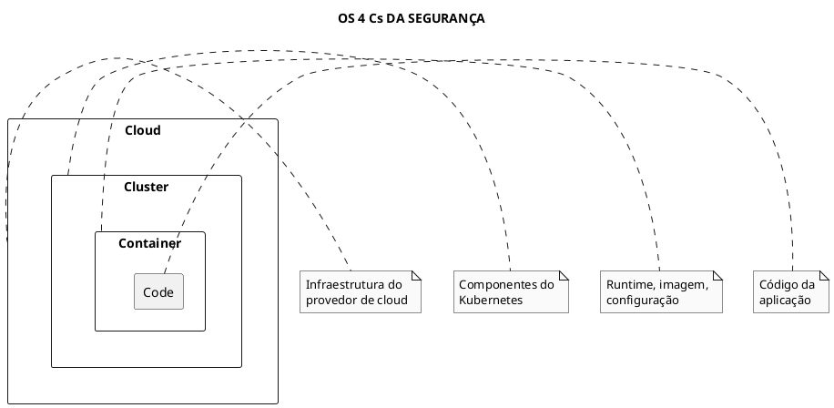

### Responsabilidades por Camada

| Camada | Responsabilidades |
|--------|-------------------|
| **Cloud** | Network security, IAM, encryption at rest |
| **Cluster** | RBAC, Network Policies, Pod Security |
| **Container** | Image scanning, runtime security, least privilege |
| **Code** | Secure coding, dependency scanning, secrets management |

### Modelo de Responsabilidade Compartilhada

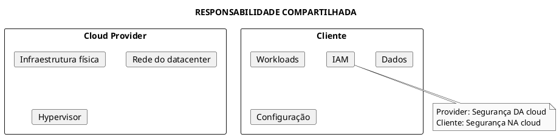

---

## Domínio 2: Kubernetes Cluster Component Security (22%)

### Componentes do Control Plane

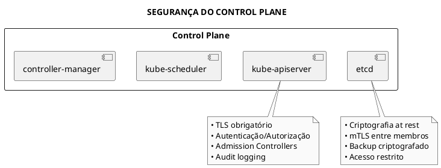

### kube-apiserver Security

| Aspecto | Configuração Segura |
|---------|---------------------|
| **Autenticação** | Certificates, OIDC, ServiceAccount tokens |
| **Autorização** | RBAC (Node, RBAC modes) |
| **Admission** | PodSecurity, validating/mutating webhooks |
| **Audit** | Audit policy habilitado |
| **TLS** | TLS 1.2+ obrigatório |

### etcd Security

```bash
# Verificar criptografia at rest
cat /etc/kubernetes/manifests/kube-apiserver.yaml | grep encryption

# Certificados etcd
ls -la /etc/kubernetes/pki/etcd/

# Verificar acesso ao etcd
etcdctl member list --cacert=/etc/kubernetes/pki/etcd/ca.crt \
  --cert=/etc/kubernetes/pki/etcd/server.crt \
  --key=/etc/kubernetes/pki/etcd/server.key
```

### kubelet Security

| Configuração | Recomendação |
|--------------|--------------|
| **--anonymous-auth** | false |
| **--authorization-mode** | Webhook |
| **--read-only-port** | 0 (desabilitado) |
| **--protect-kernel-defaults** | true |
| **--rotate-certificates** | true |

---

## Domínio 3: Kubernetes Security Fundamentals (22%)

### RBAC - Role-Based Access Control

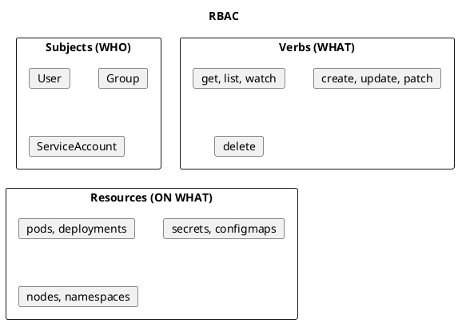

### Tipos de Roles e Bindings

| Tipo | Escopo | Uso |
|------|--------|-----|
| **Role** | Namespace | Permissões em um namespace |
| **ClusterRole** | Cluster | Permissões cluster-wide |
| **RoleBinding** | Namespace | Liga Role/ClusterRole a subjects |
| **ClusterRoleBinding** | Cluster | Liga ClusterRole a subjects |

### Pod Security

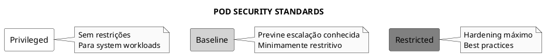

### Pod Security Admission

| Profile | Restrições |
|---------|------------|
| **Privileged** | Nenhuma |
| **Baseline** | Bloqueia hostNetwork, hostPID, privileged containers |
| **Restricted** | Exige runAsNonRoot, drop ALL capabilities, readOnlyRootFilesystem |

### Network Policies

```yaml
{{#include ../assets/network-policy/networkpolicy-deny-all-ingress.yaml}}
```

### Secrets Management

| Prática | Descrição |
|---------|-----------|
| **Encryption at rest** | EncryptionConfiguration no API server |
| **RBAC** | Limitar acesso a secrets |
| **External secrets** | HashiCorp Vault, AWS Secrets Manager |
| **Avoid env vars** | Preferir volume mounts |

---

## Domínio 4: Kubernetes Threat Model (16%)

### STRIDE Model

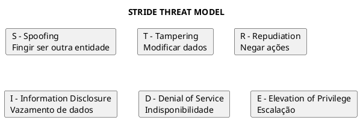

### Ameaças Comuns no Kubernetes

| Ameaça | Mitigação |
|--------|-----------|
| **Container escape** | Seccomp, AppArmor, SELinux |
| **Privilege escalation** | Pod Security, RBAC mínimo |
| **Network sniffing** | mTLS, Network Policies |
| **Secrets exposure** | Encryption, external secrets |
| **Supply chain attack** | Image signing, scanning |
| **DoS** | ResourceQuota, LimitRange |

### Attack Vectors

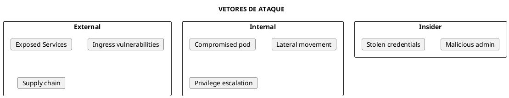

### Kubernetes-Specific Threats

| Componente | Ameaça | Mitigação |
|------------|--------|-----------|
| **API Server** | Unauthorized access | RBAC, audit, network policies |
| **etcd** | Data theft | Encryption, mTLS, backup |
| **kubelet** | Node compromise | Disable anonymous, webhook auth |
| **Pods** | Container escape | Seccomp, AppArmor, restricted |

---

## Domínio 5: Platform Security (16%)

### Supply Chain Security

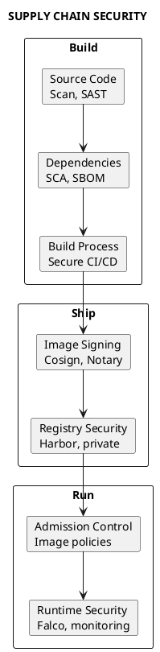

### Image Security

| Prática | Ferramenta/Método |
|---------|-------------------|
| **Base images** | Distroless, Alpine, scratch |
| **Vulnerability scanning** | Trivy, Grype, Clair |
| **Image signing** | Cosign, Notation |
| **SBOM** | Syft, cyclonedx |
| **Admission policies** | OPA/Gatekeeper, Kyverno |

### Runtime Security

| Ferramenta | Função |
|------------|--------|
| **Falco** | Runtime threat detection (CNCF) |
| **Sysdig** | Container security platform |
| **Aqua** | Full lifecycle security |
| **Prisma Cloud** | CNAPP |

### Hardening

```bash
# CIS Benchmark scan
kube-bench run --targets=master,node

# Verificar configurações inseguras
kubectl get pods -A -o jsonpath='{range .items[*]}{.metadata.name}{"\t"}{.spec.containers[*].securityContext}{"\n"}{end}'
```

---

## Domínio 6: Compliance and Security Frameworks (10%)

### Frameworks de Compliance

| Framework | Foco |
|-----------|------|
| **CIS Benchmark** | Configuração segura do Kubernetes |
| **NIST** | Cybersecurity framework |
| **SOC 2** | Trust services criteria |
| **PCI DSS** | Payment card data |
| **HIPAA** | Healthcare data |
| **GDPR** | Data protection (EU) |

### CIS Kubernetes Benchmark

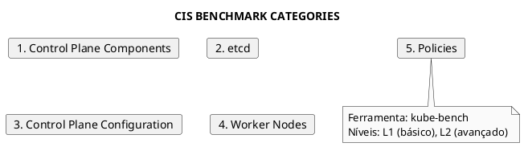

### Audit e Compliance

```yaml
{{#include ../assets/certifications/policy-1.yaml}}
```

### Ferramentas de Compliance

| Ferramenta | Função |
|------------|--------|
| **kube-bench** | CIS Benchmark scanning |
| **kube-hunter** | Penetration testing |
| **Polaris** | Best practices validation |
| **Kubescape** | Security posture |
| **Starboard** | Security reports |

---

## Comparação com Outras Certificações

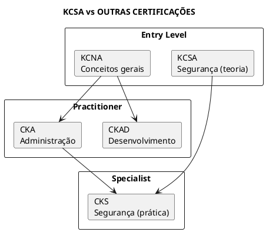

| Aspecto | KCSA | CKS |
|---------|------|-----|
| **Formato** | Múltipla escolha | Hands-on |
| **Dificuldade** | Entry-level | Specialist |
| **Pré-requisito** | Nenhum | CKA |
| **Foco** | Teoria e conceitos | Implementação prática |

---

## Dicas para o Exame

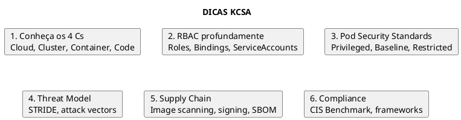

### Conceitos-Chave para Memorizar

| Conceito | Lembrar |
|----------|---------|
| **4 Cs** | Cloud → Cluster → Container → Code |
| **RBAC** | Role + RoleBinding = namespace scope |
| **Pod Security** | Restricted = mais seguro |
| **Network Policy** | Default = allow all |
| **Secrets** | Encryption at rest + RBAC |
| **CIS Benchmark** | kube-bench para validar |

### Tópicos Mais Cobrados

1. **RBAC** - Como funciona, tipos de roles
2. **Pod Security Standards** - Diferenças entre os níveis
3. **Network Policies** - Sintaxe básica, default behavior
4. **Supply Chain** - Image scanning, signing
5. **4 Cs** - Responsabilidades em cada camada
6. **Threat Model** - STRIDE, attack vectors

---

## Referências

### Documentação Oficial
- [Kubernetes Security](https://kubernetes.io/docs/concepts/security/)
- [Pod Security Standards](https://kubernetes.io/docs/concepts/security/pod-security-standards/)
- [RBAC](https://kubernetes.io/docs/reference/access-authn-authz/rbac/)
- [Network Policies](https://kubernetes.io/docs/concepts/services-networking/network-policies/)

### Arquivos Relacionados
- [Os Quatro Cs](../security/os-quatro-cs.md)
- [RBAC](../security/rbac.md)
- [Pod Security Admission](../security/pod-security-admission.md)
- [Network Policy](../security/network-policy.md)
- [Supply Chain Security](../security/supply-chain-security.md)
- [Threat Model](../security/threat-model.md)
- [Compliance](../security/compliance.md)
- [CIS Benchmark](../security/cis-benchmark.md)
