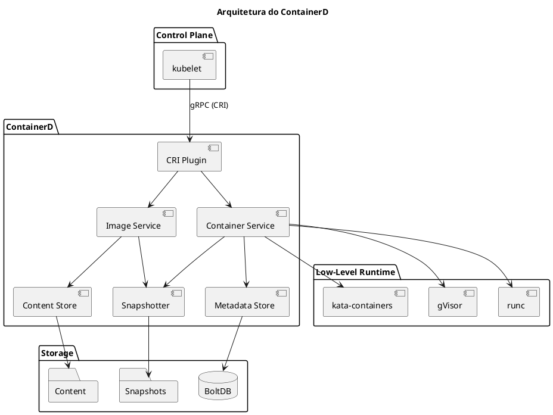
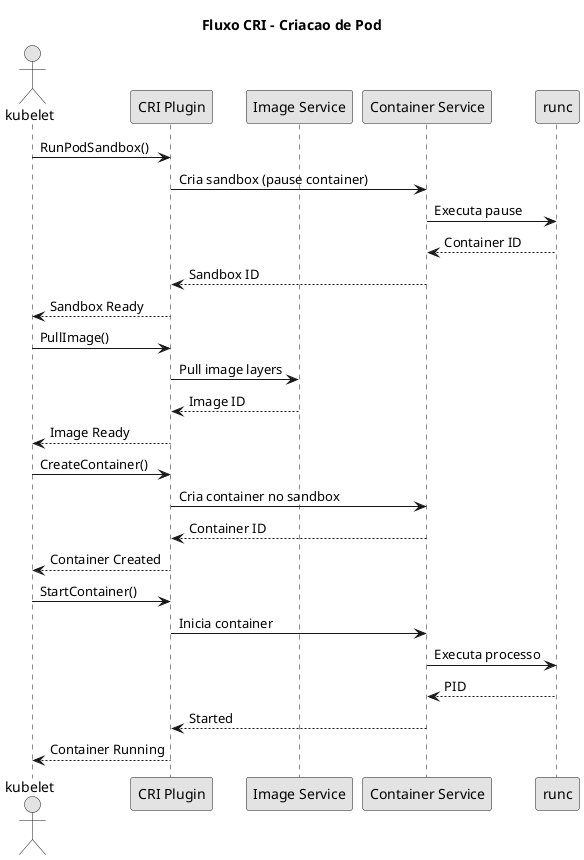
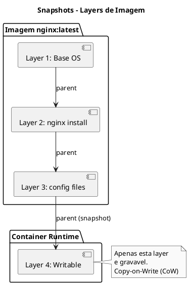

# ContainerD

O **containerd** e um runtime de containers de alto nivel, originalmente parte do Docker, mas agora um projeto independente graduado pela CNCF. E o runtime padrao utilizado pela maioria das distribuicoes Kubernetes modernas.

## Arquitetura do ContainerD

O containerd e projetado como um daemon que gerencia o ciclo de vida completo dos containers, desde o download de imagens ate a execucao e monitoramento.



## Componentes Principais

### CRI Plugin

O **Container Runtime Interface (CRI)** e a interface padrao do Kubernetes para comunicacao com runtimes de containers.



### Namespaces do ContainerD

O containerd usa namespaces para isolar recursos entre diferentes clientes:

| Namespace | Descricao | Cliente |
|-----------|-----------|---------|
| `k8s.io` | Containers gerenciados pelo Kubernetes | kubelet |
| `moby` | Containers Docker (se Docker instalado) | dockerd |
| `default` | Namespace padrao para CLI | ctr |

```admonish warning title="Importante"
Ao usar `crictl` ou `ctr`, certifique-se de especificar o namespace correto para visualizar containers do Kubernetes.
```

## Configuracao do ContainerD

### Arquivo de Configuracao Principal

O arquivo de configuracao padrao fica em `/etc/containerd/config.toml`:

```toml
# /etc/containerd/config.toml
version = 2

[plugins]
  [plugins."io.containerd.grpc.v1.cri"]
    # Sandbox image (pause container)
    sandbox_image = "registry.k8s.io/pause:3.9"

    [plugins."io.containerd.grpc.v1.cri".containerd]
      # Runtime padrao
      default_runtime_name = "runc"

      [plugins."io.containerd.grpc.v1.cri".containerd.runtimes]
        [plugins."io.containerd.grpc.v1.cri".containerd.runtimes.runc]
          runtime_type = "io.containerd.runc.v2"

          [plugins."io.containerd.grpc.v1.cri".containerd.runtimes.runc.options]
            SystemdCgroup = true

    [plugins."io.containerd.grpc.v1.cri".registry]
      [plugins."io.containerd.grpc.v1.cri".registry.mirrors]
        [plugins."io.containerd.grpc.v1.cri".registry.mirrors."docker.io"]
          endpoint = ["https://registry-1.docker.io"]
```

### Configuracao de Registry Privado

```toml
# Configuracao para registry privado com autenticacao
[plugins."io.containerd.grpc.v1.cri".registry]
  [plugins."io.containerd.grpc.v1.cri".registry.configs]
    [plugins."io.containerd.grpc.v1.cri".registry.configs."meu-registry.com".auth]
      username = "usuario"
      password = "senha"
    [plugins."io.containerd.grpc.v1.cri".registry.configs."meu-registry.com".tls]
      insecure_skip_verify = false
      ca_file = "/etc/containerd/certs.d/meu-registry.com/ca.crt"
```

### Configuracao com SystemD Cgroup

```admonish tip title="CKA/CKS Tip"
Para clusters Kubernetes, e **obrigatorio** usar SystemD como cgroup driver quando o kubelet usa SystemD.
```

```toml
[plugins."io.containerd.grpc.v1.cri".containerd.runtimes.runc.options]
  SystemdCgroup = true
```

## Comandos crictl

O `crictl` e a ferramenta CLI padrao para interagir com runtimes CRI-compativeis.

### Configuracao do crictl

```yaml
{{#include ../assets/cluster-components/containerd-example-1.yaml}}
```

### Comandos de Containers

```bash
# Listar todos os containers
crictl ps

# Listar containers incluindo parados
crictl ps -a

# Filtrar por estado
crictl ps --state running
crictl ps --state exited

# Filtrar por pod
crictl ps --pod <pod-id>

# Filtrar por nome
crictl ps --name nginx

# Filtrar por label
crictl ps --label app=web

# Inspecionar container
crictl inspect <container-id>

# Ver logs do container
crictl logs <container-id>
crictl logs -f <container-id>  # follow
crictl logs --tail 100 <container-id>
crictl logs --since 1h <container-id>

# Executar comando no container
crictl exec -it <container-id> /bin/sh

# Parar container
crictl stop <container-id>

# Remover container
crictl rm <container-id>

# Ver estatisticas
crictl stats
crictl stats <container-id>
```

### Comandos de Pods

```bash
# Listar pods
crictl pods

# Listar pods com mais detalhes
crictl pods -v

# Filtrar por namespace
crictl pods --namespace kube-system

# Filtrar por nome
crictl pods --name coredns

# Filtrar por estado
crictl pods --state ready

# Inspecionar pod
crictl inspectp <pod-id>

# Parar pod (para todos containers)
crictl stopp <pod-id>

# Remover pod
crictl rmp <pod-id>
```

### Comandos de Imagens

```bash
# Listar imagens
crictl images

# Listar com digest
crictl images --digests

# Filtrar por repositorio
crictl images nginx

# Pull de imagem
crictl pull nginx:latest
crictl pull --creds usuario:senha meu-registry.com/app:v1

# Inspecionar imagem
crictl inspecti nginx:latest

# Remover imagem
crictl rmi nginx:latest

# Remover imagens nao utilizadas
crictl rmi --prune

# Ver uso de disco
crictl imagefsinfo
```

### Tabela de Equivalencia Docker vs crictl

| Docker | crictl | Descricao |
|--------|--------|-----------|
| `docker ps` | `crictl ps` | Lista containers |
| `docker images` | `crictl images` | Lista imagens |
| `docker pull` | `crictl pull` | Baixa imagem |
| `docker logs` | `crictl logs` | Ve logs |
| `docker exec` | `crictl exec` | Executa comando |
| `docker inspect` | `crictl inspect` | Inspeciona container |
| `docker stop` | `crictl stop` | Para container |
| `docker rm` | `crictl rm` | Remove container |
| N/A | `crictl pods` | Lista pods (CRI) |
| N/A | `crictl inspectp` | Inspeciona pod (CRI) |

## Comandos ctr (ContainerD CLI)

O `ctr` e a ferramenta nativa do containerd para gerenciamento direto:

```bash
# Listar namespaces
ctr namespaces list

# Listar containers no namespace k8s.io
ctr -n k8s.io containers list

# Listar imagens
ctr -n k8s.io images list

# Pull de imagem
ctr -n k8s.io images pull docker.io/library/nginx:latest

# Exportar imagem
ctr -n k8s.io images export nginx.tar docker.io/library/nginx:latest

# Importar imagem
ctr -n k8s.io images import nginx.tar

# Ver tasks (processos em execucao)
ctr -n k8s.io tasks list

# Ver snapshots
ctr -n k8s.io snapshots list
```

## Snapshots e Layers

O containerd usa snapshotters para gerenciar layers de imagens e filesystems de containers.



### Tipos de Snapshotters

| Snapshotter | Descricao | Uso |
|-------------|-----------|-----|
| `overlayfs` | Padrao, mais comum | Producao |
| `native` | Copia completa | Debug |
| `devmapper` | Device mapper thin provisioning | Producao (alternativa) |
| `zfs` | ZFS datasets | Quando usando ZFS |
| `btrfs` | Btrfs subvolumes | Quando usando Btrfs |

```bash
# Ver snapshotter em uso
ctr -n k8s.io plugins list | grep snapshotter

# Listar snapshots
ctr -n k8s.io snapshots list

# Ver detalhes de snapshot
ctr -n k8s.io snapshots info <snapshot-key>

# Ver uso de disco por snapshot
ctr -n k8s.io snapshots usage <snapshot-key>
```

## Troubleshooting

### Verificar Status do Servico

```bash
# Status do servico
systemctl status containerd

# Logs do containerd
journalctl -u containerd -f

# Verificar socket
ls -la /run/containerd/containerd.sock

# Testar conectividade CRI
crictl info
crictl version
```

### Problemas Comuns

#### Container nao inicia

```bash
# Verificar logs do container
crictl logs <container-id>

# Inspecionar eventos do container
crictl inspect <container-id> | jq '.status'

# Verificar se imagem existe
crictl images | grep <image-name>
```

#### Problemas de Rede

```bash
# Verificar CNI plugins
ls -la /opt/cni/bin/

# Verificar configuracao CNI
ls -la /etc/cni/net.d/

# Inspecionar namespace de rede do pod
crictl inspectp <pod-id> | jq '.info.runtimeSpec.linux.namespaces'
```

#### Problemas de Imagem

```bash
# Limpar cache de imagens
crictl rmi --prune

# Verificar espaco em disco
df -h /var/lib/containerd

# Pull forcado de imagem
crictl pull --creds user:pass registry/image:tag
```

#### Verificar Configuracao

```bash
# Gerar configuracao padrao
containerd config default > /etc/containerd/config.toml

# Validar configuracao
containerd config dump

# Ver plugins ativos
ctr plugins list
```

### Logs e Debug

```bash
# Habilitar debug no containerd
# Editar /etc/containerd/config.toml
[debug]
  level = "debug"

# Reiniciar servico
systemctl restart containerd

# Ver logs detalhados
journalctl -u containerd -f --no-pager
```

## Dicas para o Exame

```admonish tip title="CKA/CKS"
1. **Conheca os comandos crictl** - Sao essenciais para troubleshooting
2. **Saiba diferenciar namespaces** - `k8s.io` para Kubernetes, `moby` para Docker
3. **Localizacao dos arquivos**:
   - Config: `/etc/containerd/config.toml`
   - Socket: `/run/containerd/containerd.sock`
   - Data: `/var/lib/containerd`
4. **SystemD Cgroup** - Sempre verificar se esta habilitado para clusters kubeadm
```

## Comandos Rapidos de Referencia

```bash
# === CONTAINERS ===
crictl ps                          # Lista containers rodando
crictl ps -a                       # Lista todos containers
crictl logs -f <id>                # Logs em tempo real
crictl exec -it <id> sh            # Shell no container
crictl stop <id>                   # Para container
crictl rm <id>                     # Remove container

# === PODS ===
crictl pods                        # Lista pods
crictl pods -v                     # Lista pods verbose
crictl inspectp <pod-id>           # Inspeciona pod
crictl stopp <pod-id>              # Para pod
crictl rmp <pod-id>                # Remove pod

# === IMAGENS ===
crictl images                      # Lista imagens
crictl pull <image>                # Baixa imagem
crictl rmi <image>                 # Remove imagem
crictl rmi --prune                 # Remove nao utilizadas

# === DEBUG ===
crictl info                        # Info do runtime
crictl version                     # Versao do runtime
crictl stats                       # Estatisticas
crictl imagefsinfo                 # Info do filesystem
```

## Referencias

- [Documentacao Oficial containerd](https://containerd.io/docs/)
- [GitHub containerd](https://github.com/containerd/containerd)
- [CRI Tools (crictl)](https://github.com/kubernetes-sigs/cri-tools)
- [Kubernetes CRI](https://kubernetes.io/docs/concepts/architecture/cri/)
