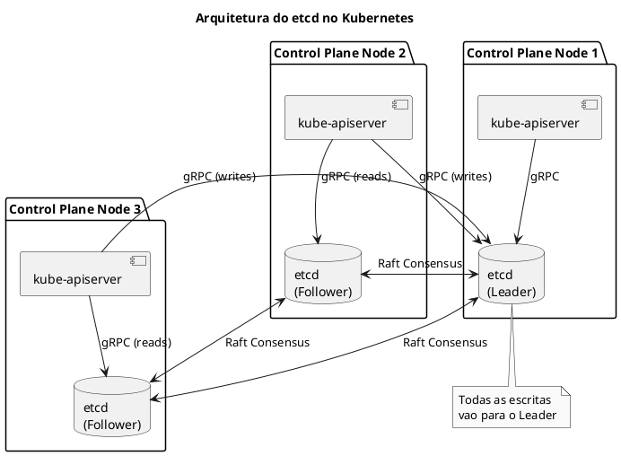
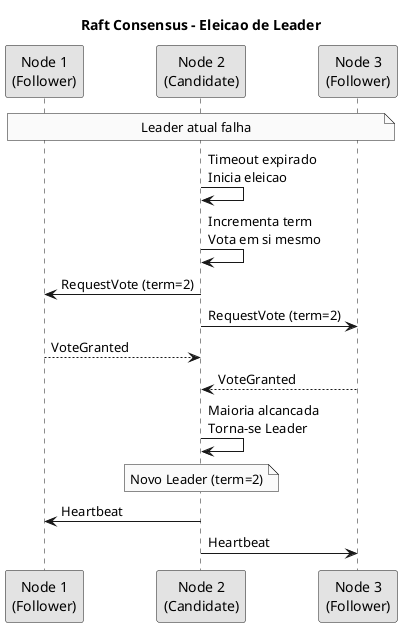
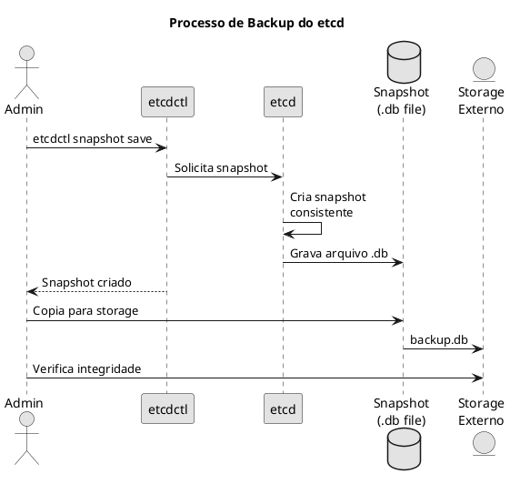
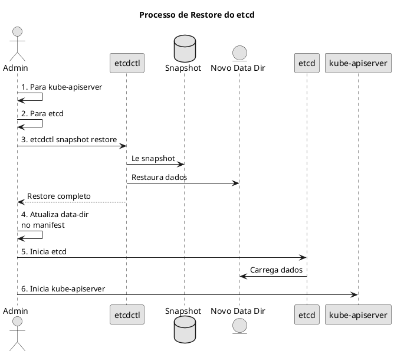

# etcd

O **etcd** e um banco de dados distribuido de chave-valor, altamente disponivel e consistente, que armazena todos os dados de configuracao e estado do cluster Kubernetes.

## Arquitetura do etcd



## Conceitos Fundamentais

### Raft Consensus

O etcd usa o algoritmo Raft para garantir consistencia entre os nos.



### Quorum

O etcd requer quorum (maioria dos nos) para operacoes de escrita:

| Total de Nos | Quorum Necessario | Tolerancia a Falhas |
|--------------|-------------------|---------------------|
| 1 | 1 | 0 |
| 2 | 2 | 0 |
| 3 | 2 | 1 |
| 5 | 3 | 2 |
| 7 | 4 | 3 |

```admonish warning title="Importante"
Sempre use numero impar de nos etcd. Com numero par, nao ha ganho de tolerancia a falhas e pode causar split-brain.
```

### Estrutura de Dados no Kubernetes

O Kubernetes armazena dados no etcd com prefixos especificos:

```
/registry/
├── pods/
│   └── <namespace>/
│       └── <pod-name>
├── deployments/
│   └── <namespace>/
│       └── <deployment-name>
├── services/
│   └── <namespace>/
│       └── <service-name>
├── secrets/
│   └── <namespace>/
│       └── <secret-name>
├── configmaps/
│   └── <namespace>/
│       └── <configmap-name>
├── nodes/
│   └── <node-name>
└── ...
```

## Configuracao do etcd

### Manifest do etcd (Static Pod)

```yaml
{{#include ../assets/pod/pod-etcd.yaml}}
```

### Portas do etcd

| Porta | Protocolo | Descricao |
|-------|-----------|-----------|
| 2379 | HTTPS | Comunicacao com clientes |
| 2380 | HTTPS | Comunicacao entre peers |
| 2381 | HTTP | Metricas e health check |

## Comandos etcdctl

### Configuracao do etcdctl

```bash
# Definir variaveis de ambiente para autenticacao
export ETCDCTL_API=3
export ETCDCTL_ENDPOINTS=https://127.0.0.1:2379
export ETCDCTL_CACERT=/etc/kubernetes/pki/etcd/ca.crt
export ETCDCTL_CERT=/etc/kubernetes/pki/etcd/server.crt
export ETCDCTL_KEY=/etc/kubernetes/pki/etcd/server.key

# Ou passar como argumentos
etcdctl --endpoints=https://127.0.0.1:2379 \
  --cacert=/etc/kubernetes/pki/etcd/ca.crt \
  --cert=/etc/kubernetes/pki/etcd/server.crt \
  --key=/etc/kubernetes/pki/etcd/server.key \
  <comando>
```

### Verificar Saude do Cluster

```bash
# Health check simples
etcdctl endpoint health

# Health check detalhado
etcdctl endpoint health --cluster -w table

# Status dos endpoints
etcdctl endpoint status -w table

# Ver membros do cluster
etcdctl member list -w table
```

### Operacoes de Leitura

```bash
# Listar todas as chaves (limitado)
etcdctl get / --prefix --keys-only --limit=10

# Listar chaves de um tipo especifico
etcdctl get /registry/pods --prefix --keys-only

# Ler valor de uma chave
etcdctl get /registry/pods/default/nginx

# Ler com formatacao JSON
etcdctl get /registry/pods/default/nginx -w json | jq

# Contar chaves
etcdctl get / --prefix --keys-only | wc -l
```

### Operacoes de Escrita (Cuidado!)

```admonish danger title="PERIGO"
Nunca modifique dados do etcd diretamente em producao! Use apenas kubectl ou a API do Kubernetes.
```

```bash
# Apenas para teste/aprendizado
etcdctl put /test/key "valor"
etcdctl get /test/key
etcdctl del /test/key
```

## Backup e Restore

### Backup do etcd



```bash
# Criar snapshot
etcdctl snapshot save /backup/etcd-snapshot.db

# Verificar snapshot
etcdctl snapshot status /backup/etcd-snapshot.db -w table

# Backup com timestamp
TIMESTAMP=$(date +%Y%m%d_%H%M%S)
etcdctl snapshot save /backup/etcd-${TIMESTAMP}.db

# Script de backup completo
ETCD_ENDPOINTS="https://127.0.0.1:2379"
BACKUP_DIR="/backup/etcd"
DATE=$(date +%Y%m%d_%H%M%S)

etcdctl --endpoints=$ETCD_ENDPOINTS \
  --cacert=/etc/kubernetes/pki/etcd/ca.crt \
  --cert=/etc/kubernetes/pki/etcd/server.crt \
  --key=/etc/kubernetes/pki/etcd/server.key \
  snapshot save ${BACKUP_DIR}/etcd-${DATE}.db

# Verificar integridade
etcdctl snapshot status ${BACKUP_DIR}/etcd-${DATE}.db -w table

# Manter apenas ultimos 7 backups
find ${BACKUP_DIR} -name "*.db" -mtime +7 -delete
```

### Restore do etcd



```bash
# 1. Parar kube-apiserver (mover manifest)
mv /etc/kubernetes/manifests/kube-apiserver.yaml /tmp/

# 2. Parar etcd (mover manifest)
mv /etc/kubernetes/manifests/etcd.yaml /tmp/

# 3. Restaurar snapshot
etcdctl snapshot restore /backup/etcd-snapshot.db \
  --data-dir=/var/lib/etcd-restored \
  --name=controlplane \
  --initial-cluster=controlplane=https://192.168.1.10:2380 \
  --initial-cluster-token=etcd-cluster-1 \
  --initial-advertise-peer-urls=https://192.168.1.10:2380

# 4. Atualizar manifest do etcd para usar novo data-dir
# Editar /tmp/etcd.yaml e mudar --data-dir para /var/lib/etcd-restored
# Ou substituir diretorio antigo
rm -rf /var/lib/etcd
mv /var/lib/etcd-restored /var/lib/etcd

# 5. Restaurar manifests
mv /tmp/etcd.yaml /etc/kubernetes/manifests/
mv /tmp/kube-apiserver.yaml /etc/kubernetes/manifests/

# 6. Verificar pods
crictl ps | grep -E "etcd|apiserver"
kubectl get pods -n kube-system
```

### Restore em Cluster HA

```bash
# Em cada no do etcd, restaurar com configuracao do cluster
# No 1:
etcdctl snapshot restore /backup/snapshot.db \
  --data-dir=/var/lib/etcd-restored \
  --name=etcd-1 \
  --initial-cluster=etcd-1=https://10.0.0.1:2380,etcd-2=https://10.0.0.2:2380,etcd-3=https://10.0.0.3:2380 \
  --initial-cluster-token=etcd-cluster-1 \
  --initial-advertise-peer-urls=https://10.0.0.1:2380

# No 2:
etcdctl snapshot restore /backup/snapshot.db \
  --data-dir=/var/lib/etcd-restored \
  --name=etcd-2 \
  --initial-cluster=etcd-1=https://10.0.0.1:2380,etcd-2=https://10.0.0.2:2380,etcd-3=https://10.0.0.3:2380 \
  --initial-cluster-token=etcd-cluster-1 \
  --initial-advertise-peer-urls=https://10.0.0.2:2380

# No 3:
etcdctl snapshot restore /backup/snapshot.db \
  --data-dir=/var/lib/etcd-restored \
  --name=etcd-3 \
  --initial-cluster=etcd-1=https://10.0.0.1:2380,etcd-2=https://10.0.0.2:2380,etcd-3=https://10.0.0.3:2380 \
  --initial-cluster-token=etcd-cluster-1 \
  --initial-advertise-peer-urls=https://10.0.0.3:2380
```

## Compaction e Defragmentacao

### Compaction

O etcd mantem historico de revisoes. Compaction remove revisoes antigas:

```bash
# Ver revisao atual
etcdctl endpoint status -w table

# Compactar ate revisao especifica
etcdctl compact <revision>

# Compactar revisoes antigas (manter ultima hora)
# Usar auto-compaction no manifest e melhor pratica
```

### Defragmentacao

Apos compaction, o espaco nao e liberado automaticamente:

```bash
# Defragmentar membro local
etcdctl defrag

# Defragmentar todos os membros
etcdctl defrag --cluster

# Verificar tamanho do banco
etcdctl endpoint status -w table
# Coluna DB SIZE mostra tamanho atual
```

```admonish warning title="Atencao"
A defragmentacao bloqueia o membro do etcd temporariamente. Em clusters HA, execute um membro por vez.
```

## Clustering

### Adicionar Novo Membro

```bash
# 1. Adicionar membro ao cluster existente
etcdctl member add etcd-4 --peer-urls=https://10.0.0.4:2380

# 2. No novo no, iniciar etcd com initial-cluster-state=existing
etcd --name=etcd-4 \
  --initial-cluster=etcd-1=https://10.0.0.1:2380,etcd-2=https://10.0.0.2:2380,etcd-3=https://10.0.0.3:2380,etcd-4=https://10.0.0.4:2380 \
  --initial-cluster-state=existing \
  --initial-advertise-peer-urls=https://10.0.0.4:2380 \
  ...
```

### Remover Membro

```bash
# Listar membros
etcdctl member list -w table

# Remover membro pelo ID
etcdctl member remove <member-id>
```

### Trocar Membro com Falha

```bash
# 1. Remover membro com falha
etcdctl member remove <failed-member-id>

# 2. Adicionar novo membro
etcdctl member add etcd-new --peer-urls=https://10.0.0.5:2380

# 3. Iniciar novo membro com --initial-cluster-state=existing
```

## Seguranca

### Certificados TLS

```bash
# Verificar certificados do etcd
openssl x509 -in /etc/kubernetes/pki/etcd/server.crt -text -noout

# Ver validade
openssl x509 -in /etc/kubernetes/pki/etcd/server.crt -noout -dates

# Verificar CA
openssl x509 -in /etc/kubernetes/pki/etcd/ca.crt -text -noout
```

### Encriptacao de Secrets

O etcd armazena Secrets em base64 por padrao. Para encriptacao em repouso:

```yaml
{{#include ../assets/cluster-components/encryptionconfiguration-key1.yaml}}
```

```bash
# Adicionar ao kube-apiserver
--encryption-provider-config=/etc/kubernetes/enc/encryption-config.yaml
```

## Troubleshooting

### Verificar Health

```bash
# Health de todos endpoints
etcdctl endpoint health --cluster -w table

# Status detalhado
etcdctl endpoint status --cluster -w table

# Ver alarmes
etcdctl alarm list

# Limpar alarmes (apos resolver problema)
etcdctl alarm disarm
```

### Problemas Comuns

#### Cluster sem quorum

```bash
# Verificar membros
etcdctl member list

# Se apenas 1 no sobrou, forcar como unico membro
etcd --force-new-cluster ...
```

#### Espaco em disco cheio

```bash
# Verificar tamanho
etcdctl endpoint status -w table

# Compactar
CURRENT_REV=$(etcdctl endpoint status -w json | jq '.[0].Status.header.revision')
etcdctl compact $CURRENT_REV

# Defragmentar
etcdctl defrag --cluster

# Limpar alarme
etcdctl alarm disarm
```

#### Latencia alta

```bash
# Verificar metricas
curl -s http://127.0.0.1:2381/metrics | grep etcd_disk

# Metricas importantes:
# - etcd_disk_wal_fsync_duration_seconds
# - etcd_disk_backend_commit_duration_seconds
# - etcd_server_slow_apply_total
```

### Logs

```bash
# Ver logs do etcd (pod)
kubectl logs -n kube-system etcd-controlplane

# Ver logs do etcd (systemd)
journalctl -u etcd -f

# Ver logs do container
crictl logs <etcd-container-id>
```

## Dicas para o Exame

```admonish tip title="CKA/CKS"
1. **Backup e Restore sao MUITO cobrados no CKA**
2. **Memorize os caminhos dos certificados**:
   - CA: `/etc/kubernetes/pki/etcd/ca.crt`
   - Server: `/etc/kubernetes/pki/etcd/server.crt` e `.key`
   - Peer: `/etc/kubernetes/pki/etcd/peer.crt` e `.key`
3. **Memorize as variaveis de ambiente do etcdctl**
4. **Saiba a diferenca entre backup e restore em cluster HA**
5. **Data directory padrao**: `/var/lib/etcd`
6. **Sempre verifique o snapshot apos criar**: `etcdctl snapshot status`
```

## Comandos Rapidos de Referencia

```bash
# === VARIAVEIS DE AMBIENTE ===
export ETCDCTL_API=3
export ETCDCTL_ENDPOINTS=https://127.0.0.1:2379
export ETCDCTL_CACERT=/etc/kubernetes/pki/etcd/ca.crt
export ETCDCTL_CERT=/etc/kubernetes/pki/etcd/server.crt
export ETCDCTL_KEY=/etc/kubernetes/pki/etcd/server.key

# === HEALTH ===
etcdctl endpoint health
etcdctl endpoint status -w table
etcdctl member list -w table

# === BACKUP ===
etcdctl snapshot save /backup/snapshot.db
etcdctl snapshot status /backup/snapshot.db -w table

# === RESTORE ===
etcdctl snapshot restore /backup/snapshot.db \
  --data-dir=/var/lib/etcd-restored

# === LEITURA ===
etcdctl get / --prefix --keys-only --limit=10
etcdctl get /registry/pods --prefix --keys-only

# === MANUTENCAO ===
etcdctl defrag --cluster
etcdctl alarm list
etcdctl alarm disarm
```

## Referencias

- [Documentacao Oficial etcd](https://etcd.io/docs/)
- [Operating etcd clusters for Kubernetes](https://kubernetes.io/docs/tasks/administer-cluster/configure-upgrade-etcd/)
- [Backing up an etcd cluster](https://kubernetes.io/docs/tasks/administer-cluster/configure-upgrade-etcd/#backing-up-an-etcd-cluster)
- [etcd Disaster Recovery](https://etcd.io/docs/v3.5/op-guide/recovery/)
