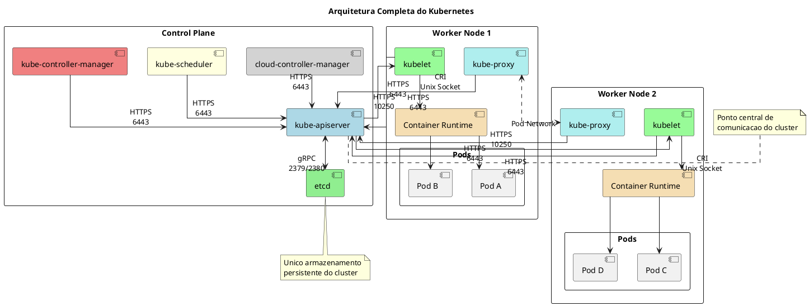
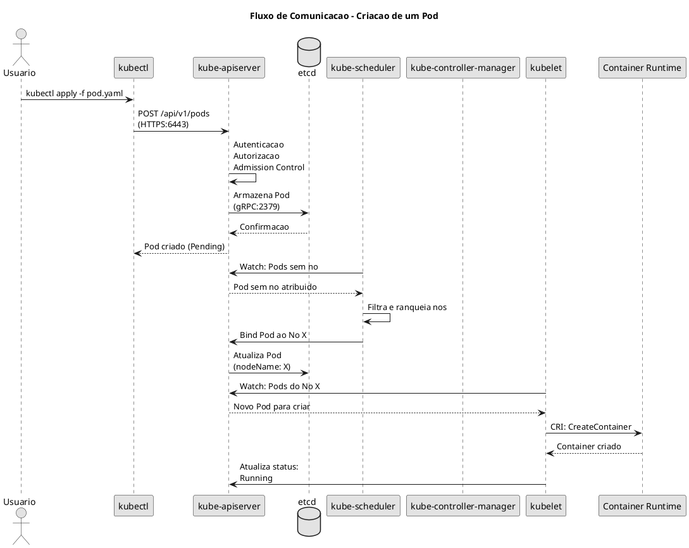

# Componentes dos Nos Kubernetes

O Kubernetes e composto por diversos componentes que trabalham juntos para orquestrar containers. Esses componentes são divididos em dois grupos principais: **Control Plane** (painel de controle) e **Worker Nodes** (nós de trabalho).

## Visão Geral da Arquitetura

O cluster Kubernetes segue uma arquitetura master-worker onde:

- **Control Plane**: Responsavel por tomar decisoes globais sobre o cluster e detectar/responder a eventos
- **Worker Nodes**: Executam as aplicacoes containerizadas e reportam o status ao Control Plane

```admonish info title="Importante para o Exame"
Entender a funcao de cada componente e como eles se comunicam e essencial para as certificacoes CKA e KCNA. Questoes frequentes envolvem identificar qual componente e responsavel por determinada funcao.
```

## Diagrama da Arquitetura



## Componentes do Control Plane

O Control Plane e responsavel por manter o estado desejado do cluster. Em ambientes de producao, geralmente executa em multiplos nos para alta disponibilidade.

### kube-apiserver

O **kube-apiserver** e o componente central do Kubernetes que expoe a API REST. Todos os outros componentes se comunicam atraves dele.

| Caracteristica | Valor |
|----------------|-------|
| Porta padrao | 6443 (HTTPS) |
| Protocolo | REST/gRPC |
| Arquivo de configuracao (kubeadm) | `/etc/kubernetes/manifests/kube-apiserver.yaml` |
| Arquivo de configuracao (manual) | `/etc/systemd/system/kube-apiserver.service` |

**Funcoes principais:**
- Autenticacao e autorizacao de requisicoes
- Validacao de objetos da API
- Unico componente que se comunica diretamente com o etcd
- Gateway para todas as operacoes do cluster

```admonish tip title="Dica para o Exame"
Quando usar `kubectl`, voce esta interagindo diretamente com o kube-apiserver. Problemas de conectividade com a API geralmente indicam problemas no apiserver ou na rede.
```

[Saiba mais sobre o kube-apiserver](./kube-apiserver.md)

---

### etcd

O **etcd** e o banco de dados distribuido que armazena todo o estado do cluster em formato chave-valor.

| Caracteristica | Valor |
|----------------|-------|
| Porta cliente | 2379 |
| Porta peer | 2380 |
| Ferramenta CLI | `etcdctl` |
| Localizacao dos dados | `/var/lib/etcd` |

**Funcoes principais:**
- Armazenamento persistente de todos os recursos do cluster
- Suporte a replicacao para alta disponibilidade
- Watch API para notificar mudancas em tempo real

```admonish warning title="Critico"
O backup do etcd e essencial para recuperacao de desastres. Sem ele, todos os dados do cluster sao perdidos.
```

[Saiba mais sobre o etcd](./etcd)

---

### kube-scheduler

O **kube-scheduler** decide em qual no um Pod deve ser executado, baseado em diversos fatores.

| Caracteristica | Valor |
|----------------|-------|
| Porta | 10259 (HTTPS) |
| Arquivo de configuracao (kubeadm) | `/etc/kubernetes/manifests/kube-scheduler.yaml` |
| Arquivo de configuracao (manual) | `/etc/systemd/system/kube-scheduler.service` |

**Funcoes principais:**
- Observa Pods sem no atribuido
- Avalia requisitos de recursos (CPU, memoria)
- Considera afinidade, anti-afinidade, taints e tolerations
- Ranqueia nos e seleciona o mais adequado

```admonish note title="Importante"
O scheduler apenas DECIDE onde o Pod vai rodar. Quem efetivamente CRIA o container e o kubelet.
```

[Saiba mais sobre o kube-scheduler](./kube-scheduler.md)

---

### kube-controller-manager

O **kube-controller-manager** executa os controladores que monitoram o estado do cluster e tomam acoes corretivas.

| Caracteristica | Valor |
|----------------|-------|
| Porta | 10257 (HTTPS) |
| Arquivo de configuracao (kubeadm) | `/etc/kubernetes/manifests/kube-controller-manager.yaml` |
| Arquivo de configuracao (manual) | `/etc/systemd/system/kube-controller-manager.service` |

**Principais controladores incluidos:**
- **Node Controller**: Monitora nos (heartbeat a cada 5s, grace period 40s, eviction 5min)
- **Replication Controller**: Garante o numero correto de replicas
- **Endpoints Controller**: Popula objetos Endpoints
- **Service Account Controller**: Cria contas padrao para novos namespaces

[Saiba mais sobre o kube-controller-manager](./kube-controller-manager.md)

---

### cloud-controller-manager

O **cloud-controller-manager** integra o Kubernetes com APIs de provedores de nuvem (AWS, GCP, Azure).

**Funcoes principais:**
- Node Controller (cloud): Verifica se nos foram deletados na nuvem
- Route Controller: Configura rotas na infraestrutura de nuvem
- Service Controller: Cria/atualiza load balancers

```admonish info
Este componente so existe em clusters gerenciados por provedores de nuvem. Em clusters on-premises, ele nao e necessario.
```

---

## Componentes dos Worker Nodes

Os Worker Nodes sao as maquinas que executam as cargas de trabalho containerizadas.

### kubelet

O **kubelet** e o agente que roda em cada Worker Node, responsavel por gerenciar os containers.

| Caracteristica | Valor |
|----------------|-------|
| Porta API (full) | 10250 (HTTPS) |
| Porta read-only | 10255 (HTTP) - desabilitada por padrao |
| Arquivo de configuracao | `/var/lib/kubelet/config.yaml` |
| Servico systemd | `kubelet.service` |

**Funcoes principais:**
- Registra o no no cluster
- Recebe especificacoes de Pods (PodSpecs) do apiserver
- Interage com o Container Runtime via CRI
- Monitora a saude dos containers e reporta ao apiserver
- Executa probes (liveness, readiness, startup)

```admonish warning title="Atencao"
O kubelet NAO e instalado pelo kubeadm. Ele deve ser instalado manualmente em cada no antes de executar `kubeadm join`.
```

[Saiba mais sobre o kubelet](./kubelet.md)

---

### kube-proxy

O **kube-proxy** mantem as regras de rede em cada no, permitindo a comunicacao com os Pods.

| Caracteristica | Valor |
|----------------|-------|
| Porta metricas | 10249 |
| Porta health | 10256 |
| Modo padrao | iptables |

**Funcoes principais:**
- Mantem regras de rede (iptables/IPVS)
- Implementa Services (ClusterIP, NodePort, LoadBalancer)
- Garante que cada Pod pode se comunicar com qualquer outro Pod

**Modos de operacao:**
- `iptables`: Modo padrao, usa regras iptables
- `ipvs`: Melhor performance para muitos Services
- `userspace`: Modo legado, nao recomendado

```admonish tip
O kube-proxy roda como DaemonSet, garantindo que existe uma instancia em cada no do cluster.
```

[Saiba mais sobre o kube-proxy](./kube-proxy.md)

---

### Container Runtime

O **Container Runtime** e responsavel por executar os containers. O Kubernetes suporta qualquer runtime compativel com CRI (Container Runtime Interface).

**Runtimes suportados:**
- **containerd**: Runtime padrao, doado para CNCF
- **CRI-O**: Desenvolvido especificamente para Kubernetes
- **Docker**: Via cri-dockerd (dockershim foi removido no k8s 1.24)

| Caracteristica | Valor |
|----------------|-------|
| Socket (containerd) | `unix:///run/containerd/containerd.sock` |
| Socket (CRI-O) | `unix:///var/run/crio/crio.sock` |
| Ferramenta CLI | `crictl` |

[Saiba mais sobre ContainerD](./containerd)

---

## Comunicacao entre Componentes



### Tabela de Comunicacao

| Origem | Destino | Porta | Protocolo | Descricao |
|--------|---------|-------|-----------|-----------|
| kubectl | apiserver | 6443 | HTTPS | Comandos do usuario |
| apiserver | etcd | 2379 | gRPC | Leitura/escrita de estado |
| etcd | etcd | 2380 | gRPC | Replicacao entre peers |
| scheduler | apiserver | 6443 | HTTPS | Bind de Pods |
| controller-manager | apiserver | 6443 | HTTPS | Reconciliacao de estado |
| kubelet | apiserver | 6443 | HTTPS | Watch e status updates |
| apiserver | kubelet | 10250 | HTTPS | Logs, exec, port-forward |
| kube-proxy | apiserver | 6443 | HTTPS | Watch Services/Endpoints |

---

## Portas e Protocolos

### Control Plane

| Componente | Porta | Protocolo | Uso |
|------------|-------|-----------|-----|
| kube-apiserver | 6443 | HTTPS | API do Kubernetes |
| etcd | 2379 | gRPC | Clientes etcd |
| etcd | 2380 | gRPC | Comunicacao peer-to-peer |
| kube-scheduler | 10259 | HTTPS | Metricas e health check |
| kube-controller-manager | 10257 | HTTPS | Metricas e health check |

### Worker Nodes

| Componente | Porta | Protocolo | Uso |
|------------|-------|-----------|-----|
| kubelet | 10250 | HTTPS | API do kubelet |
| kubelet | 10255 | HTTP | Read-only (desabilitado) |
| kube-proxy | 10249 | HTTP | Metricas |
| kube-proxy | 10256 | HTTP | Health check |
| NodePort Services | 30000-32767 | TCP/UDP | Servicos expostos |

---

## Comandos para Verificar Status

### Verificar Componentes do Control Plane

```bash
# Ver status dos pods do control plane
kubectl get pods -n kube-system

# Ver status detalhado dos componentes
kubectl get componentstatuses  # Deprecado, mas ainda funciona

# Ver eventos do kube-system
kubectl get events -n kube-system --sort-by='.lastTimestamp'

# Ver logs do apiserver (kubeadm)
kubectl logs -n kube-system kube-apiserver-<node-name>

# Ver logs do scheduler
kubectl logs -n kube-system kube-scheduler-<node-name>

# Ver logs do controller-manager
kubectl logs -n kube-system kube-controller-manager-<node-name>
```

### Verificar Componentes dos Worker Nodes

```bash
# Ver status dos nos
kubectl get nodes -o wide

# Ver detalhes de um no especifico
kubectl describe node <node-name>

# Ver status do kubelet
systemctl status kubelet

# Ver logs do kubelet
journalctl -u kubelet -f

# Ver configuracao do kubelet
kubectl get cm -n kube-system kubelet-config -o yaml
```

### Verificar etcd

```bash
# Ver membros do cluster etcd
kubectl exec -n kube-system etcd-<node> -- etcdctl \
  --cacert=/etc/kubernetes/pki/etcd/ca.crt \
  --cert=/etc/kubernetes/pki/etcd/server.crt \
  --key=/etc/kubernetes/pki/etcd/server.key \
  member list -w table

# Ver health do etcd
kubectl exec -n kube-system etcd-<node> -- etcdctl \
  --cacert=/etc/kubernetes/pki/etcd/ca.crt \
  --cert=/etc/kubernetes/pki/etcd/server.crt \
  --key=/etc/kubernetes/pki/etcd/server.key \
  endpoint health
```

### Verificar kube-proxy

```bash
# Ver modo do kube-proxy
kubectl get cm -n kube-system kube-proxy -o yaml | grep mode

# Ver regras iptables criadas
sudo iptables -t nat -L KUBE-SERVICES -n

# Ver logs do kube-proxy
kubectl logs -n kube-system -l k8s-app=kube-proxy
```

---

## Troubleshooting

### Problemas Comuns

```admonish bug title="kubelet nao inicia"
**Sintomas**: No nao aparece no cluster ou fica NotReady

**Verificar**:
1. `systemctl status kubelet`
2. `journalctl -u kubelet -f`
3. Verificar se o container runtime esta rodando
4. Verificar certificados em `/var/lib/kubelet/pki/`
```

```admonish bug title="apiserver inacessivel"
**Sintomas**: kubectl retorna "connection refused"

**Verificar**:
1. `kubectl get pods -n kube-system | grep apiserver`
2. Verificar manifesto em `/etc/kubernetes/manifests/kube-apiserver.yaml`
3. Verificar certificados em `/etc/kubernetes/pki/`
4. Verificar se a porta 6443 esta aberta
```

```admonish bug title="scheduler nao agenda Pods"
**Sintomas**: Pods ficam em Pending indefinidamente

**Verificar**:
1. `kubectl describe pod <pod>` - ver eventos
2. Verificar se ha nos disponiveis com recursos suficientes
3. Verificar taints e tolerations
4. Verificar logs do scheduler
```

---

## Dicas para o Exame

```admonish success title="CKA - Dicas"
1. Saiba identificar onde cada componente armazena sua configuracao
2. Pratique troubleshooting de componentes do control plane
3. Conheca os comandos para verificar logs de cada componente
4. Entenda o fluxo de criacao de um Pod do inicio ao fim
5. Saiba fazer backup e restore do etcd
```

```admonish success title="KCNA - Dicas"
1. Foque em entender a funcao de cada componente
2. Saiba diferenciar componentes do Control Plane vs Worker Node
3. Entenda por que o apiserver e o componente central
4. Conheca os diferentes Container Runtimes suportados
```

---

## Referencias

- [Kubernetes Components - Documentacao Oficial](https://kubernetes.io/docs/concepts/overview/components/)
- [Cluster Architecture - Kubernetes](https://kubernetes.io/docs/concepts/architecture/)
- [etcd Documentation](https://etcd.io/docs/)
- [Container Runtime Interface (CRI)](https://kubernetes.io/docs/concepts/architecture/cri/)
- [kubelet Configuration](https://kubernetes.io/docs/reference/config-api/kubelet-config.v1beta1/)
- [kube-proxy Modes](https://kubernetes.io/docs/reference/networking/virtual-ips/)
