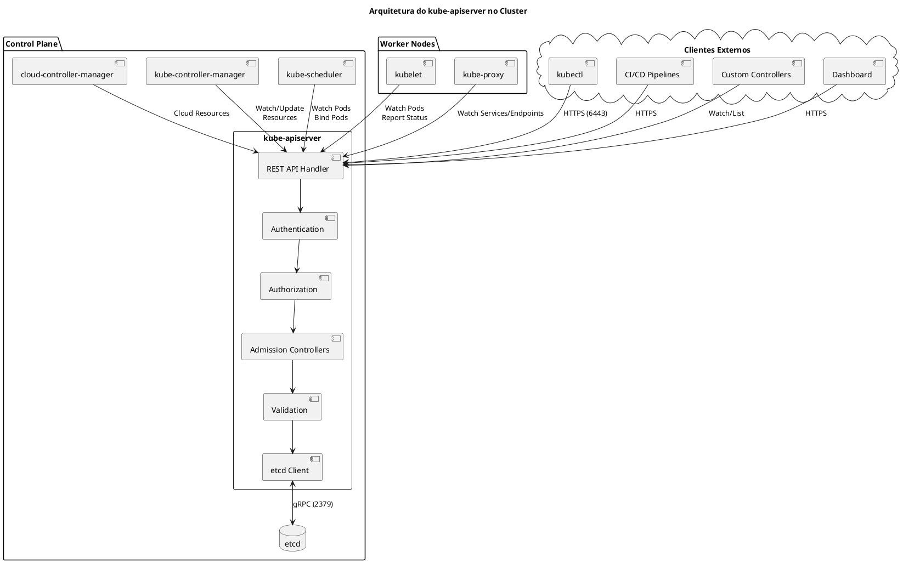
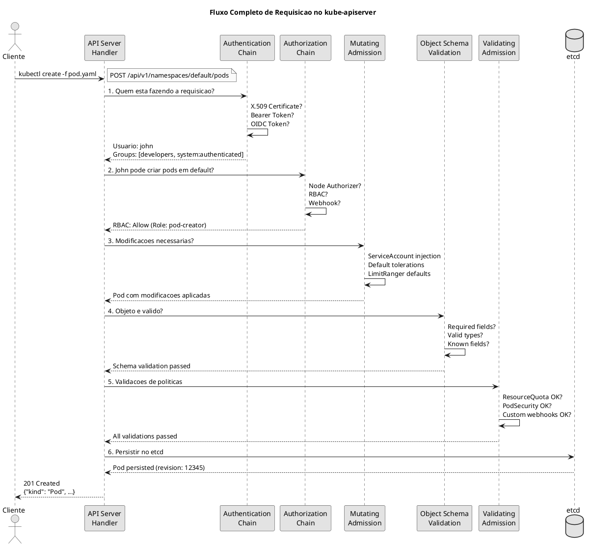
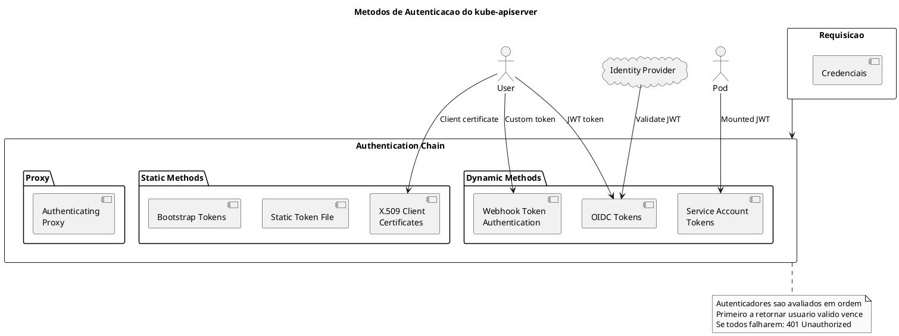
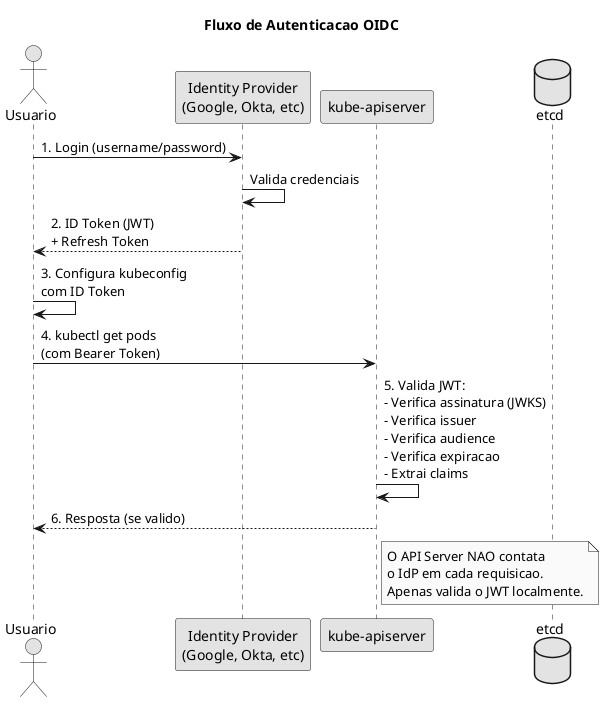
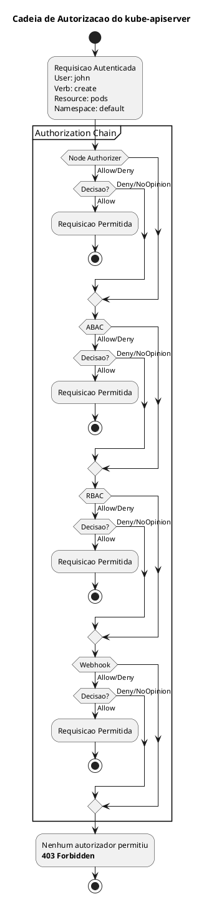
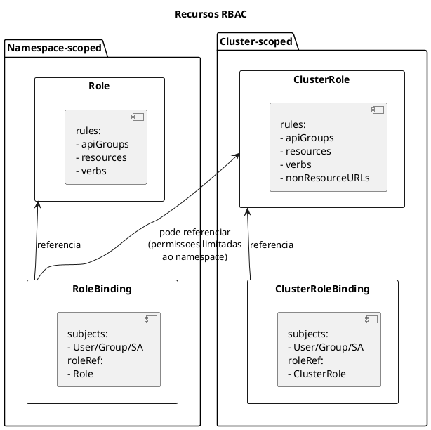
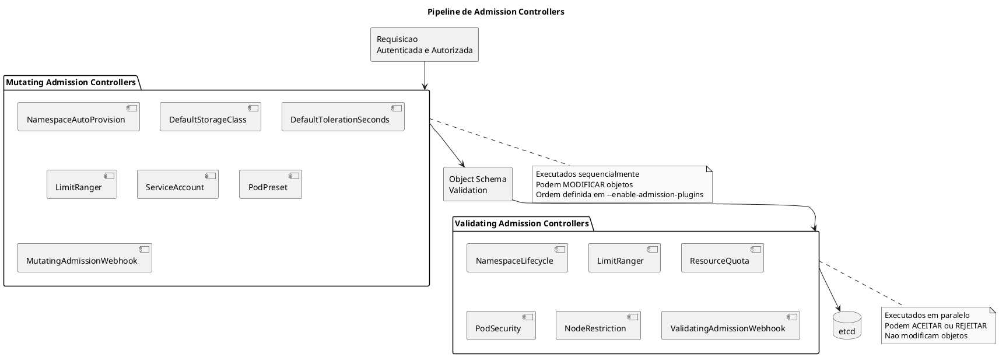

# kube-apiserver

O **kube-apiserver** e o componente central do control plane do Kubernetes. Ele expoe a API do Kubernetes e serve como o unico ponto de entrada para todas as operacoes administrativas do cluster. Todos os outros componentes interagem com o cluster atraves do API Server.

## O que e o API Server

O kube-apiserver e responsavel por:

- **Expor a API REST** do Kubernetes para clientes internos e externos
- **Validar e configurar** dados para objetos da API (Pods, Services, etc.)
- **Persistir o estado** no etcd (unico componente com acesso direto ao etcd)
- **Autenticar e autorizar** todas as requisicoes
- **Servir como hub central** de comunicacao entre todos os componentes do cluster
- **Implementar admission control** para modificar e validar objetos
- **Servir a API de descoberta** para clientes saberem quais recursos estao disponiveis

```admonish info title="Ponto Central"
O kube-apiserver e o UNICO componente que se comunica diretamente com o etcd. Todos os outros componentes (scheduler, controller-manager, kubelet, kubectl) interagem com o cluster exclusivamente atraves da API REST.
```

## Arquitetura e Fluxo de Requisicoes

### Visao Geral da Arquitetura



### Fluxo Detalhado de uma Requisicao

Quando uma requisicao chega ao API Server, ela passa por uma pipeline bem definida:



### Etapas do Processamento

| Etapa | Componente | Descricao | Pode Rejeitar? |
|-------|------------|-----------|----------------|
| **1** | Authentication | Identifica quem fez a requisicao | Sim (401) |
| **2** | Authorization | Verifica se a acao e permitida | Sim (403) |
| **3** | Mutating Admission | Modifica o objeto se necessario | Sim (400) |
| **4** | Schema Validation | Valida estrutura do objeto | Sim (400) |
| **5** | Validating Admission | Validacoes customizadas | Sim (400) |
| **6** | Persistence | Salva no etcd | Sim (500) |

## Autenticacao

O API Server suporta multiplos metodos de autenticacao que podem ser usados simultaneamente. Cada requisicao passa por todos os autenticadores configurados ate um deles validar as credenciais.

### Diagrama de Metodos de Autenticacao



### 1. Certificados X.509 (Client Certificates)

O metodo mais comum para usuarios humanos e componentes do cluster.

```bash
# Flags do kube-apiserver
--client-ca-file=/etc/kubernetes/pki/ca.crt

# O certificado do cliente contem:
# - CN (Common Name) = username
# - O (Organization) = groups

# Exemplo: criar certificado para usuario "john" nos grupos "developers" e "qa"
# 1. Gerar chave privada
openssl genrsa -out john.key 2048

# 2. Criar CSR com CN e O
openssl req -new -key john.key -out john.csr \
  -subj "/CN=john/O=developers/O=qa"

# 3. Assinar com a CA do cluster
openssl x509 -req -in john.csr \
  -CA /etc/kubernetes/pki/ca.crt \
  -CAkey /etc/kubernetes/pki/ca.key \
  -CAcreateserial \
  -out john.crt \
  -days 365

# 4. Verificar certificado
openssl x509 -in john.crt -text -noout | grep -E "Subject:|Issuer:"
```

**Configuracao no kubeconfig:**

```yaml
{{#include ../assets/cluster-components/config-kubernetes.yaml}}
```

### 2. Service Account Tokens

Usados por Pods para autenticacao automatica com o API Server.

```yaml
{{#include ../assets/serviceaccount/serviceaccount-my-service-account.yaml}}
```

```bash
# Ver token do ServiceAccount no pod
kubectl exec my-pod -- cat /var/run/secrets/kubernetes.io/serviceaccount/token

# Decodificar payload do JWT (sem validar assinatura)
kubectl exec my-pod -- cat /var/run/secrets/kubernetes.io/serviceaccount/token | \
  cut -d'.' -f2 | base64 -d 2>/dev/null | jq

# Criar token para ServiceAccount (Kubernetes 1.24+)
kubectl create token my-service-account --duration=1h

# Usar token para autenticar
TOKEN=$(kubectl create token default)
curl -k -H "Authorization: Bearer $TOKEN" \
  https://localhost:6443/api/v1/namespaces/default/pods
```

**Flags relacionadas:**

```bash
# Chave publica para verificar tokens
--service-account-key-file=/etc/kubernetes/pki/sa.pub

# Chave privada para assinar tokens (controller-manager usa)
--service-account-signing-key-file=/etc/kubernetes/pki/sa.key

# Issuer dos tokens
--service-account-issuer=https://kubernetes.default.svc.cluster.local

# Audiences aceitas
--api-audiences=https://kubernetes.default.svc.cluster.local
```

### 3. OIDC (OpenID Connect)

Integracao com provedores de identidade externos como Google, Okta, Keycloak, Azure AD.



**Configuracao do kube-apiserver:**

```bash
# URL do provedor OIDC (obrigatorio)
--oidc-issuer-url=https://accounts.google.com

# Client ID da aplicacao registrada no IdP (obrigatorio)
--oidc-client-id=kubernetes

# Claim do JWT que contem o username
--oidc-username-claim=email  # padrao: sub

# Prefixo para o username (evitar colisoes)
--oidc-username-prefix="oidc:"  # john@example.com -> oidc:john@example.com

# Claim do JWT que contem os groups
--oidc-groups-claim=groups

# Prefixo para groups
--oidc-groups-prefix="oidc:"

# CA do IdP (se auto-assinado)
--oidc-ca-file=/etc/kubernetes/pki/oidc-ca.crt

# Claims extras para extrair
--oidc-required-claim=email_verified=true
```

**Exemplo de kubeconfig com OIDC:**

```yaml
{{#include ../assets/cluster-components/config-oidc-user.yaml}}
```

### 4. Webhook Token Authentication

Delega autenticacao para um servico externo customizado.

```yaml
{{#include ../assets/cluster-components/config-authn-webhook.yaml}}
```

```bash
# Flags do kube-apiserver
--authentication-token-webhook-config-file=/etc/kubernetes/auth/webhook-authn-config.yaml
--authentication-token-webhook-cache-ttl=2m  # cache de respostas
```

**Request enviado ao webhook:**

```json
{
  "apiVersion": "authentication.k8s.io/v1",
  "kind": "TokenReview",
  "spec": {
    "token": "<token-do-usuario>"
  }
}
```

**Response esperada:**

```json
{
  "apiVersion": "authentication.k8s.io/v1",
  "kind": "TokenReview",
  "status": {
    "authenticated": true,
    "user": {
      "username": "john",
      "uid": "12345",
      "groups": ["developers", "system:authenticated"],
      "extra": {
        "department": ["engineering"]
      }
    }
  }
}
```

### 5. Authenticating Proxy

Permite que um proxy reverso autentique usuarios e passe a identidade via headers.

```bash
# Headers que o proxy pode enviar
--requestheader-username-headers=X-Remote-User
--requestheader-group-headers=X-Remote-Group
--requestheader-extra-headers-prefix=X-Remote-Extra-

# CA que assinou o certificado do proxy
--requestheader-client-ca-file=/etc/kubernetes/pki/front-proxy-ca.crt

# CNs permitidos no certificado do proxy
--requestheader-allowed-names=front-proxy-client
```

### Tabela de Flags de Autenticacao

| Flag | Descricao | Metodo |
|------|-----------|--------|
| `--client-ca-file` | CA para certificados de clientes | X.509 |
| `--token-auth-file` | Arquivo CSV com tokens estaticos | Static Token |
| `--service-account-key-file` | Chave para validar tokens SA | ServiceAccount |
| `--service-account-issuer` | Issuer dos tokens SA | ServiceAccount |
| `--oidc-issuer-url` | URL do provedor OIDC | OIDC |
| `--oidc-client-id` | Client ID OIDC | OIDC |
| `--oidc-username-claim` | Claim para username | OIDC |
| `--oidc-groups-claim` | Claim para groups | OIDC |
| `--authentication-token-webhook-config-file` | Config do webhook | Webhook |
| `--anonymous-auth` | Permitir anonimos (padrao: true) | Geral |

## Autorizacao

Apos autenticacao, o API Server verifica se o usuario identificado tem permissao para realizar a acao solicitada. Os modos de autorizacao sao avaliados em cadeia.

### Diagrama de Autorizacao



### Modos de Autorizacao

```bash
# Configurar modos (ordem importa!)
--authorization-mode=Node,RBAC,Webhook
```

| Modo | Descricao | Uso |
|------|-----------|-----|
| `AlwaysAllow` | Permite tudo (PERIGOSO!) | Teste apenas |
| `AlwaysDeny` | Nega tudo | Teste apenas |
| `Node` | Autorizacao especial para kubelets | Sempre usar |
| `ABAC` | Attribute-Based Access Control | Legado |
| `RBAC` | Role-Based Access Control | **Recomendado** |
| `Webhook` | Delega para servico externo | Integracao |

### 1. RBAC (Role-Based Access Control)

O modo de autorizacao mais usado e recomendado.

#### Recursos RBAC



#### Exemplos de Role e RoleBinding

```yaml
{{#include ../assets/rbac/role-pod-manager.yaml}}
```

#### Exemplos de ClusterRole e ClusterRoleBinding

```yaml
{{#include ../assets/rbac/clusterrole-secret-reader-1.yaml}}
```

#### Verbos RBAC

| Verbo | Descricao | HTTP Method |
|-------|-----------|-------------|
| `get` | Ler um recurso especifico | GET /resource/name |
| `list` | Listar recursos | GET /resources |
| `watch` | Observar mudancas | GET /resources?watch=true |
| `create` | Criar recurso | POST /resources |
| `update` | Atualizar recurso completo | PUT /resource/name |
| `patch` | Atualizar parcialmente | PATCH /resource/name |
| `delete` | Deletar recurso | DELETE /resource/name |
| `deletecollection` | Deletar multiplos | DELETE /resources |
| `*` | Todos os verbos | Todos |

#### Agregacao de ClusterRoles

```yaml
{{#include ../assets/rbac/clusterrole-monitoring-admin.yaml}}
```

### 2. Node Authorization

Autorizacao especial para kubelets que restringe o que cada node pode acessar.

```bash
# Habilitar Node authorizer (sempre antes do RBAC)
--authorization-mode=Node,RBAC
```

**O que o kubelet pode fazer com Node authorization:**

| Acao | Restricao |
|------|-----------|
| Ler Secrets | Apenas dos pods agendados nele |
| Ler ConfigMaps | Apenas dos pods agendados nele |
| Ler PVCs/PVs | Apenas dos pods agendados nele |
| Escrever Node status | Apenas do proprio node |
| Escrever Pod status | Apenas dos pods agendados nele |
| Criar eventos | Relacionados ao node/pods |
| Criar/Atualizar CSRs | Proprio certificado |

### 3. Webhook Authorization

Delega autorizacao para servico externo.

```yaml
{{#include ../assets/cluster-components/config-authz-webhook.yaml}}
```

```bash
# Flags do kube-apiserver
--authorization-mode=Node,RBAC,Webhook
--authorization-webhook-config-file=/etc/kubernetes/auth/webhook-authz-config.yaml
--authorization-webhook-cache-authorized-ttl=5m
--authorization-webhook-cache-unauthorized-ttl=30s
```

**Request enviado ao webhook:**

```json
{
  "apiVersion": "authorization.k8s.io/v1",
  "kind": "SubjectAccessReview",
  "spec": {
    "user": "john",
    "groups": ["developers", "system:authenticated"],
    "resourceAttributes": {
      "namespace": "default",
      "verb": "create",
      "group": "",
      "resource": "pods"
    }
  }
}
```

## Admission Controllers

Admission Controllers interceptam requisicoes apos autenticacao e autorizacao, podendo modificar objetos (mutating) ou rejeitar requisicoes (validating).

### Tipos de Admission Controllers



### Admission Controllers Importantes

| Controller | Tipo | Descricao | Habilitado? |
|------------|------|-----------|-------------|
| `NamespaceLifecycle` | Validating | Impede criar recursos em namespaces terminando | Padrao |
| `LimitRanger` | Both | Aplica defaults e valida limites de recursos | Padrao |
| `ServiceAccount` | Mutating | Injeta ServiceAccount em Pods automaticamente | Padrao |
| `DefaultStorageClass` | Mutating | Define StorageClass padrao em PVCs sem SC | Padrao |
| `DefaultTolerationSeconds` | Mutating | Adiciona tolerations padrao para taints | Padrao |
| `ResourceQuota` | Validating | Verifica se cabe nos limites do ResourceQuota | Padrao |
| `PodSecurity` | Validating | Aplica Pod Security Standards | Padrao (1.25+) |
| `NodeRestriction` | Validating | Restringe o que kubelet pode modificar | **Recomendado** |
| `MutatingAdmissionWebhook` | Mutating | Executa webhooks customizados | Padrao |
| `ValidatingAdmissionWebhook` | Validating | Executa webhooks customizados | Padrao |
| `ValidatingAdmissionPolicy` | Validating | Policies em CEL (1.28+) | Beta |

### Habilitando/Desabilitando Controllers

```bash
# Ver controllers habilitados por padrao
kube-apiserver -h 2>&1 | grep enable-admission-plugins

# Habilitar controllers adicionais
--enable-admission-plugins=NodeRestriction,PodSecurity,ResourceQuota

# Desabilitar controllers (cuidado!)
--disable-admission-plugins=DefaultStorageClass
```

### Webhook Admission Controllers

#### MutatingWebhookConfiguration

```yaml
{{#include ../assets/cluster-components/mutatingwebhookconfiguration-sidecar-injector.yaml}}
```

#### ValidatingWebhookConfiguration

```yaml
{{#include ../assets/cluster-components/validatingwebhookconfiguration-pod-policy.yaml}}
```

#### AdmissionReview Request/Response

```json
// Request enviado ao webhook
{
  "apiVersion": "admission.k8s.io/v1",
  "kind": "AdmissionReview",
  "request": {
    "uid": "705ab4f5-6393-11e8-b7cc-42010a800002",
    "kind": {"group": "", "version": "v1", "kind": "Pod"},
    "resource": {"group": "", "version": "v1", "resource": "pods"},
    "namespace": "default",
    "operation": "CREATE",
    "userInfo": {
      "username": "john",
      "groups": ["developers", "system:authenticated"]
    },
    "object": {
      // Pod sendo criado
    },
    "oldObject": null,  // preenchido em UPDATE
    "dryRun": false
  }
}
```

```json
// Response do webhook (Mutating)
{
  "apiVersion": "admission.k8s.io/v1",
  "kind": "AdmissionReview",
  "response": {
    "uid": "705ab4f5-6393-11e8-b7cc-42010a800002",
    "allowed": true,
    "patchType": "JSONPatch",
    "patch": "W3sib3AiOiAiYWRkIiwgInBhdGgiOiAiL3NwZWMvY29udGFpbmVycy8tIiwgInZhbHVlIjogeyJuYW1lIjogInNpZGVjYXIiLCAiaW1hZ2UiOiAic2lkZWNhcjpsYXRlc3QifX1d"
  }
}
```

```json
// Response do webhook (Validating - negado)
{
  "apiVersion": "admission.k8s.io/v1",
  "kind": "AdmissionReview",
  "response": {
    "uid": "705ab4f5-6393-11e8-b7cc-42010a800002",
    "allowed": false,
    "status": {
      "code": 403,
      "message": "Pod must have resource limits defined"
    }
  }
}
```

## Configuracao do kube-apiserver

### Manifest Completo do Static Pod

```yaml
{{#include ../assets/pod/pod-kube-apiserver.yaml}}
```

### Tabela de Flags Importantes

#### Rede e Conexao

| Flag | Descricao | Valor Padrao |
|------|-----------|--------------|
| `--advertise-address` | IP anunciado para o cluster | IP do node |
| `--bind-address` | IP para escutar | 0.0.0.0 |
| `--secure-port` | Porta HTTPS | 6443 |
| `--service-cluster-ip-range` | CIDR para ClusterIPs | 10.96.0.0/12 |
| `--service-node-port-range` | Range para NodePorts | 30000-32767 |

#### TLS e Certificados

| Flag | Descricao |
|------|-----------|
| `--tls-cert-file` | Certificado TLS do servidor |
| `--tls-private-key-file` | Chave privada TLS |
| `--tls-cipher-suites` | Cipher suites permitidas |
| `--tls-min-version` | Versao minima TLS |
| `--client-ca-file` | CA para certificados de clientes |

#### etcd

| Flag | Descricao |
|------|-----------|
| `--etcd-servers` | Endpoints do etcd |
| `--etcd-cafile` | CA do etcd |
| `--etcd-certfile` | Certificado cliente etcd |
| `--etcd-keyfile` | Chave cliente etcd |

#### Audit

| Flag | Descricao |
|------|-----------|
| `--audit-log-path` | Caminho do arquivo de log |
| `--audit-log-maxage` | Dias para manter logs |
| `--audit-log-maxbackup` | Numero de backups |
| `--audit-log-maxsize` | Tamanho maximo em MB |
| `--audit-policy-file` | Arquivo de politica |
| `--audit-webhook-config-file` | Webhook para audit |

## Audit Logging

O Audit Logging registra todas as requisicoes ao API Server para auditoria e compliance.

### Politica de Audit

```yaml
{{#include ../assets/cluster-components/policy.yaml}}
```

### Niveis de Audit

| Nivel | O que loga | Uso |
|-------|------------|-----|
| `None` | Nada | Ignorar eventos |
| `Metadata` | Metadados (user, timestamp, resource, verb) | Auditoria basica |
| `Request` | Metadata + body da requisicao | Debug, compliance |
| `RequestResponse` | Metadata + request + response | Auditoria completa |

### Exemplo de Evento de Audit

```json
{
  "kind": "Event",
  "apiVersion": "audit.k8s.io/v1",
  "level": "RequestResponse",
  "auditID": "abc123",
  "stage": "ResponseComplete",
  "requestURI": "/api/v1/namespaces/default/pods",
  "verb": "create",
  "user": {
    "username": "john",
    "groups": ["developers", "system:authenticated"]
  },
  "sourceIPs": ["192.168.1.100"],
  "userAgent": "kubectl/v1.29.0",
  "objectRef": {
    "resource": "pods",
    "namespace": "default",
    "name": "nginx"
  },
  "responseStatus": {
    "code": 201
  },
  "requestObject": {
    "kind": "Pod",
    "apiVersion": "v1",
    "metadata": {"name": "nginx"},
    "spec": {}
  },
  "responseObject": {
    "kind": "Pod",
    "apiVersion": "v1",
    "metadata": {"name": "nginx", "uid": "xxx"},
    "spec": {}
  },
  "requestReceivedTimestamp": "2024-01-15T10:30:00.000000Z",
  "stageTimestamp": "2024-01-15T10:30:00.100000Z"
}
```

## Comandos de Diagnostico

### Verificar Status do API Server

```bash
# Ver status do pod (kubeadm)
kubectl get pods -n kube-system | grep kube-apiserver

# Ver logs do API Server (via kubectl)
kubectl logs -n kube-system kube-apiserver-controlplane

# Ver logs via crictl (quando kubectl nao funciona)
crictl ps | grep apiserver
crictl logs $(crictl ps | grep apiserver | awk '{print $1}')

# Verificar se API esta respondendo
kubectl cluster-info

# Health check endpoints
curl -k https://localhost:6443/livez
curl -k https://localhost:6443/readyz
curl -k https://localhost:6443/healthz

# Health check detalhado
curl -k https://localhost:6443/livez?verbose
curl -k https://localhost:6443/readyz?verbose

# Listar todos os health checks
curl -k https://localhost:6443/livez?verbose 2>/dev/null | grep -E "^\[|check"
```

### Verificar Configuracao

```bash
# Ver processo do API Server
ps aux | grep kube-apiserver | grep -v grep

# Ver flags do API Server no manifest
grep -A 100 "command:" /etc/kubernetes/manifests/kube-apiserver.yaml

# Ver uma flag especifica
grep "authorization-mode" /etc/kubernetes/manifests/kube-apiserver.yaml

# Verificar certificado do API Server
openssl x509 -in /etc/kubernetes/pki/apiserver.crt -text -noout

# Ver SANs (Subject Alternative Names) do certificado
openssl x509 -in /etc/kubernetes/pki/apiserver.crt -noout -text | grep -A 1 "Subject Alternative Name"

# Verificar validade de todos os certificados
kubeadm certs check-expiration
```

### Testar Autenticacao

```bash
# Ver usuario atual
kubectl auth whoami

# Testar com certificado de cliente
curl -k --cert /etc/kubernetes/pki/apiserver-kubelet-client.crt \
     --key /etc/kubernetes/pki/apiserver-kubelet-client.key \
     https://localhost:6443/api/v1/namespaces

# Criar e usar token de ServiceAccount
TOKEN=$(kubectl create token default --duration=10m)
curl -k -H "Authorization: Bearer $TOKEN" \
     https://localhost:6443/api/v1/namespaces/default/pods

# Ver info do token (sem validar)
echo $TOKEN | cut -d'.' -f2 | base64 -d 2>/dev/null | jq
```

### Testar Autorizacao

```bash
# Verificar se usuario atual pode fazer acao
kubectl auth can-i create pods
kubectl auth can-i create pods -n production

# Verificar como outro usuario
kubectl auth can-i create pods --as john
kubectl auth can-i create pods --as system:serviceaccount:default:my-sa

# Verificar como membro de um grupo
kubectl auth can-i create pods --as john --as-group developers

# Listar todas as permissoes do usuario atual
kubectl auth can-i --list

# Listar permissoes de outro usuario
kubectl auth can-i --list --as john

# Listar permissoes em namespace especifico
kubectl auth can-i --list -n production

# Verificar RBAC
kubectl get roles -A
kubectl get rolebindings -A
kubectl get clusterroles
kubectl get clusterrolebindings

# Ver detalhes de uma role
kubectl describe role pod-reader -n default

# Ver quem tem uma clusterrole
kubectl get clusterrolebindings -o wide | grep cluster-admin
```

### Verificar Admission Controllers

```bash
# Ver admission controllers habilitados
kubectl exec -n kube-system kube-apiserver-controlplane -- \
  kube-apiserver -h 2>&1 | grep enable-admission-plugins

# Ver webhooks configurados
kubectl get mutatingwebhookconfigurations
kubectl get validatingwebhookconfigurations

# Descrever webhook
kubectl describe validatingwebhookconfiguration pod-policy

# Testar dry-run (passa por admission, mas nao persiste)
kubectl apply -f pod.yaml --dry-run=server

# Ver eventos de admission webhook
kubectl get events --field-selector reason=FailedCreate
```

### Verificar API e Recursos

```bash
# Listar API groups
kubectl api-versions

# Listar todos os recursos
kubectl api-resources

# Listar recursos de um grupo especifico
kubectl api-resources --api-group=apps

# Ver detalhes de um recurso
kubectl explain pod.spec.containers

# Ver versao preferida de um grupo
kubectl api-resources --api-group=apps -o wide
```

## Troubleshooting

### API Server nao Inicia

```bash
# 1. Verificar logs do container
crictl ps -a | grep apiserver
crictl logs $(crictl ps -a | grep apiserver | awk '{print $1}')

# 2. Verificar logs do kubelet (que gerencia static pods)
journalctl -u kubelet | grep apiserver | tail -50

# 3. Verificar sintaxe do manifest
cat /etc/kubernetes/manifests/kube-apiserver.yaml
# Validar YAML
python3 -c "import yaml; yaml.safe_load(open('/etc/kubernetes/manifests/kube-apiserver.yaml'))"

# 4. Verificar se certificados existem
ls -la /etc/kubernetes/pki/apiserver.*
ls -la /etc/kubernetes/pki/ca.crt
ls -la /etc/kubernetes/pki/etcd/

# 5. Verificar validade dos certificados
openssl x509 -in /etc/kubernetes/pki/apiserver.crt -noout -dates

# 6. Verificar conectividade com etcd
ETCDCTL_API=3 etcdctl --endpoints=https://127.0.0.1:2379 \
  --cacert=/etc/kubernetes/pki/etcd/ca.crt \
  --cert=/etc/kubernetes/pki/apiserver-etcd-client.crt \
  --key=/etc/kubernetes/pki/apiserver-etcd-client.key \
  endpoint health

# 7. Verificar se a porta esta em uso
ss -tlnp | grep 6443
```

### Erros de Autenticacao (401 Unauthorized)

```bash
# 1. Verificar kubeconfig
kubectl config view
cat ~/.kube/config

# 2. Verificar se certificado e valido
openssl x509 -in ~/.kube/client.crt -text -noout 2>/dev/null || \
  kubectl config view --raw -o jsonpath='{.users[0].user.client-certificate-data}' | base64 -d | openssl x509 -text -noout

# 3. Verificar se certificado foi assinado pela CA correta
openssl verify -CAfile /etc/kubernetes/pki/ca.crt ~/.kube/client.crt

# 4. Verificar conectividade
curl -k https://$(kubectl config view -o jsonpath='{.clusters[0].cluster.server}' | sed 's|https://||')/healthz

# 5. Testar autenticacao com curl
curl -k --cert ~/.kube/client.crt --key ~/.kube/client.key \
  https://localhost:6443/api/v1/namespaces
```

### Erros de Autorizacao (403 Forbidden)

```bash
# 1. Identificar usuario e grupos
kubectl auth whoami

# 2. Verificar permissoes especificas
kubectl auth can-i <verb> <resource>
kubectl auth can-i create pods -n production

# 3. Listar todas as permissoes
kubectl auth can-i --list

# 4. Verificar RoleBindings do usuario
kubectl get rolebindings -A -o wide | grep <username>
kubectl get clusterrolebindings -o wide | grep <username>

# 5. Criar permissao se necessario
kubectl create role pod-reader --verb=get,list,watch --resource=pods -n default
kubectl create rolebinding pod-reader-binding --role=pod-reader --user=john -n default
```

### Erros de Admission (admission webhook denied)

```bash
# 1. Identificar qual webhook rejeitou
# O erro geralmente mostra o nome do webhook

# 2. Ver webhooks configurados
kubectl get validatingwebhookconfigurations
kubectl get mutatingwebhookconfigurations

# 3. Ver detalhes do webhook
kubectl describe validatingwebhookconfiguration <name>

# 4. Verificar se o servico do webhook esta funcionando
kubectl get svc -n <webhook-namespace>
kubectl get endpoints -n <webhook-namespace>

# 5. Ver logs do webhook
kubectl logs -n <webhook-namespace> -l app=<webhook-label>

# 6. Bypass temporario do webhook (CUIDADO!)
# Editar e adicionar namespace ao namespaceSelector ou remover o webhook
kubectl delete validatingwebhookconfiguration <name>

# 7. Testar sem persistir
kubectl apply -f resource.yaml --dry-run=server -v=6
```

### Performance Lenta

```bash
# 1. Verificar metricas do API Server
curl -k https://localhost:6443/metrics 2>/dev/null | grep apiserver_request_duration

# Metricas importantes:
# - apiserver_request_duration_seconds: latencia das requisicoes
# - apiserver_request_total: total de requisicoes
# - apiserver_current_inflight_requests: requisicoes em andamento
# - etcd_request_duration_seconds: latencia do etcd

# 2. Verificar limites de requisicoes
ps aux | grep kube-apiserver | grep -o '\-\-max-requests-inflight=[0-9]*'
ps aux | grep kube-apiserver | grep -o '\-\-max-mutating-requests-inflight=[0-9]*'

# 3. Verificar audit log (pode causar lentidao se muito verboso)
tail -f /var/log/kubernetes/audit/audit.log

# 4. Verificar recursos do container
crictl stats $(crictl ps | grep apiserver | awk '{print $1}')
```

## Dicas para o Exame

```admonish tip title="CKA"
1. **Localizacao do manifest**: `/etc/kubernetes/manifests/kube-apiserver.yaml`

2. **Certificados importantes**:
   - API Server: `/etc/kubernetes/pki/apiserver.crt` e `.key`
   - Client CA: `/etc/kubernetes/pki/ca.crt`
   - etcd client: `/etc/kubernetes/pki/apiserver-etcd-client.crt`
   - kubelet client: `/etc/kubernetes/pki/apiserver-kubelet-client.crt`

3. **Comandos essenciais**:
   ```bash
   kubectl auth can-i <verb> <resource>
   kubectl auth whoami
   kubectl api-resources
   kubeadm certs check-expiration
   ```

4. **RBAC e muito cobrado**: pratique criar Roles e RoleBindings rapidamente

5. **Porta padrao**: 6443 (HTTPS)
```

```admonish tip title="CKS"
1. **Audit Logging**:
   - Saiba configurar `--audit-policy-file` e `--audit-log-path`
   - Conheca os niveis: None, Metadata, Request, RequestResponse

2. **Admission Controllers criticos para seguranca**:
   - `NodeRestriction`: SEMPRE habilitar
   - `PodSecurity`: Aplica Pod Security Standards
   - `ValidatingAdmissionWebhook`: Webhooks customizados (OPA/Gatekeeper)

3. **Flags de seguranca importantes**:
   ```bash
   --authorization-mode=Node,RBAC  # Nunca AlwaysAllow!
   --anonymous-auth=false          # Se possivel
   --profiling=false               # Desabilitar em producao
   --enable-admission-plugins=NodeRestriction,PodSecurity
   ```

4. **Encriptacao de Secrets**: saiba configurar `--encryption-provider-config`

5. **Service Account Tokens**: entenda `--service-account-issuer` e BoundServiceAccountToken
```

## Comandos Rapidos de Referencia

```bash
# === STATUS E HEALTH ===
kubectl cluster-info
kubectl get pods -n kube-system | grep apiserver
curl -k https://localhost:6443/healthz
curl -k https://localhost:6443/livez
curl -k https://localhost:6443/readyz

# === LOGS ===
kubectl logs -n kube-system kube-apiserver-controlplane
crictl logs $(crictl ps | grep apiserver | awk '{print $1}')

# === AUTENTICACAO ===
kubectl auth whoami
kubectl config view
kubectl create token <serviceaccount>

# === AUTORIZACAO ===
kubectl auth can-i create pods
kubectl auth can-i create pods --as john
kubectl auth can-i --list
kubectl auth can-i '*' '*' --as-group system:masters

# === RBAC ===
kubectl get roles,rolebindings -A
kubectl get clusterroles,clusterrolebindings
kubectl create role pod-reader --verb=get,list,watch --resource=pods
kubectl create rolebinding read-pods --role=pod-reader --user=john
kubectl create clusterrolebinding admin --clusterrole=cluster-admin --user=admin

# === ADMISSION ===
kubectl get mutatingwebhookconfigurations
kubectl get validatingwebhookconfigurations
kubectl apply -f pod.yaml --dry-run=server

# === API RESOURCES ===
kubectl api-versions
kubectl api-resources
kubectl api-resources --api-group=apps
kubectl explain pod.spec

# === CERTIFICADOS ===
kubeadm certs check-expiration
openssl x509 -in /etc/kubernetes/pki/apiserver.crt -noout -text
openssl x509 -in /etc/kubernetes/pki/apiserver.crt -noout -dates

# === TROUBLESHOOTING ===
crictl ps -a | grep apiserver
crictl logs <container-id>
journalctl -u kubelet | grep apiserver
ps aux | grep kube-apiserver
```

## Referencias

- [kube-apiserver Reference](https://kubernetes.io/docs/reference/command-line-tools-reference/kube-apiserver/)
- [Controlling Access to the Kubernetes API](https://kubernetes.io/docs/concepts/security/controlling-access/)
- [Authenticating](https://kubernetes.io/docs/reference/access-authn-authz/authentication/)
- [Authorization Overview](https://kubernetes.io/docs/reference/access-authn-authz/authorization/)
- [Using RBAC Authorization](https://kubernetes.io/docs/reference/access-authn-authz/rbac/)
- [Using Admission Controllers](https://kubernetes.io/docs/reference/access-authn-authz/admission-controllers/)
- [Dynamic Admission Control](https://kubernetes.io/docs/reference/access-authn-authz/extensible-admission-controllers/)
- [Auditing](https://kubernetes.io/docs/tasks/debug/debug-cluster/audit/)
- [Encrypting Secret Data at Rest](https://kubernetes.io/docs/tasks/administer-cluster/encrypt-data/)
- [PKI Certificates and Requirements](https://kubernetes.io/docs/setup/best-practices/certificates/)
