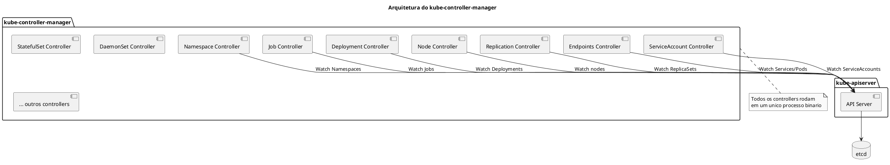
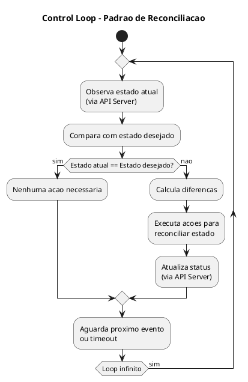
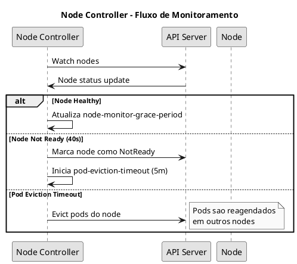
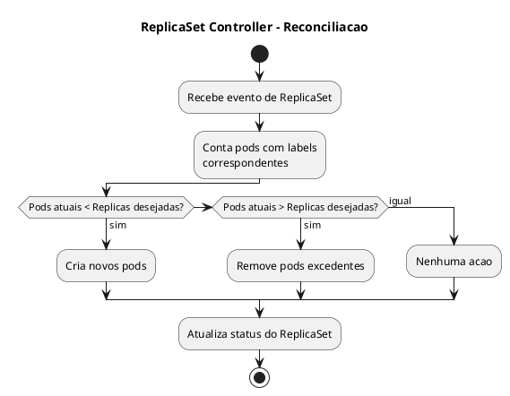
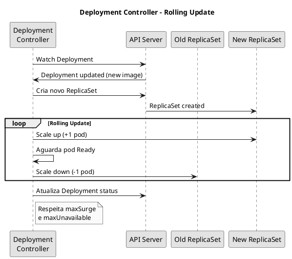
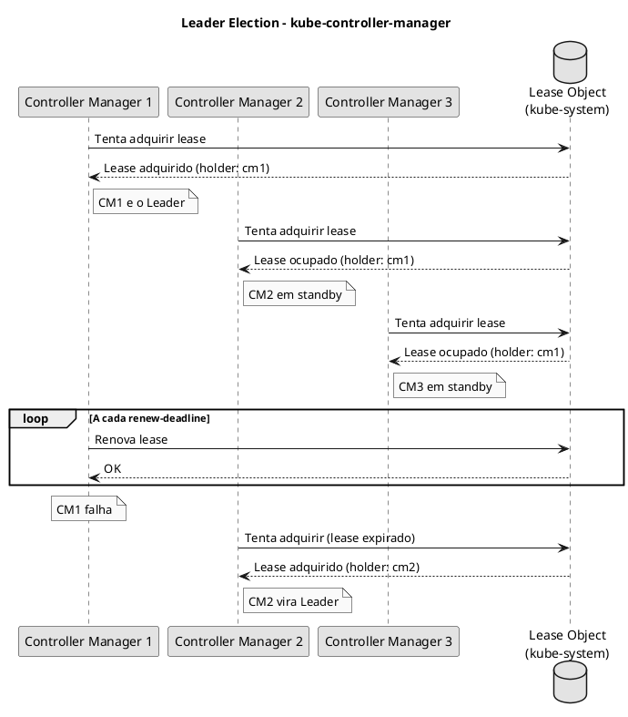
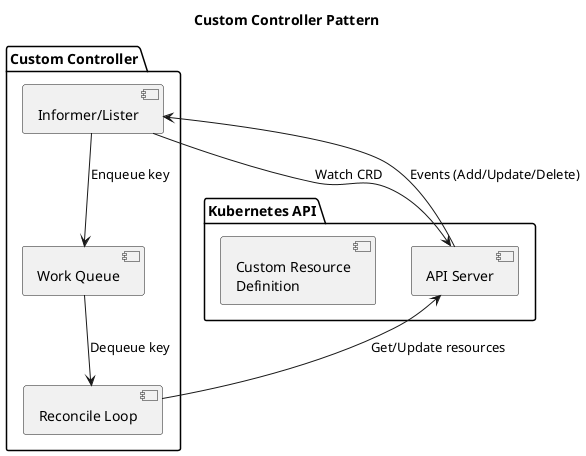

# kube-controller-manager

O **kube-controller-manager** e o componente que executa os controllers do Kubernetes. Cada controller e um loop de controle que observa o estado do cluster atraves do API Server e faz alteracoes para mover o estado atual em direcao ao estado desejado.

## Arquitetura e Funcionamento



## Control Loop Pattern



## Controllers Principais

### Node Controller

Responsavel por monitorar e responder quando nodes ficam indisponiveis.



**Parametros importantes:**

| Parametro | Padrao | Descricao |
|-----------|--------|-----------|
| `--node-monitor-period` | 5s | Intervalo de verificacao de status |
| `--node-monitor-grace-period` | 40s | Tempo antes de marcar como NotReady |
| `--pod-eviction-timeout` | 5m | Tempo antes de evictar pods |

### Replication Controller / ReplicaSet Controller

Garante que o numero desejado de replicas esteja rodando.



### Deployment Controller

Gerencia Deployments, incluindo rolling updates e rollbacks.



### Endpoints Controller

Popula os objetos Endpoints (que conectam Services a Pods).

```bash
# Ver endpoints de um service
kubectl get endpoints my-service

# Ver detalhes
kubectl describe endpoints my-service
```

### ServiceAccount Controller

Cria ServiceAccounts padrao para namespaces e gerencia tokens.

```bash
# Ver service accounts
kubectl get serviceaccounts -A

# Service account default e criado automaticamente
kubectl get sa default -o yaml
```

### Namespace Controller

Gerencia a finalizacao de namespaces quando deletados.

```bash
# Namespace em Terminating pode estar aguardando finalizers
kubectl get namespace <ns> -o yaml | grep finalizers
```

### Job Controller

Gerencia Jobs, criando pods e rastreando conclusao.

### CronJob Controller

Cria Jobs baseado em schedule cron.

### StatefulSet Controller

Gerencia StatefulSets com identidade persistente e ordenacao.

### DaemonSet Controller

Garante que um pod rode em todos (ou alguns) nodes.

## Configuracao

### Manifest do kube-controller-manager

```yaml
{{#include ../assets/pod/pod-kube-controller-manager.yaml}}
```

## Flags Importantes

### Controle de Controllers

```bash
# Habilitar todos controllers exceto alguns
--controllers=*,-bootstrapsigner,-tokencleaner

# Habilitar apenas controllers especificos
--controllers=deployment,replicaset,namespace

# Listar todos controllers disponiveis
kube-controller-manager --help | grep -A 100 "controllers strings"
```

### Leader Election

Para clusters HA, apenas um controller-manager esta ativo por vez:

```bash
# Habilitar leader election
--leader-elect=true

# Duracao do lease
--leader-elect-lease-duration=15s

# Deadline para renovar lease
--leader-elect-renew-deadline=10s

# Intervalo de retry
--leader-elect-retry-period=2s
```

```bash
# Ver quem e o leader atual
kubectl get lease -n kube-system kube-controller-manager -o yaml
```

### Node Controller

```bash
# Intervalo de monitoramento de nodes
--node-monitor-period=5s

# Tempo de graca antes de marcar NotReady
--node-monitor-grace-period=40s

# Tempo antes de evictar pods
--pod-eviction-timeout=5m0s

# Rate de eviction
--node-eviction-rate=0.1
--secondary-node-eviction-rate=0.01
--unhealthy-zone-threshold=0.55
```

### Certificados

```bash
# CA para assinar CSRs (Certificate Signing Requests)
--cluster-signing-cert-file=/etc/kubernetes/pki/ca.crt
--cluster-signing-key-file=/etc/kubernetes/pki/ca.key

# Duracao dos certificados assinados
--cluster-signing-duration=8760h  # 1 ano

# CA root distribuido para pods
--root-ca-file=/etc/kubernetes/pki/ca.crt

# Chave para assinar tokens de ServiceAccount
--service-account-private-key-file=/etc/kubernetes/pki/sa.key
```

### Network

```bash
# CIDR para alocar IPs de pods (usado pelo Node IPAM)
--cluster-cidr=10.244.0.0/16

# Range de IPs de services
--service-cluster-ip-range=10.96.0.0/12

# Habilitar alocacao de CIDR por node
--allocate-node-cidrs=true

# Tamanho do CIDR por node
--node-cidr-mask-size=24  # para IPv4
--node-cidr-mask-size-ipv6=64  # para IPv6
```

## Leader Election em Detalhes



```bash
# Ver lease atual
kubectl get lease -n kube-system kube-controller-manager -o yaml

# Output exemplo:
# holderIdentity: controlplane_xxx
# leaseDurationSeconds: 15
# acquireTime: "2024-01-01T00:00:00Z"
# renewTime: "2024-01-01T00:00:10Z"
```

## Troubleshooting

### Verificar Status

```bash
# Verificar se esta rodando
crictl ps | grep controller-manager

# Ver logs
kubectl logs -n kube-system kube-controller-manager-<node>

# Ou via crictl
crictl logs <container-id>

# Health check
curl -k https://127.0.0.1:10257/healthz
```

### Problemas Comuns

#### Pods nao sendo criados por ReplicaSet

```bash
# Verificar eventos do ReplicaSet
kubectl describe rs <replicaset-name>

# Verificar logs do controller-manager
kubectl logs -n kube-system kube-controller-manager-<node> | grep -i replicaset

# Verificar se controller esta habilitado
cat /etc/kubernetes/manifests/kube-controller-manager.yaml | grep controllers
```

#### Nodes permanecendo NotReady por muito tempo

```bash
# Verificar configuracao de timeout
cat /etc/kubernetes/manifests/kube-controller-manager.yaml | grep node-monitor

# Verificar logs relacionados a nodes
kubectl logs -n kube-system kube-controller-manager-<node> | grep -i node
```

#### Pods nao sendo evictados

```bash
# Verificar pod-eviction-timeout
cat /etc/kubernetes/manifests/kube-controller-manager.yaml | grep eviction

# Verificar taints no node
kubectl describe node <node> | grep Taints

# Verificar se pods tem tolerations
kubectl get pod <pod> -o yaml | grep -A 5 tolerations
```

#### Leader election falhando

```bash
# Verificar lease
kubectl get lease -n kube-system kube-controller-manager -o yaml

# Verificar logs de leader election
kubectl logs -n kube-system kube-controller-manager-<node> | grep -i "leader\|election"

# Verificar conectividade com API server
kubectl get --raw /api/v1/namespaces/kube-system/leases/kube-controller-manager
```

### Verificar Controllers Ativos

```bash
# Ver metricas de controllers
curl -k https://127.0.0.1:10257/metrics | grep controller

# Verificar qual controller esta processando
kubectl logs -n kube-system kube-controller-manager-<node> | grep -i "starting\|controller"
```

## Controllers Customizados

O padrao controller pode ser usado para criar operadores customizados:



## Dicas para o Exame

```admonish tip title="CKA/CKS"
1. **Conheca o caminho do manifest**: `/etc/kubernetes/manifests/kube-controller-manager.yaml`
2. **Saiba os parametros do Node Controller**:
   - `--node-monitor-grace-period=40s`
   - `--pod-eviction-timeout=5m`
3. **Leader election** - saiba verificar com `kubectl get lease`
4. **Certificados** - o controller-manager assina CSRs com `--cluster-signing-*`
5. **Controllers podem ser habilitados/desabilitados** com `--controllers=`
6. **Porta de metricas/health**: 10257 (HTTPS)
```

## Comandos Rapidos de Referencia

```bash
# === VERIFICACAO ===
crictl ps | grep controller-manager
kubectl get pods -n kube-system | grep controller
kubectl logs -n kube-system kube-controller-manager-<node>

# === LEADER ELECTION ===
kubectl get lease -n kube-system kube-controller-manager -o yaml

# === HEALTH ===
curl -k https://127.0.0.1:10257/healthz

# === CONFIGURACAO ===
cat /etc/kubernetes/manifests/kube-controller-manager.yaml

# === TROUBLESHOOTING ===
kubectl logs -n kube-system kube-controller-manager-<node> | grep -i error
kubectl describe rs <replicaset>
kubectl describe deployment <deployment>

# === EVENTOS ===
kubectl get events --sort-by='.lastTimestamp'
kubectl get events --field-selector reason=FailedCreate
```

## Referencias

- [kube-controller-manager Reference](https://kubernetes.io/docs/reference/command-line-tools-reference/kube-controller-manager/)
- [Controllers](https://kubernetes.io/docs/concepts/architecture/controller/)
- [Leader Election](https://kubernetes.io/docs/concepts/cluster-administration/controller-manager-leader-election/)
- [Writing Controllers](https://kubernetes.io/docs/concepts/architecture/controller/#writing-controllers)
