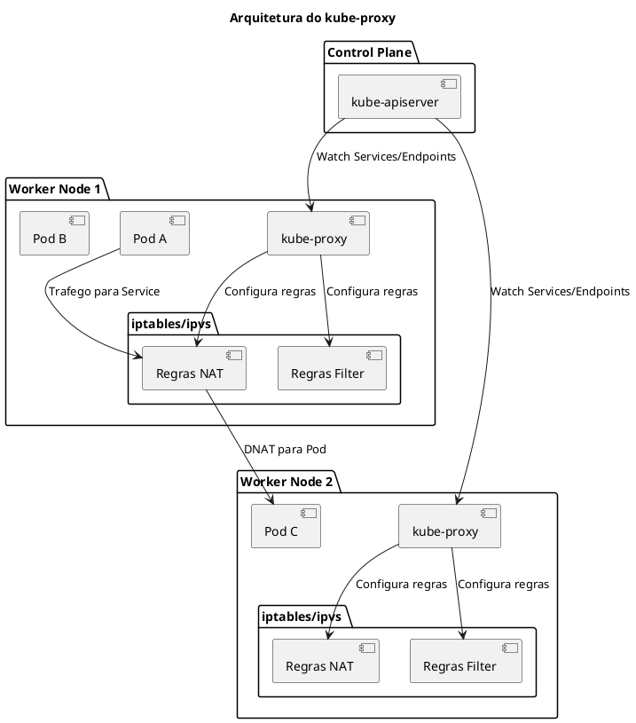
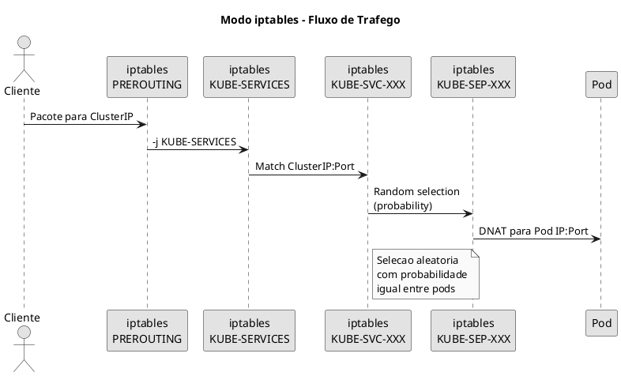
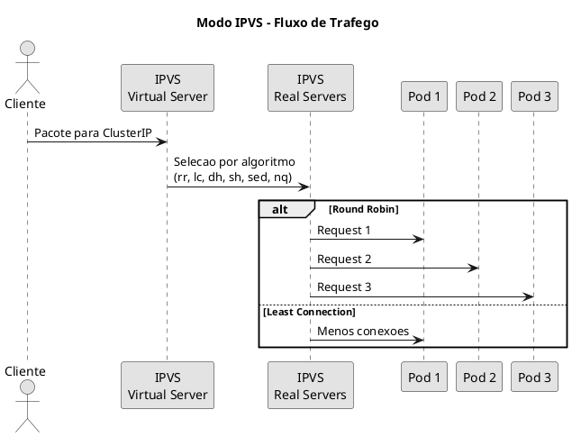

# kube-proxy

O **kube-proxy** e um componente de rede que roda em cada no do cluster Kubernetes. Ele mantem as regras de rede que permitem a comunicacao com os Pods atraves de Services.

## Arquitetura e Funcionamento



## Modos de Operacao

O kube-proxy suporta tres modos de operacao para implementar Services:

### Modo iptables (Padrao)

O modo mais comum, usa regras iptables para redirecionar trafego.



**Caracteristicas:**
- Usa netfilter/iptables do kernel Linux
- Regras sao avaliadas sequencialmente
- Selecao aleatoria de backends usando probabilidade
- Performance pode degradar com muitos Services (>1000)

```bash
# Ver regras iptables criadas pelo kube-proxy
iptables -t nat -L KUBE-SERVICES -n --line-numbers
iptables -t nat -L KUBE-SVC-* -n --line-numbers
iptables -t nat -L KUBE-SEP-* -n --line-numbers

# Ver todas as chains do kube-proxy
iptables-save | grep -i kube

# Contar regras
iptables -t nat -L | wc -l
```

### Modo IPVS

O modo IPVS (IP Virtual Server) oferece melhor performance para clusters grandes.



**Caracteristicas:**
- Usa IPVS do kernel Linux (hash tables)
- Complexidade O(1) para lookup
- Suporta multiplos algoritmos de balanceamento
- Melhor para clusters com muitos Services

**Algoritmos de Balanceamento IPVS:**

| Algoritmo | Flag | Descricao |
|-----------|------|-----------|
| Round Robin | `rr` | Distribuicao sequencial |
| Least Connection | `lc` | Menos conexoes ativas |
| Destination Hashing | `dh` | Hash do IP destino |
| Source Hashing | `sh` | Hash do IP origem (sticky) |
| Shortest Expected Delay | `sed` | Menor delay esperado |
| Never Queue | `nq` | Envia para servidor disponivel |

```bash
# Ver virtual servers IPVS
ipvsadm -Ln

# Ver estatisticas
ipvsadm -Ln --stats

# Ver conexoes ativas
ipvsadm -Lnc

# Ver com mais detalhes
ipvsadm -Ln --rate
```

### Modo nftables (Kubernetes 1.29+)

Novo modo que usa nftables em vez de iptables.

**Caracteristicas:**
- Substitui iptables (deprecado)
- Melhor performance e sintaxe
- Atomicidade nas atualizacoes
- Disponivel como beta a partir do Kubernetes 1.29

```bash
# Ver regras nftables
nft list ruleset | grep -A 20 kube
```

### Comparacao de Modos

| Caracteristica | iptables | IPVS | nftables |
|---------------|----------|------|----------|
| Performance (muitos svc) | Baixa | Alta | Alta |
| Complexidade lookup | O(n) | O(1) | O(1) |
| Algoritmos LB | Apenas random | Multiplos | Multiplos |
| Maturidade | Alta | Alta | Beta |
| Session affinity | Sim | Sim | Sim |

## Configuracao

### ConfigMap do kube-proxy

O kube-proxy e configurado atraves de um ConfigMap no namespace `kube-system`:

```yaml
{{#include ../assets/configmap/configmap-kube-proxy.yaml}}
```

### Alterando o Modo para IPVS

```bash
# Editar ConfigMap
kubectl edit configmap kube-proxy -n kube-system

# Alterar mode para ipvs
# mode: "ipvs"

# Reiniciar todos os pods do kube-proxy
kubectl rollout restart daemonset kube-proxy -n kube-system

# Verificar se IPVS esta ativo
kubectl logs -n kube-system -l k8s-app=kube-proxy | grep -i ipvs
```

### Pre-requisitos para IPVS

```bash
# Carregar modulos do kernel necessarios
modprobe ip_vs
modprobe ip_vs_rr
modprobe ip_vs_wrr
modprobe ip_vs_sh
modprobe nf_conntrack

# Tornar permanente
cat >> /etc/modules-load.d/ipvs.conf << EOF
ip_vs
ip_vs_rr
ip_vs_wrr
ip_vs_sh
nf_conntrack
EOF

# Verificar modulos carregados
lsmod | grep ip_vs

# Instalar ipvsadm para gerenciamento
apt-get install ipvsadm  # Debian/Ubuntu
yum install ipvsadm      # RHEL/CentOS
```

## DaemonSet do kube-proxy

O kube-proxy roda como DaemonSet para garantir uma instancia em cada no:

```yaml
{{#include ../assets/daemonset/daemonset-kube-proxy.yaml}}
```

## Troubleshooting

### Verificar Status do kube-proxy

```bash
# Ver pods do kube-proxy
kubectl get pods -n kube-system -l k8s-app=kube-proxy -o wide

# Ver logs
kubectl logs -n kube-system -l k8s-app=kube-proxy --tail=100

# Ver logs de um no especifico
kubectl logs -n kube-system kube-proxy-xxxxx

# Ver configuracao atual
kubectl get configmap kube-proxy -n kube-system -o yaml
```

### Verificar Regras de Rede

```bash
# === MODO IPTABLES ===
# Ver chain principal de services
iptables -t nat -L KUBE-SERVICES -n -v

# Ver regras para um service especifico
iptables -t nat -L -n | grep <service-name>

# Ver todas as regras NAT
iptables -t nat -L -n -v --line-numbers

# Salvar todas as regras para analise
iptables-save > /tmp/iptables-rules.txt

# === MODO IPVS ===
# Listar virtual servers
ipvsadm -Ln

# Ver estatisticas de conexao
ipvsadm -Ln --stats

# Ver conexoes em tempo real
watch -n 1 ipvsadm -Ln --stats

# Ver real servers de um virtual server
ipvsadm -Ln -t <cluster-ip>:<port>
```

### Problemas Comuns

#### Service nao acessivel

```bash
# 1. Verificar se Service existe e tem endpoints
kubectl get svc <service-name>
kubectl get endpoints <service-name>

# 2. Verificar se pods do backend estao rodando
kubectl get pods -l <selector-do-service>

# 3. Verificar regras do kube-proxy
# Para iptables:
iptables -t nat -L KUBE-SERVICES -n | grep <cluster-ip>

# Para IPVS:
ipvsadm -Ln | grep <cluster-ip>

# 4. Verificar logs do kube-proxy
kubectl logs -n kube-system -l k8s-app=kube-proxy | grep -i error

# 5. Testar conectividade do node
curl -v <cluster-ip>:<port>
```

#### Regras iptables nao atualizando

```bash
# Verificar se kube-proxy esta rodando
kubectl get pods -n kube-system -l k8s-app=kube-proxy

# Forcar resync
kubectl rollout restart daemonset kube-proxy -n kube-system

# Verificar erros de sync
kubectl logs -n kube-system -l k8s-app=kube-proxy | grep -i sync
```

#### Performance degradada

```bash
# Contar numero de regras iptables
iptables -t nat -L | wc -l

# Se > 5000 regras, considerar mudar para IPVS
# Verificar tempo de sync
kubectl logs -n kube-system -l k8s-app=kube-proxy | grep -i "sync"
```

### Metricas e Monitoramento

```bash
# Acessar metricas do kube-proxy (porta 10249)
curl http://localhost:10249/metrics

# Metricas importantes:
# - kubeproxy_sync_proxy_rules_duration_seconds
# - kubeproxy_sync_proxy_rules_last_timestamp_seconds
# - kubeproxy_network_programming_duration_seconds

# Health check
curl http://localhost:10256/healthz
```

## Session Affinity

O kube-proxy suporta session affinity (sticky sessions) para manter conexoes do mesmo cliente no mesmo pod:

```yaml
{{#include ../assets/service/service-my-service.yaml}}
```

```bash
# Verificar session affinity no IPVS
ipvsadm -Ln --persistent

# Ver conexoes persistentes
ipvsadm -Lnc
```

## Arquivos e Diretorios Importantes

| Caminho | Descricao |
|---------|-----------|
| `/var/lib/kube-proxy/` | Diretorio de configuracao |
| `/var/lib/kube-proxy/config.conf` | Arquivo de configuracao |
| `/run/xtables.lock` | Lock para iptables |
| `/proc/sys/net/ipv4/` | Parametros de rede do kernel |

## Dicas para o Exame

```admonish tip title="CKA/CKS"
1. **Saiba verificar o modo** - `kubectl logs` ou `ipvsadm -Ln`
2. **Conheca os comandos iptables basicos** para debug
3. **Entenda a diferenca entre modos** e quando usar cada um
4. **Localizacoes importantes**:
   - ConfigMap: `kubectl get cm kube-proxy -n kube-system`
   - Logs: `kubectl logs -n kube-system -l k8s-app=kube-proxy`
   - Metricas: `curl localhost:10249/metrics`
5. **IPVS requer modulos do kernel** - verifique com `lsmod | grep ip_vs`
```

## Comandos Rapidos de Referencia

```bash
# === VERIFICACAO ===
kubectl get pods -n kube-system -l k8s-app=kube-proxy
kubectl get cm kube-proxy -n kube-system -o yaml
kubectl logs -n kube-system -l k8s-app=kube-proxy

# === IPTABLES ===
iptables -t nat -L KUBE-SERVICES -n
iptables -t nat -L -n | grep <svc>
iptables-save | grep -i kube

# === IPVS ===
ipvsadm -Ln
ipvsadm -Ln --stats
ipvsadm -Lnc

# === TROUBLESHOOTING ===
kubectl get endpoints <svc>
curl localhost:10256/healthz
curl localhost:10249/metrics

# === RESTART ===
kubectl rollout restart daemonset kube-proxy -n kube-system
```

## Referencias

- [Documentacao Oficial kube-proxy](https://kubernetes.io/docs/reference/command-line-tools-reference/kube-proxy/)
- [Virtual IPs and Service Proxies](https://kubernetes.io/docs/reference/networking/virtual-ips/)
- [IPVS-Based In-Cluster Load Balancing](https://kubernetes.io/blog/2018/07/09/ipvs-based-in-cluster-load-balancing-deep-dive/)
- [nftables Mode Documentation](https://kubernetes.io/docs/reference/networking/virtual-ips/#proxy-mode-nftables)
