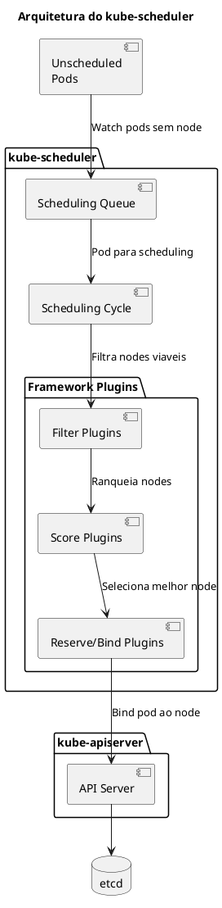
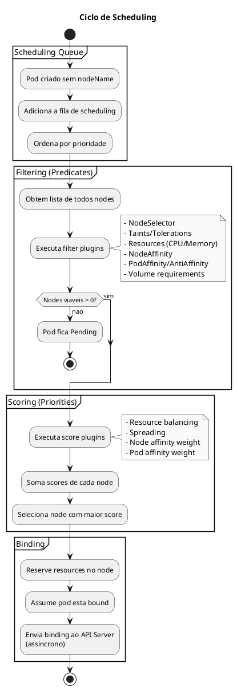
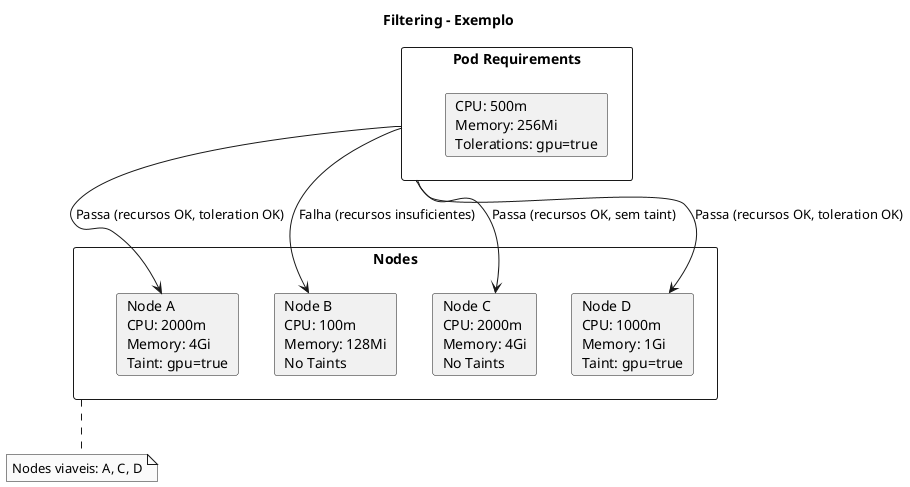
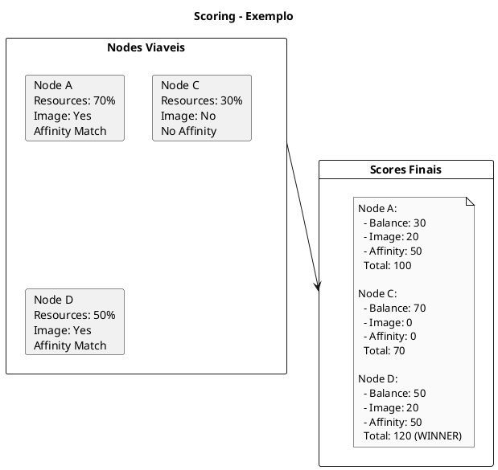
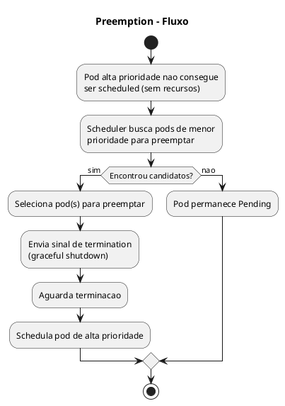

# kube-scheduler

O **kube-scheduler** e o componente responsavel por decidir em qual node cada pod sera executado. Ele observa pods recem-criados que nao tem um node atribuido e seleciona o melhor node para eles.

```admonish warning title="Importante"
O scheduler apenas **decide** onde o pod vai rodar. Quem **executa** o pod e o kubelet do node selecionado.
```

## Arquitetura e Funcionamento



## Ciclo de Scheduling



## Filter Plugins (Predicates)

Os filter plugins eliminam nodes que nao podem executar o pod.

### Plugins de Filtering Padrao

| Plugin | Descricao |
|--------|-----------|
| `NodeResourcesFit` | Verifica se node tem recursos suficientes |
| `NodeName` | Verifica se pod especificou nodeName |
| `NodePorts` | Verifica se portas estao disponiveis |
| `NodeAffinity` | Verifica node affinity requirements |
| `TaintToleration` | Verifica se pod tolera taints do node |
| `NodeUnschedulable` | Verifica se node esta marcado unschedulable |
| `PodTopologySpread` | Verifica topology spread constraints |
| `InterPodAffinity` | Verifica pod affinity/anti-affinity |
| `VolumeBinding` | Verifica se volumes podem ser bound |
| `VolumeZone` | Verifica zone requirements de volumes |

### Exemplo de Filtering



## Score Plugins (Priorities)

Os score plugins ranqueiam os nodes viaveis.

### Plugins de Scoring Padrao

| Plugin | Descricao |
|--------|-----------|
| `NodeResourcesBalancedAllocation` | Prefere nodes com uso balanceado de recursos |
| `ImageLocality` | Prefere nodes que ja tem a imagem |
| `InterPodAffinity` | Score baseado em pod affinity |
| `NodeAffinity` | Score baseado em node affinity preferido |
| `PodTopologySpread` | Score baseado em spreading |
| `TaintToleration` | Score baseado em tolerations |
| `NodeResourcesFit` | Score baseado em recursos disponiveis |

### Exemplo de Scoring



## Scheduler Profiles

A partir do Kubernetes 1.18, e possivel configurar multiplos profiles de scheduling.

### Configuracao de Profile

```yaml
{{#include ../assets/cluster-components/kubeschedulerconfiguration-noderesourcesbalancedallocation.yaml}}
```

### Usar Profile Especifico em Pod

```yaml
{{#include ../assets/pod/pod-batch-job-pod.yaml}}
```

## Scheduling Policies

### Node Affinity

```yaml
{{#include ../assets/pod/pod-with-node-affinity.yaml}}
```

### Pod Affinity e Anti-Affinity

```yaml
{{#include ../assets/pod/pod-with-pod-affinity.yaml}}
```

### Topology Spread Constraints

```yaml
{{#include ../assets/pod/pod-with-topology-spread.yaml}}
```

## Priority e Preemption

### PriorityClass

```yaml
{{#include ../assets/cluster-components/priorityclass-high-priority.yaml}}
```

### Usar PriorityClass

```yaml
{{#include ../assets/pod/pod-high-priority-pod.yaml}}
```

### Fluxo de Preemption



## Custom Scheduler

Voce pode criar e executar seu proprio scheduler.

### Deploy de Custom Scheduler

```yaml
{{#include ../assets/serviceaccount/serviceaccount-my-scheduler.yaml}}
```

### Usar Custom Scheduler

```yaml
{{#include ../assets/pod/pod-pod-with-custom-scheduler.yaml}}
```

## Configuracao do kube-scheduler

### Manifest Completo

```yaml
{{#include ../assets/pod/pod-kube-scheduler.yaml}}
```

### Arquivo de Configuracao

```yaml
{{#include ../assets/cluster-components/kubeschedulerconfiguration-noderesourcesfit.yaml}}
```

## Troubleshooting

### Verificar Status

```bash
# Verificar se scheduler esta rodando
crictl ps | grep scheduler

# Ver logs
kubectl logs -n kube-system kube-scheduler-<node>

# Health check
curl -k https://127.0.0.1:10259/healthz

# Ver leader
kubectl get lease -n kube-system kube-scheduler -o yaml
```

### Pod Pendente

```bash
# Ver eventos do pod
kubectl describe pod <pod-name>

# Motivos comuns:
# - 0/3 nodes are available: insufficient cpu
# - 0/3 nodes are available: insufficient memory
# - 0/3 nodes are available: 3 node(s) had taint {key: NoSchedule}
# - 0/3 nodes are available: 3 node(s) didn't match Pod's node affinity

# Ver recursos dos nodes
kubectl describe nodes | grep -A 5 "Allocated resources"

# Ver taints dos nodes
kubectl describe nodes | grep Taints

# Verificar node selectors/affinity do pod
kubectl get pod <pod-name> -o yaml | grep -A 10 nodeSelector
kubectl get pod <pod-name> -o yaml | grep -A 20 affinity
```

### Verificar Scheduling Events

```bash
# Ver eventos de scheduling
kubectl get events --field-selector reason=FailedScheduling

# Ver eventos recentes
kubectl get events --sort-by='.lastTimestamp' | grep -i schedul

# Ver metricas do scheduler
curl -k https://127.0.0.1:10259/metrics | grep scheduler
```

### Simulacoes com dry-run

```bash
# Ver onde pod seria scheduled (alpha feature)
kubectl alpha debug -it pod/<pod> --image=busybox --dry-run=server
```

## Dicas para o Exame

```admonish tip title="CKA/CKS"
1. **Caminho do manifest**: `/etc/kubernetes/manifests/kube-scheduler.yaml`
2. **Saiba a diferenca entre**:
   - `nodeSelector` - simples, labels
   - `nodeAffinity` - avancado, operadores
   - `podAffinity/AntiAffinity` - relacao entre pods
3. **Taints e Tolerations** - scheduler respeita, mas nao garante placement
4. **PriorityClass** - controla ordem de scheduling e preemption
5. **spec.schedulerName** - para usar scheduler customizado
6. **Porta de health**: 10259 (HTTPS)
7. **kubectl describe pod** - mostra motivo de Pending
```

## Comandos Rapidos de Referencia

```bash
# === VERIFICACAO ===
crictl ps | grep scheduler
kubectl get pods -n kube-system | grep scheduler
kubectl logs -n kube-system kube-scheduler-<node>

# === LEADER ELECTION ===
kubectl get lease -n kube-system kube-scheduler -o yaml

# === DEBUG POD PENDING ===
kubectl describe pod <pod>
kubectl get events --field-selector reason=FailedScheduling

# === NODES ===
kubectl describe nodes | grep -A 5 "Allocated"
kubectl describe nodes | grep Taints
kubectl get nodes -o custom-columns=NAME:.metadata.name,TAINTS:.spec.taints

# === PRIORITY ===
kubectl get priorityclasses
kubectl describe priorityclass <name>

# === CONFIGURACAO ===
cat /etc/kubernetes/manifests/kube-scheduler.yaml
kubectl get cm -n kube-system | grep scheduler
```

## Referencias

- [kube-scheduler Reference](https://kubernetes.io/docs/reference/command-line-tools-reference/kube-scheduler/)
- [Scheduler Configuration](https://kubernetes.io/docs/reference/scheduling/config/)
- [Scheduling Framework](https://kubernetes.io/docs/concepts/scheduling-eviction/scheduling-framework/)
- [Assigning Pods to Nodes](https://kubernetes.io/docs/concepts/scheduling-eviction/assign-pod-node/)
- [Pod Priority and Preemption](https://kubernetes.io/docs/concepts/scheduling-eviction/pod-priority-preemption/)
- [Topology Spread Constraints](https://kubernetes.io/docs/concepts/scheduling-eviction/topology-spread-constraints/)
