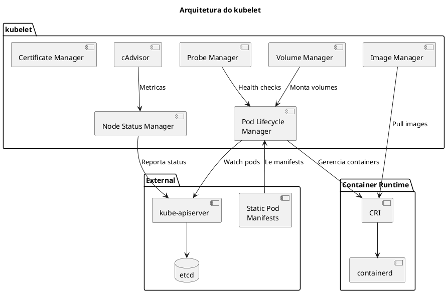
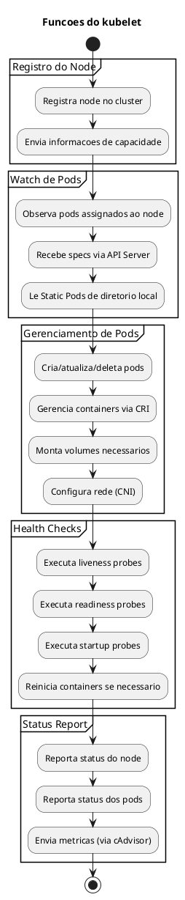
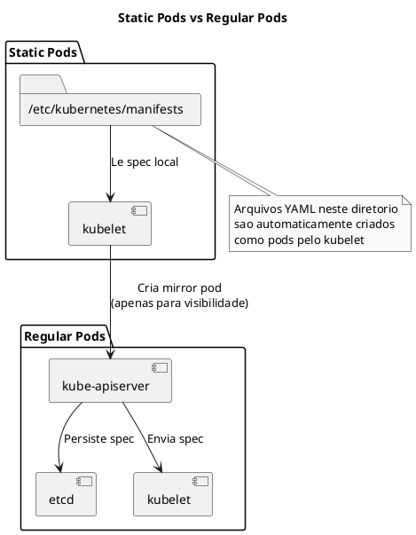
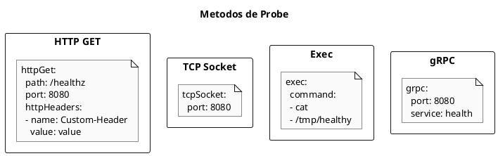
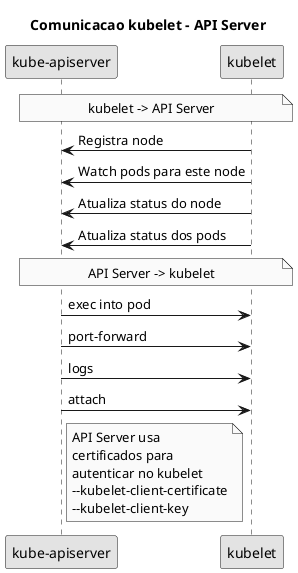

# kubelet

O **kubelet** e o agente que roda em cada node do cluster Kubernetes. Ele garante que os containers estejam rodando em pods, gerencia o ciclo de vida dos pods e reporta o status do node para o control plane.

```admonish warning title="Importante"
O kubelet **nao e instalado pelo kubeadm** como static pod. Ele deve ser instalado manualmente como servico systemd em cada node.
```

## Arquitetura e Funcionamento



## Funcoes do kubelet



## Configuracao do kubelet

### KubeletConfiguration

O kubelet e configurado atraves de um arquivo YAML do tipo `KubeletConfiguration`:

```yaml
{{#include ../assets/cluster-components/kubeletconfiguration.yaml}}
```

### Arquivo de Servico systemd

```ini
# /etc/systemd/system/kubelet.service
[Unit]
Description=kubelet: The Kubernetes Node Agent
Documentation=https://kubernetes.io/docs/
Wants=network-online.target
After=network-online.target

[Service]
ExecStart=/usr/bin/kubelet
Restart=always
StartLimitInterval=0
RestartSec=10

[Install]
WantedBy=multi-user.target
```

### Drop-in de Configuracao kubeadm

```ini
# /etc/systemd/system/kubelet.service.d/10-kubeadm.conf
[Service]
Environment="KUBELET_KUBECONFIG_ARGS=--bootstrap-kubeconfig=/etc/kubernetes/bootstrap-kubelet.conf --kubeconfig=/etc/kubernetes/kubelet.conf"
Environment="KUBELET_CONFIG_ARGS=--config=/var/lib/kubelet/config.yaml"
EnvironmentFile=-/var/lib/kubelet/kubeadm-flags.env
EnvironmentFile=-/etc/default/kubelet
ExecStart=
ExecStart=/usr/bin/kubelet $KUBELET_KUBECONFIG_ARGS $KUBELET_CONFIG_ARGS $KUBELET_KUBEADM_ARGS $KUBELET_EXTRA_ARGS
```

## Static Pods

Static Pods sao gerenciados diretamente pelo kubelet, sem passar pelo API Server.



### Criar Static Pod

```bash
# Criar manifest no diretorio de static pods
cat > /etc/kubernetes/manifests/my-static-pod.yaml << EOF
apiVersion: v1
kind: Pod
metadata:
  name: my-static-pod
  namespace: default
spec:
  containers:
  - name: nginx
    image: nginx:latest
    ports:
    - containerPort: 80
EOF

# O pod sera criado automaticamente
# Nome tera sufixo do node: my-static-pod-<node-name>
```

### Diretorio de Static Pods

```bash
# Ver configuracao atual
grep staticPodPath /var/lib/kubelet/config.yaml

# Ou via flag (depreciado)
ps aux | grep kubelet | grep static-pod-path

# Padrao: /etc/kubernetes/manifests
```

## Probes (Health Checks)

O kubelet executa tres tipos de probes:

### Liveness Probe

Determina se o container esta rodando. Se falhar, o container e reiniciado.

```yaml
{{#include ../assets/pod/pod-liveness-example.yaml}}
```

### Readiness Probe

Determina se o container esta pronto para receber trafego.

```yaml
{{#include ../assets/pod/pod-readiness-example.yaml}}
```

### Startup Probe

Usado para containers que demoram a iniciar. Desabilita liveness/readiness ate passar.

```yaml
{{#include ../assets/pod/pod-startup-example.yaml}}
```

### Metodos de Probe



## Seguranca do kubelet

### Portas do kubelet

| Porta | Protocolo | Descricao |
|-------|-----------|-----------|
| 10250 | HTTPS | API principal (requer auth) |
| 10255 | HTTP | Read-only (deprecado, desabilitar!) |
| 10248 | HTTP | Health check |

### Autenticacao

```yaml
{{#include ../assets/cluster-components/kubelet-example-5.yaml}}
```

### Autorizacao

```yaml
{{#include ../assets/cluster-components/kubelet-example-6.yaml}}
```

### Desabilitar Porta Read-Only

```yaml
{{#include ../assets/cluster-components/kubelet-example-7.yaml}}
```

```admonish danger title="CKS - Seguranca"
A porta 10255 (read-only) permite acesso nao autenticado a informacoes sensiveis. **Sempre desabilite em producao!**
```

### TLS Certificates

```yaml
{{#include ../assets/cluster-components/kubelet-example-8.yaml}}
```

## Comunicacao kubelet-APIServer



## Gerenciamento de Configuracao

### Atualizar Configuracao do kubelet

```bash
# Editar ConfigMap de configuracao do cluster
kubectl edit cm -n kube-system kubelet-config

# Aplicar em um node especifico
kubeadm upgrade node phase kubelet-config

# Reiniciar kubelet
systemctl restart kubelet
```

### Ver Configuracao Atual

```bash
# Via proxy
kubectl proxy &
curl http://127.0.0.1:8001/api/v1/nodes/<node-name>/proxy/configz | jq

# Diretamente no node
cat /var/lib/kubelet/config.yaml
```

## Resource Management

### Eviction Thresholds

```yaml
{{#include ../assets/cluster-components/kubelet-example-9.yaml}}
```

### System Reserved

```yaml
{{#include ../assets/cluster-components/kubelet-example-10.yaml}}
```

### Pod Resource Limits

```yaml
{{#include ../assets/cluster-components/kubelet-example-11.yaml}}
```

## Troubleshooting

### Verificar Status do kubelet

```bash
# Status do servico
systemctl status kubelet

# Logs do kubelet
journalctl -u kubelet -f

# Logs com mais detalhes
journalctl -u kubelet -f --no-pager -l

# Ver erros recentes
journalctl -u kubelet --since "5 minutes ago" | grep -i error
```

### Problemas Comuns

#### kubelet nao inicia

```bash
# Verificar configuracao
kubelet --config=/var/lib/kubelet/config.yaml --v=5

# Verificar certificados
ls -la /etc/kubernetes/pki/
ls -la /var/lib/kubelet/pki/

# Verificar container runtime
crictl info
systemctl status containerd
```

#### Node NotReady

```bash
# Ver condicoes do node
kubectl describe node <node> | grep -A 20 Conditions

# Verificar kubelet no node
systemctl status kubelet
journalctl -u kubelet | tail -100

# Verificar rede
ip addr
ip route
```

#### Pods nao iniciam

```bash
# Ver eventos do pod
kubectl describe pod <pod>

# Ver logs do kubelet relacionados ao pod
journalctl -u kubelet | grep <pod-name>

# Verificar CRI
crictl pods
crictl ps -a
```

#### Container CrashLoopBackOff

```bash
# Ver logs do container
kubectl logs <pod> -c <container>
kubectl logs <pod> -c <container> --previous

# Verificar probes
kubectl describe pod <pod> | grep -A 10 Liveness
kubectl describe pod <pod> | grep -A 10 Readiness
```

### Debug Avancado

```bash
# Aumentar verbosidade do kubelet
# Editar /var/lib/kubelet/kubeadm-flags.env
KUBELET_KUBEADM_ARGS="--v=5"

# Reiniciar
systemctl restart kubelet

# Ver metricas
curl -k https://localhost:10250/metrics
```

## Flags Importantes

```bash
# Configuracao principal
--config=/var/lib/kubelet/config.yaml

# Kubeconfig para comunicar com API Server
--kubeconfig=/etc/kubernetes/kubelet.conf

# Bootstrap kubeconfig (inicial)
--bootstrap-kubeconfig=/etc/kubernetes/bootstrap-kubelet.conf

# Container runtime
--container-runtime-endpoint=unix:///run/containerd/containerd.sock

# Cgroup driver (deve match com container runtime)
--cgroup-driver=systemd

# Static pods
--pod-manifest-path=/etc/kubernetes/manifests

# Hostname override
--hostname-override=<custom-hostname>

# Node IP (util em multi-homed nodes)
--node-ip=192.168.1.10

# Verbosidade
--v=2
```

## Dicas para o Exame

```admonish tip title="CKA/CKS"
1. **kubelet NAO e static pod** - e servico systemd
2. **Localizacoes importantes**:
   - Config: `/var/lib/kubelet/config.yaml`
   - Kubeconfig: `/etc/kubernetes/kubelet.conf`
   - Static pods: `/etc/kubernetes/manifests`
   - Logs: `journalctl -u kubelet`
3. **Seguranca (CKS)**:
   - Desabilitar `readOnlyPort: 0`
   - Habilitar `authentication.anonymous.enabled: false`
   - Usar `authorization.mode: Webhook`
4. **Static Pods** - arquivos em `/etc/kubernetes/manifests` sao criados automaticamente
5. **Probes** - saiba os tres tipos e quando usar cada um
6. **systemctl restart kubelet** - para aplicar mudancas
```

## Comandos Rapidos de Referencia

```bash
# === SERVICO ===
systemctl status kubelet
systemctl restart kubelet
systemctl enable kubelet
journalctl -u kubelet -f

# === CONFIGURACAO ===
cat /var/lib/kubelet/config.yaml
cat /etc/kubernetes/kubelet.conf
cat /var/lib/kubelet/kubeadm-flags.env

# === STATIC PODS ===
ls /etc/kubernetes/manifests/
cat /etc/kubernetes/manifests/*.yaml

# === DEBUG ===
kubectl describe node <node>
kubectl get node <node> -o yaml
crictl ps
crictl pods

# === METRICAS ===
curl -k https://localhost:10250/healthz
curl -k https://localhost:10250/metrics

# === ATUALIZAR CONFIG ===
kubectl edit cm -n kube-system kubelet-config
kubeadm upgrade node phase kubelet-config
systemctl restart kubelet
```

## Referencias

- [kubelet Reference](https://kubernetes.io/docs/reference/command-line-tools-reference/kubelet/)
- [Kubelet Configuration](https://kubernetes.io/docs/reference/config-api/kubelet-config.v1beta1/)
- [Static Pods](https://kubernetes.io/docs/tasks/configure-pod-container/static-pod/)
- [Configure Liveness, Readiness and Startup Probes](https://kubernetes.io/docs/tasks/configure-pod-container/configure-liveness-readiness-startup-probes/)
- [Kubelet Authentication/Authorization](https://kubernetes.io/docs/reference/access-authn-authz/kubelet-authn-authz/)
- [Reserve Compute Resources](https://kubernetes.io/docs/tasks/administer-cluster/reserve-compute-resources/)
